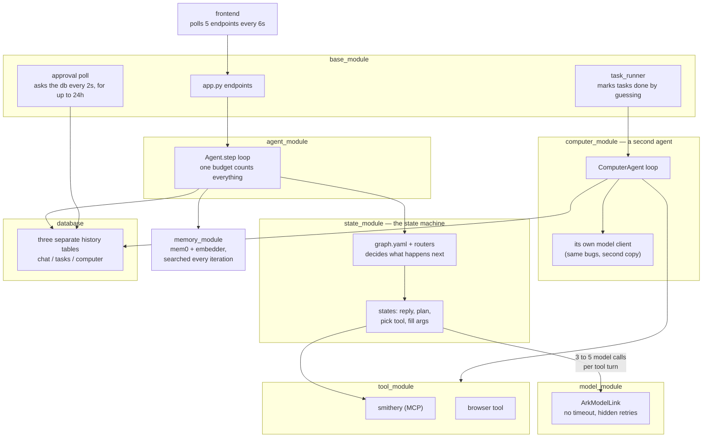
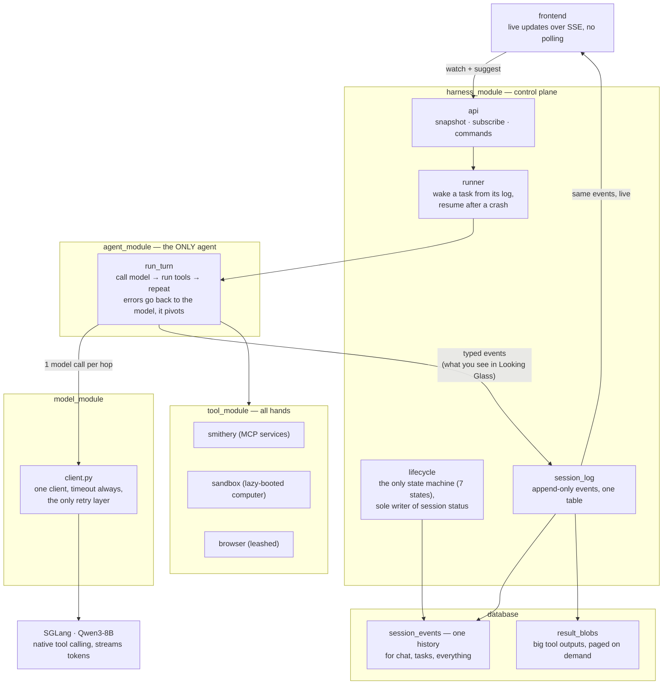

# Single-Loop Redesign — Native Tool Calling

> **SPLIT 2026-08-21 (owner):** this spec is two files. **This one (`_00`) holds
> the shared background and Tasks 0-10 — ALL DONE.** The live plan — Tasks 11.x
> onward, the Status header, Open Questions, Decisions — is
> `single_loop_redesign_spec_01.md`. The background sections (Problem, Technical
> Background, Proposed Approach) are duplicated verbatim in both so either file
> reads alone; when they must change, change them in BOTH or the copies drift.


## START HERE

This is the entry point. It tells you **what to build next**. It does NOT tell you
whether what you built is correct.

> **Gate: `docs/contracts.md` is law. Read it before writing code.**
> This document is a plan and it goes stale as tasks complete. Contracts states
> the invariants and does not. If the two ever disagree, contracts wins and this
> file is the bug.

Which question are you asking:

| Question | Doc |
|---|---|
| What do I build next, and in what order? | **this file** → Implementation Plan |
| What is guaranteed? (events, endpoints, lifecycle, IO) | `docs/contracts.md` |
| Why is it like this? Can I change it? | `docs/decisions.md` (D1-D26) |
| What happens at runtime in state X? | `docs/decision_tables.md` |
| What tables and columns exist? | `docs/schema.md` |
| Who is allowed to do what? | `docs/auth.md` |
| What does the user see? | the current design export (`designs/new-frontend/`) + Tasks 11.8, 12.1-12.3 |
| What is still unresolved? | `docs/GAPS_2026-08-06.md` (Tier 2 and 3) |

**Never read `docs/deprecated/`.** It is the architecture this redesign deletes.

Two standing rules for any session picking this up. Gaps in `GAPS_2026-08-06.md`
are pinned to the task that forces them, so read that task's gaps before starting
it, not the whole file. And Task 0a is a measurement, not a formality: everything
downstream assumes native tool calling works on this model, so it gets measured
before Task 7 deletes the fallback machinery.

---

This file is background and finished work. **The Status header, the
where-things-stand table, and everything that still moves live in
`single_loop_redesign_spec_01.md`** — one copy of anything living.

# Problem

One "use a tool" turn today costs 3-5 sequential LLM calls (reply, plan, tool
choice, tool args, advance decision), each preceded by a Postgres read and a
vector search, routed through a state graph. On a self-hosted 8B this is the
difference between instant and tens of seconds.

Stacked on top: three nested retry loops (SDK 600s default x client retries x
agent-loop retries) give a worst-case turn of ~16.5 hours and 99 requests.
Streaming is fake (full completion, then per-char replay). The task runner conflates
transitions with retries and marks runaway tasks **completed**. Approvals poll
Postgres every 2s for up to 24h, then fail the task.

Success: first token < 1s, one LLM call per hop, warm tool calls in 1 round trip,
tasks that resume instead of re-executing, production code ~4.5k lines.

---

# Technical Background

**Native tool calling.** Our server is **SGLang** (`model_module/run.sh`:
`lmsysorg/sglang` running `Qwen/Qwen3-8B` on :30000), not vLLM.
SGLang's OpenAI-compatible endpoint returns `tool_calls` inside the same
completion that streams text, given `--tool-call-parser qwen25` at launch. The
chat template does in one call what ARKOS does in three. Routing is already in
the response shape: tool calls present → execute and loop; absent → done.

⚠️ **Launch-flag prerequisite:** the checked-in `run.sh` does NOT pass
`--tool-call-parser`. Without it SGLang returns tool calls as raw text instead
of a parsed `tool_calls` field, and the whole redesign has nothing to stand on.
Verify what the running server was actually launched with before Task 0a, and
fix `run.sh` if it drifted from production.

**Qwen3-8B thinks by default, and that is a launch-flag problem too.** Qwen3 is a
hybrid reasoning model: it emits `<think>` blocks unless told otherwise. Without
`--reasoning-parser qwen3` that reasoning is returned inside `content`, so it
streams into our `content` events and renders as the model's reply. It also
spends output tokens before the first useful one, which is the latency complaint
this redesign exists to fix. Two flags, not one:

```
--tool-call-parser qwen25      # NOT "qwen3" (that is the reasoning parser name);
                               # "qwen3_coder" is for the Coder variants only
--reasoning-parser qwen3       # splits <think> into reasoning_content
```

Task 0a measures both: malformed-call rate AND whether reasoning and tool calling
interact badly (a known Qwen3 failure is tool-call XML leaking into content when
both are on). If thinking costs more latency than it buys on our schemas, disable
it per-request rather than living with it.

**Why the state graph exists.** Enum-constrained selection was built to keep a small model
on rails. The rails cost 5x latency every turn to prevent a failure (malformed
tool call) that is rare and cheaply recovered with validate-and-retry.

**Four loops today:** the multiplicative LLM retry stack; the agent step loop
(budget conflates transitions with retries — simultaneously too tight and too
loose); the 2s/24h approval poll; and browser_use's internal loop behind one
blocking tool call.

**The computer agent already proves the design.** `ComputerAgent.run()` is the
target loop (message list, native tool calling, step cap) and it shipped. The
redesign generalizes it into THE loop and deletes the class. It carries the same
infra bugs fixed here (client per access, no timeout, zero retries, 24h blocking
ask, no persistence).

**Load-bearing and kept:** Smithery vault+proxy OAuth, the approvals table,
Pydantic at boundaries, the FastAPI surface, `browser_use` (behind the tool
boundary). Not kept, because it never existed: `emit_log` / `logging_module` —
CLAUDE.md mandates it, the repo has neither, so it gets built (D17).

---

# Proposed Approach

### Today



### Target




One loop (`run_turn`): in-memory message list, one streaming completion with
`tools=[...]`; execute tool calls (readonly in parallel), append results, call
again; no tool calls means done. ~200 lines with budgets and error handling.
All interfaces, invariants, and the event vocabulary: **contracts.md**.

- **States collapse into prompts and tools.** Every pause is a tool that parks:
  `ask` for a question, `request_approval` for consent (both park the session,
  event-driven resume). Completion = explicit `finish_task`. Graphs/routers/StateOutput are
  deleted, not ported.
- **One retry policy.** One cached client, timeout always set, the client is the
  only retry layer; the loop gets honest counters (hops, per-tool attempts).
- **Real streaming, structurally.** Client deltas re-yield as `content` events
  immediately; no accumulation step exists; pinned by conformance test.
- **Write-behind persistence.** The turn never re-reads Postgres mid-loop;
  events append as they happen; resume folds the log back into messages.
- **One agent, zero agent classes.** ComputerAgent deleted; computer_module
  dissolved — sandbox manager + toolset move to `tool_module/sandbox/`, next to
  `tool_module/browser/`. All hands live in tool_module. Browser stays a leashed
  third-party inner loop behind `browser_task`.
- **One session, two modes — nothing spawns.** The session you chat with plans,
  executes, and is the one you reopen. *Attended* (turn-taking) flips to
  *unattended* when you approve; approving is the handoff, inside one transcript.
  `create_session` and the word "subagent" are both gone. Parallelism is the
  project grid. New state `idle` = alive, waiting for you.
- **Long-term memory is REMOVED for now** (mem0, embedder service, extraction —
  all dropped; the transcript is the memory within a session). Reimplementation
  TBD, direction in contracts.md.
- **Context recovery, v1 = rungs 0-1 only.** Input budget =
  `llm.context_window - llm.max_tokens` (today 32768 - 8192 ≈ 24k; both are
  config, not constants — see the config contract). Rung 0, proactive: estimate
  the view per hop; over `context.recovery_threshold` (0.8) of budget → apply
  rung 1 preemptively. Rung 1, drop re-derivable: clear the oldest tool results
  whose tool is in `context.clearable_tools` from the VIEW, replaced with
  `[cleared, ref b_x, re-read if needed]`; full content stays in result_blobs. Every drop recorded as a `view_transform` event (invariant in
  contracts.md: view-only, log never rewritten, deterministic replay).
  Today's behavior this replaces: overflow surfaces as BadRequestError →
  non-retryable → turn dies; token estimates via cl100k on a Qwen tokenizer;
  char/token unit confusion in tool_result_budget; blind head+tail truncation
  that destroys data. *Future work (not v1):* rung 2 demote-to-preview+ref,
  rung 3 summarize-old-hops under a preservation contract, and the reactive
  arm (classify the server's context-length error as recoverable and re-enter
  the ladder one rung deeper, sticky flags + breakers) — adopt if rungs 0-1
  prove insufficient in practice.

**Not in scope:** model swap (config later), replacing browser_use, watching/
triggers (scrapped, own future feature), multi-worker leasing (Task 15).

**Deletion inventory:**

Estimated before, measured after Tasks 7+8 landed on 2026-08-13.

| Module | Before | Planned | **Actual** | Notes |
|---|---|---|---|---|
| state_module | 1,708 | ~0 | **0** | deleted: graphs, routers, discovery, both agent packages |
| memory_module | 335 | ~0 | **0** | deleted: mem0 + embedder out of the stack |
| computer_module | 1,757 | 0 | **0** | dissolved: agent/model/runner/router/store deleted; sandbox+tools → `tool_module/sandbox/` |
| base_module → harness_module | 2,564 | ~1,700 | **172** | app/task_runner/tasks/task_store/users deleted outright. Only `jwt_utils` + `browser_routes` survive; the four control-plane files are Tasks 4-5, not yet written |
| agent_module | 535 | ~250 | **629** | loop.py + events.py; `agent.py` deleted |
| model_module | 442 | ~150 | **363** | one client; ArkModelNew + llm_json deleted |
| tool_module | 1,930 | ~1,950 | **2,828** | envelope · registry · connections · smithery · tools/ · browser · sandbox (absorbed) |
| config_module + db | — | — | **515** | loader, migration 0, asyncpg pool |
| tests | 5,037 | ~2,200 | **3,894** | 14 test files went with their machinery |
| **Total (py)** | **~14.9k** | **~6.3k** | **8,576** | production 9.9k → **4,682** against a ~4.5k target |

**Measured again after Task 8.10, 2026-08-18.** The 08-13 row above is the
redesign's own cull; this one is what the 08-17 audit found still standing
behind no import path, plus what Tasks 4-8.9 added in between.

| | Before 8.10 | **After** | |
|---|---|---|---|
| production (py, excl. `landing/` and `frontend/`) | 9,546 | **8,289** | −1,257: the four browser files, `browser_routes`, a superseded config test, `scripts/debug/` |
| tests | 10,822 | **9,415** | −1,407: the four browser test files, which pinned `register_local_tool` and bare-string returns |

Production is up from 4,682 because Tasks 4 through 8.9 wrote the control plane,
the store and memory; the ~4.5k target described a repo with no HTTP server, no
store and no memory in it. What 8.10 removed is dead weight, not function: every
deleted file was reachable from no import path in the repo, which is why a
deletions-only commit leaves the suite green.

Where the two big misses are, and why neither is alarming: `harness_module` is
172 instead of ~1,700 because its four files are not written yet, so that gap is
Tasks 4-5 arriving, not a saving. `tool_module` overshot ~900 because the
inventory assumed sandbox would arrive trimmed; it arrived as-is (Task 8's
integration is unfinished) and the browser tool is untouched until Task 9.

Migration is replace-then-delete, with no flag and no bridge: Tasks 1-3 build
the new path alongside the old, 0c wipes the database, Task 4 cuts over, and the
old modules are dead code deleted one PR each in Task 7. The app is down between
0c and Task 4 landing.

---

# Implementation Plan


> Tasks 11.x and later: `single_loop_redesign_spec_01.md`.

## Task 0: Preflight (before any implementation)

**0a — model reliability harness (the load-bearing test).**
**Done when:** (i) one authoritative model config exists — `run.sh` launches
**Qwen3-8B** with `--tool-call-parser qwen25` AND `--reasoning-parser qwen3`,
`llm.model_name` matches the served name (not the stale `"tgi"`), and `computer_agent.llm` is deleted along with its wrong
`qwen3` tool-parser comment, while `computer_agent.sandbox` is PROMOTED to a
top-level `sandbox:` block in the same edit (deleting it wholesale breaks the live
sandbox, which `computer_module/sandbox.py` reads at runtime and which Task 8, the
last deletion, has not relocated yet); (ii) a script fires
~20 realistic prompts at the real SGLang endpoint with our actual tool schemas
and reports malformed-call rate + repair-retry success rate; (iii) the decision
is recorded in Implementation Notes (>~5% malformed → temp 0.2 for tool turns,
or SGLang constrained decoding / xgrammar). Everything downstream assumes this
passes; measure before building on it.
**Effort:** half day | **Blockers:** none
**Status:** done — (i) landed in `5f3705f`; (ii) measured 2026-08-11, passed;
(iii) recorded in `implementation_notes.md`. The probe script was a one-off and
was deleted rather than committed: it imported `computer_module.tools`, which
Task 8 removes. Re-measuring means rewriting it against the then-current tool
schemas, which is the correct amount of work for a check that only re-runs when
the served model or its parser flags change.

**0b — Quarantine the superseded guidance (do NOT rewrite CLAUDE.md yet).**
**Done when:** (i) a ~10-line note at the top of CLAUDE.md: redesign in progress,
`docs/contracts.md` supersedes the architecture contracts below, `state_module`
is deprecated, add no new states/routers; (ii) `docs/specs/` moved to
`docs/deprecated/` with a README that tells AI assistants never to open it, and
CLAUDE.md carries the same instruction. Without both, every AI-assisted session
reads instructions mandating the architecture being deleted. (iii) The docstrings
that route implementers there — `agent_module/agent.py:305,306,328`,
`computer_module/__init__.py:4`, `computer_module/agent.py:5`,
`spike_sandbox.py:100` — are deleted during Tasks 7/8, which delete or rewrite
those files anyway; `agent.py:306` points at `ENVIRONMENT_SPEC`, a doc that was
never written. Full CLAUDE.md rewrite stays in Task 7.
**Effort:** 30 min | **Blockers:** none
**Status:** (ii) done — `docs/deprecated/` exists, CLAUDE.md guardrail in place.

**0c — Database reset to migration 0** (full DDL in `schema.md`).
**Done when:** existing data cleared (zero users; **preserve the `waitlist`
table — it has real signups**), `db/migrations/0001`–`0007` **deleted** (done —
they described tables the redesign does not build; nothing migrates forward), and
a single migration 0 creates the target schema directly: `users`, `projects`,
`project_files`, `sessions`, `session_events`, `result_blobs`, `system_events`,
`approvals`, `resource_leases`, `user_sandboxes`, `user_connections`,
`shared_connections`. No history migration — fresh cutover. `repeat_tasks` is
carried over untouched alongside `waitlist`.
**Effort:** half day | **Blockers:** none to write; **RUNS AFTER TASK 3**
**Blocked by Task 14** (host hardening) unless that risk is accepted knowingly.
**Runs after Tasks 1-3, immediately before Task 4.** Those three build the
client, loop and tool layer and none of them need the new database. There is no
expand/contract and no bridge: this drops the old tables outright, so **the app
is DOWN from the moment 0c runs until Task 4 lands.** That is the price of a
clean overhaul, and it is accepted. Reap all e2b sandboxes first (see the
migration header).
**Status:** DONE — applied 2026-08-13 to the ark box. 15 tables in `public`,
`waitlist` (8 rows) and `repeat_tasks` preserved. Two teardown gaps found only by
running it against the real database; both fixed in the same commit (see
Implementation Notes).
**Re-applied 2026-08-16 to a NEW Supabase project** — that ark database is no
longer the target. See the Implementation Note at the end of this file for the
project ref, what carried over and what did not.

## Task 1: Model client rewrite
**Done when:** one cached client (timeout=90, max_retries=0); the only retry
layer (classified, ≤3, backoff; background source fails fast on overload);
streaming + tools through one path. Replaces ArkModelLink AND ToolCallingModel.
**Touch:** `model_module/client.py` | **P0, 1d** | **Blockers:** none
**Test:** hung endpoint → ≤3 requests, bounded wall clock, no event-loop stall.
**Status:** written + tested (`tests/test_model_client.py`, 12 tests). Nothing
calls it yet, and `ArkModelLink`/`ToolCallingModel` are still live for their
existing callers — they are deleted in Tasks 7/8, not here.

## Task 2: Core loop
**Done when:** `run_turn` per contracts.md (generalized from ComputerAgent.run,
which is deleted); yields the event vocabulary; validates args with one repair
retry; honest hop/attempt counters; streams structurally.
**Touch:** `agent_module/loop.py`, `events.py` | **P0, 2-3d** | **Blockers:** 1
**Test:** mocked model, 2 tool calls then text → exactly 3 LLM calls, parallel
readonly execution, `done{completed}`.
**Status:** done in commits 2a (events), 2b (run_turn), 2c (parallel readonly),
2d (review fixes). 45 tests. `run_turn` takes three parameters the contracts
signature omits: `dispatch` (required, or the loop must import `tool_module` and
stops being pure) plus `hops_used` and the model pass-throughs.
**Not done here:** `tool_result.ref` is only ever what the envelope supplies, so
an oversized result with no blob loses its tail. The blob store is Task 4/5.

## Task 3: Tool layer slim-down
**Done when:** envelope + manifest per contracts.md; one ClientSession; TTL
revalidation; `user_connections` persisted + rehydrated, keyed by `(user_id,
mcp_url)`; `_user_conn_id()`/`_shared_conn_id()` formulas DELETED — the id is
minted once and stored (D24); scoped.py deleted; tools/call timeout 120s.
**Touch:** `tool_module/` | **P0, 2d** | **Blockers:** none
**Test:** warm per-user tool call = exactly 1 HTTP request; restart = 1 DB read,
0 Smithery PUTs for connected servers; renaming a key under `mcp_servers:`
changes no row and prompts no reconnect.
**Status:** DONE. 3a envelope, 3b registry + manifest + the five control tools,
3c review fixes, 3d the Smithery half. `ToolSpec`/`ResultEnvelope` are defined
once in `tool_module/envelope.py` and imported by the loop, so the mirrors
cannot drift. `registry.bind()` adapts dispatch to the loop's `(name, args)`
shape. `smithery.py` is rewritten on D24: `tool_module/connections.py` stores
`user_connections` / `shared_connections`, ids are minted once and written
before the PUT, one `ClientSession`, TTL revalidation that never re-PUTs.
`scoped.py` and `tool_call.py` are deleted.
**Deviation resolved:** `manifest` now matches contracts —
`manifest(user_id, *, mcp=None)`. It is async (the MCP half is a DB read) and
takes the source by injection so the registry stays free of transport.
**Cost, accepted knowingly:** the old path is broken from here, not at Task 4.
`base_module/app.py`, `task_runner.py`, `state_module/*/state_tool.py` and
`computer_module/agent.py` still import the deleted names; 0c already dropped
the tables they read, so they were corpses regardless. `tests/test_scoped.py`,
`test_smithery_isolation.py`, `test_smithery_local_tools.py`,
`test_state_module.py` and `test_tasks.py` went with them (−55 tests).

## Task 4: Chat on the new loop
**No flag.** A flag whose off position 500s is not a rollback, it is dead config
pretending to be one: 0c has already dropped the tables the old path reads. This
is a straight cutover, and the app is down until it lands.
**Done when:** chat routes through `run_turn`; first token before
completion (measured); memory auto-injection code DELETED (memory removed);
SSE error chunk on mid-stream failure; chat transcripts ride `session_events`;
an attended turn ends in `idle`; the five **`world` tools** ship in the manifest;
a **system prompt** exists and a file owns it; the **MCP connections surface** is
reachable over HTTP.
**Touch:** `harness_module/api.py` | **P0, 4d** | **Blockers:** 1-3, 0c applied
**Note:** `app.py` is DELETED (Task 7 ran early), so this is now "write
`harness/api.py`" rather than "untangle app.py". There is no HTTP server until
it lands. `harness_module/` currently holds only `jwt_utils.py` and
`browser_routes.py`; the naming question (Open Question 5) is now free to settle.
**Test:** first SSE chunk arrives before mocked model finishes; forced mid-stream
exception yields an error chunk, not truncation.
**Status:** DONE 2026-08-17, in four commits (4a lifecycle + session_log,
4b prompt + world tools, 4c runner + stream, 4d api). `harness_module/` now holds
`api · runner · lifecycle · session_log · stream · hands · jwt_utils`. Three
deviations from the card, each recorded in `implementation_notes.md`: the card
said "touch api.py" but chat needs the fold, so a Task 4 runner exists and Task 5
extends it; `Sink` writes behind the loop rather than inline; and `jwt_utils` was
rewritten around two secrets. Not built here, and absent rather than stubbed:
`/approve` (5), `/approvals/{id}/respond` (6), `/attention` and file upload
(Looking Glass), browser frames (9).

**Folded in 2026-08-16** — three pieces contracts requires that no card owned.
All three need the harness, so they belong here and nowhere earlier:

- **The five `world` tools** — `list_projects` · `get_project` · `list_sessions`
  · `get_session` · `list_files`. They appear once in the whole doc set
  (`contracts.md:376`) and Task 3 closed DONE having built only the control set,
  so the manifest ships 5 of the ~20 tools contracts promises. They are reads
  against `projects`/`sessions`, which is why they could not have been built
  before now.
- **The system prompt.** No system prompt exists in live code. `run_turn` takes
  `messages` already built, so whoever assembles the first message owns it — that
  is `api.py`. G44 pinned this to Task 2 and Task 2 shipped without it. The
  finishing contract (`finish_task` vs bare text), read-before-edit and the
  unique-`old_string` rule all have to be taught somewhere, and
  `tool_module/sandbox/tools.py`'s descriptions already assume they were. Port
  the surviving discipline from `git show cf27b08^:computer_module/prompt.py`
  (57 lines, the only prompt in repo history written for a native-tool-calling
  loop). Move the nudge text out of `agent_module/loop.py:175-178` in the same
  change: it is hardcoded English under a contract that bans magic values.
- **The MCP connections + OAuth surface.** `smithery.py` kept `connect()` /
  `disconnect()` / `status()` but every route that reached them died with
  `app.py`, and the endpoint table has no row for them — so D24's "the id is
  minted at connect time" has no path a human can walk, and `auth_required`'s
  setup URL points at a page that does not exist. Needs list · connect ·
  disconnect · `GET /oauth/callback/{service}`, plus one `Smithery` constructed
  at startup (nothing in production constructs one today), `initialize_shared()`
  called so no-auth servers come up, and `close()` on shutdown. Endpoint rows
  landed in `contracts.md` on 2026-08-16.
  **The callback must fire the verification**, as a post-response background
  task — Starlette's `BackgroundTask` runs after the response is sent, which is
  exactly one attempt that blocks nothing:
  ```python
  return HTMLResponse(POPUP_CLOSE_HTML, background=BackgroundTask(_verify_once, user_id, label))
  # _verify_once: await smithery.connect(user_id, label)
  # swallow AuthRequiredError (OAuth did not finish; read-repair covers it), log the rest
  ```
  `connect()` is already idempotent — `claim()`'s ON CONFLICT reuses the id and
  the PUT is a no-op re-assert — so this needs no new machinery. Without it the
  card can be completed and still strand a connection: dispatch never re-verifies
  (D24 — a tool call must not open OAuth) and revalidation skips unconnected rows,
  so a popup closed before the opener re-fetches leaves a row reading
  `auth_required` forever after a successful authorization.
  Prior art: `git show cf27b08^:base_module/app.py:302-511`. It retried
  `_ensure_user_server` 3× at 1.5s INSIDE the callback because Smithery's token
  is not always live when the redirect fires — do not copy that. It is a poll on
  the request path, and losing the race showed the user a failure for a
  connection that became valid moments later with nothing re-checking.
  Deliberately NOT repaired in dispatch or the manifest build: revalidation never
  re-PUTs (a restart costs zero Smithery writes), and repair belongs at the two
  human-triggered edges, where a human is present anyway.

## Task 5: Unattended runs on the new loop
**Done when:** runner per contracts.md (wake/fold/lease); `POST /sessions/{id}/approve`
flips attended → unattended; completion ONLY via `finish_task` when unattended;
`idle` on an attended turn end; terminal reason recorded; budgets enforced;
cancel wins races; **context-recovery ladder rungs 0-1 live in the fold**.
**Touch:** `harness_module` runner/task_store/tasks | **P1, 4d** | **Blockers:** 4
**Test:** kill mid-task → resume at cursor, no duplicate side effects; budget
exhaustion → `failed{max_hops}`, never completed; a log that overflows the input
budget folds to a view under it by clearing the oldest results that hold a blob
ref, and the same log folds byte-identically twice.

**Status:** DONE 2026-08-17, in three commits (5a approve + quota, 5b overflow +
blobbing, 5c the ladder). Not built here: the `resource_leases` machinery, moved
to Task 8 with owner sign-off (below), and the incremental wake-at-cursor fold —
the fold rebuilds the whole log every time, which is what makes replay
deterministic and what the ladder now bounds. `sessions.cursor_seq` is written
and still read by nothing.

**Two things called "lease", and only one of them is here.** The SESSION claim —
the conditional UPDATE in `lifecycle.transition`, which the lifecycle table calls
"the runner claims the lease" — is live and stays in this card's scope. The
`resource_leases` TABLE, and `acquire`/`release` around the sandbox and the
browser, move to **Task 8**: their first caller is the sandbox toolset, which
that card registers. Building them here would ship a mechanism nothing calls.

**Folded in 2026-08-16 — the context-recovery ladder.** Scoped into v1 at
Proposed Approach above, given an invariant at `contracts.md:161-165`, and built
by no card. It lands here rather than in Task 4 because the fold is this task's,
because rung 1 needs the `result_blobs` Task 4 delivers, and because a 6-hop
attended turn rarely overflows while a 15-hop worker run is where it actually
bites. Required: estimate the view per hop; over `context.recovery_threshold`
(0.8) of `llm.context_window - llm.max_tokens`, clear the oldest tool results
that hold a blob ref — regardless of which tool produced them, and never a
result without a ref — replaced in the VIEW with a pointer to `read_result`;
full content stays in `result_blobs`; every drop appended as a `view_transform`
event; the log is never rewritten. (Owner sign-off 2026-08-17 replaced the
`clearable_tools` whitelist with the ref rule; see contracts.)
Two prerequisites, both currently missing: `config.yaml` has no `context:` block
at all, and `llm.context_window` is read by zero lines of code. Fix
`done{context_overflow}` in the same change — `agent_module/loop.py:157` only
fires on `finish_reason == "length"` (output truncation), so real input overflow
still returns `bad_request` → `done{model_error}`, which is the exact violation
contracts declared resolved by deletion.

**Carried forward from the Task 4 review — NOT done in Task 5.** These were
carded here to interleave and did not get picked up before the card closed; they
are listed under Task 5 only because that is where they were filed. None blocks
anything. None permanently kills a session, falsifies the record or breaches
consent, which is the bar the review batches used. Take them with the next piece
of harness work:

- **MOVED to LG-1** (owner, 2026-08-17): the SSE backlog paging bug and the
  unpublished `lifecycle` event. Both are invisible without a browser rendering
  the stream, so they are scheduled as LG-1's first commit and tested against
  the consumer that shows them.
- ~~**`projects.updated_at` is written by nothing.**~~ **DONE 2026-08-17:**
  `lifecycle.touch_project` runs inside `transition`'s transaction, and
  `POST /sessions` touches at create time. A code-side touch rather than a
  restored trigger: the trigger was dropped deliberately in migration 0, and a
  write in code is greppable.
- ~~**Local tools never blob an oversized result.**~~ **DONE in Task 5b:**
  `run_turn` takes `store_blob`, and an oversized result from one of our own
  tools now carries a ref. Note what this did NOT change: the message appended
  to history still holds the full envelope text, capped only in the event. The
  cap bounds the screen, not the context window, which is the behaviour the
  2026-08-13 Smithery note describes. A local oversized result therefore reaches
  the model in full for the rest of that turn, and the ladder can only clear it
  at the next fold.
- **`system_events` has zero writers** repo-wide, while `contracts.md:167-176`
  makes it half the logging contract. **Deferred to Task 8, with its decision
  made (owner, 2026-08-17)** so it stops being an open question. The rule is the
  one contracts already gives: record what you would query during an incident,
  and nothing else. For v1 that is three writers — fold duration per wake (the
  measurement that would justify the incremental-fold card), terminal-reaper
  attempts (each retry is an incident breadcrumb), and lease waits and expiries
  once Task 8 creates them. Batched, best-effort, never blocking, per the
  contract. Three call sites; it rides with Task 8 because that is when the
  third writer exists.
- **Three conformance gaps.** `test_retry_budget_bounded` does not exist by that
  name (its substance is spread across `test_model_client.py` and
  `test_loop.py`). `test_streaming_first_token` pins only the SSE fan-out — its
  fake model appends straight to the log, so nothing pins the thing the sink
  exists for; drive `run_turn` with a slow fake append and assert the model
  stream never stalls. `test_event_replay_deterministic` folds a two-event log
  twice in one process and can only fail on a clock read; fold a log containing
  mid-call steering twice and assert byte equality, which pins the one place the
  fold has ordering freedom. The missing name and the thin replay test ride with
  the next cleanup commit.

## Task 6: Event-driven approvals
**Done when:** `request_approval` parks (no polling, no timeout-fail); respond
appends + wakes at cursor; **the park closes its own tool_call before parking**.
**Touch:** `harness_module` | **P1, 2d** | **Blockers:** 5
**Test:** zero DB queries while parked; restart preserves the pending approval;
a parked session's transcript has no open `tool_call`, and folds cleanly on wake.

**Status:** DONE 2026-08-17. The park lives in the harness, not the tool: the
control tools return an ordinary result so the call closes, and the sink parks
on seeing that result. Tests in `tests/test_approvals.py`.

**The 1h reminder is cut, 2026-08-17 (owner).** It was specified to go out by
email, and this system sends no mail: there is no mailer, no provider, no
sending address, and adding one is a feature with its own spec rather than a
line on this card. A parked session is already visible where a human is looking
— the project dot turns ochre and the session appears in `GET /attention` — so
the wait is surfaced by pull, not push. `users.email` stays for identity;
`schema.md` no longer justifies it by a reminder that does not exist.

Two earlier passes reached the same place and neither was actioned: G46 named
deleting the line as "the minimum acceptable alternative", and the review reply
on "why are we firing reminder notifications" recommended cutting it, noting
that 1h is the same species of magic number as the 2s poll — nothing makes it
right, and the first question is why not 15m. If a nudge is wanted later, build
it against real response-time data once the attention surface ships.

**Settled 2026-08-16 (owner): a tool call is never left open.**
`decision_tables.md` used to call an open call across a park "parked, healthy",
contradicting `contracts.md:52`. The owner ruled for contracts, and the mechanics
agree: SGLang's chat template rejects a request whose `tool_call` id has no
matching tool message, so parking with the call open makes the session
unwakeable on the next load — the park would brick the session it exists to
suspend. So `request_approval` / `ask` return a real result ("asked, awaiting a
human"), the call closes, and the session parks with a clean transcript. The
answer arrives later as a `user` event, which is what wakes the run; respond
never back-fills a `tool_result`, and no resume has to reconcile one. Full
rationale in `decision_tables.md:37-49`. Note the current stubs at
`tool_module/tools/control.py:45-46,64-65` already return `ok()` immediately,
which is the correct half — what is missing is the park itself.

## Task 7: Delete the old machinery
**Done when:** state_module, old step/step_stream, llm_json repair, memory_module,
mem0/embedder deps, and their tests are gone; CLAUDE.md rewritten;
production LOC ≤ ~4.5k. No flag to remove, and everything here is already dead
code by now, so deletion is mechanical rather than a second cutover.
**Touch:** everywhere | **P1, several small PRs** | **Blockers:** 4-6 stable 1 week
**Test:** suite green; grep for StateHandler/StateOutput/graph.yaml/mem0 = nothing.
**Status:** DONE 2026-08-13, pulled forward ahead of Task 4. The stated blocker
("4-6 stable 1 week") was written when the old path still had to run; 0c dropped
the tables it reads, so waiting would only have preserved rubble. Deleted:
`state_module/`, `memory_module/`, `model_module/{ArkModelNew,llm_json,tests_arkmodel}`,
`agent_module/agent.py`, `base_module/{app,task_runner,tasks,task_store,users,
main_interface*,depricated}`, `tool_module/slack_notify.py` (its only caller was
`state_approval.py`, and nothing notifies out-of-band now), and 13 test files.
**Production 9.9k → 4,682 lines; 17.4k → 8.6k with tests. Suite green at 231.**
CLAUDE.md rewrite is the one part NOT done.

## Task 8: Dissolve computer_module into tool_module/sandbox/
**Done when:** sandbox manager + toolset relocated to `tool_module/sandbox/`,
behind envelope, in the worker manifest; lazy provisioning on first sandbox
call; ComputerAgent/model.py/runner/router deleted; computer_module gone;
endpoints shimmed; no credentials in sandbox env; **`resource_leases`
acquire/release around sandbox use, a contended wait emitting
`status{label:"waiting for the sandbox"}` while staying `running`, and the lease
released on terminal and on park.**
**Touch:** `computer_module/` → `tool_module/sandbox/` | **P1, 3d** | **Blockers:** 1, 2, 6
**Test:** one task does MCP → sandbox code → browser in a single run, no
re-spawn, no upfront typing; sandbox boots only at first sandbox call.
**Status:** DONE 2026-08-17, in three commits (8a the toolset, 8b leases,
8c the operational log). `computer_module` was gone already; what landed here is
the integration it was missing.
**What that took, since none of it was a matter of wiring.** The toolset was
still in the pre-redesign shape — OpenAI schemas and a dispatch returning
strings — so it was rewritten as seven tools in the current protocol and
registered through `tool_module/tools/sandbox.py`. Its `todo_write` was dropped:
`control.py` already provides that name. Read-before-edit moved onto
`ToolContext.scratch`, so it is enforced in `validate`, before the sandbox is
touched. `manager.py` moved onto `db.pool` and onto the columns migration 0
actually created — it had been reading `e2b_sandbox_id` and a `status` column
that does not exist, over psycopg2, against a TEXT `user_id` that is now UUID.
Three broken things, none of which anything had ever run.

The e2b SDK is imported inside the two functions that need it, so the process
starts and the manifest builds without e2b installed, as `browser_tool` already
does. The manifest is 17 tools; `browser_task` (Task 9) makes 18.

**Tested against a real sandbox**, under the `integration` marker:
`tests/test_sandbox_integration.py` boots e2b for a file and command round trip,
resume from the stored id after the in-process handle is dropped, one sandbox
per user, and the credential check the card asks for — it runs `env` inside the
sandbox and asserts neither the names nor the values of our secrets appear.
Each test kills its sandbox in a `finally`, because an orphan keeps billing.

**Status of the lease half, DONE 2026-08-17:** `harness_module/leases.py` holds
`acquire`/`release`/`release_all`/`holder` against `resource_leases`. The sink
takes the lease on the first sandbox call and gives it up on terminal and on
park. A contended session stays `running`, emits
`status{label:"waiting for the sandbox"}` and retries until
`leases.wait_timeout_s`, after which the tool returns
`{ok:false, error_kind:timeout, retryable:true}` and the model routes around it.
Leases carry an expiry so a dead process does not hold a resource forever.
**Not implemented:** the wall clock does not exclude lease-wait time. Contracts
asks for that "using the same active-segment accounting park already needs", and
park does not have it either, so neither does this.

**The operational log, DONE 2026-08-17:** `harness_module/system_log.py` queues
records in memory and a background task writes them in one statement per batch,
pruned at `system_log.retain_days`. `record()` is synchronous and never raises,
so nothing on a request or token path waits for it, and a failed write drops the
batch rather than retrying a poison one. Three writers, scoped by the contracts
rule "record what you would query during an incident": `fold` (ms, messages,
hops, results cleared), `terminal_retry` and `terminal_abandoned`, and
`lease_wait` and `lease_timeout`. Shutdown asks the loop to finish rather than
cancelling it: a cancel landing inside an in-flight write loses that batch,
because `flush` has already taken it off the queue.

The `resource_leases` machinery. Task 5
owns the SESSION claim (the conditional UPDATE in `lifecycle.transition`); what
lands here is `acquire`/`release` for `sandbox:{user}` and `browser:{user}`
(`sandbox:{user}` deleted by 8.6b, which makes the box per-session capacity),
because the sandbox toolset this card registers is their first caller. Held for
the whole session, not per call; released on terminal and on park; a contended
session stays `running` and says so with a `status` event rather than parking.
It is in the done-when above so the card cannot close with it unreachable.

**Superseded in part, 2026-08-18:** Tasks 8.1-8.9 below demote this card's
persistence story. e2b's filesystem stops being where the agent's files live
(D27); it becomes a cache of a store we own, and pause/resume becomes a
warm-start optimization rather than durability.

## Tasks 8.1-8.9: The store — the agent's filesystem, owned by us

Added 2026-08-18 (owner), from the storage/compute design sessions. The problem
they answer: as shipped, e2b's per-sandbox filesystem is the source of truth for
the agent's files — the vendor holds the agent's life, browsing files requires
booting a computer, and Looking Glass open question 2 (file sync back) has no
answer because files exist in two places. The resolution is one place: bytes in
object storage we control, the tree in Postgres, the sandbox disk demoted to a
cache filled at lease acquire and flushed at release. A filesystem is bytes plus
a tree; blobs are content-addressed by sha256 (dedup, cheap snapshots, safe
crash-time writes), the tree is rows. Total ~6.5d across nine cards; 8.1-8.3
land while thinking, 8.4-8.5 are the heart, the rest interleave.

### Task 8.1: The rulings — storage, residence, and claims become law
**Done when:** `decisions.md` gains **D27** (storage separated from compute:
bytes in object storage we own, tree in Postgres, sandbox disk is a cache filled
at lease acquire and flushed at release; e2b persistence demoted to warm-start),
**D28** (the agent lives outside the computer: loop, transcript writer, and
credentials never enter the sandbox; inner loops only as leashed tools), **D29**
(the unit of conflict is the path set, named and persisted as **claims**:
declared at session creation, sole source of both lease acquisition and sandbox
contents; memory is shared, never leased, append-gated, compacted alone).
`contracts.md` gains the store section (layout, the memory-never-mounts rule,
the blobs-first-rows-last flush invariant). `looking_glass_spec.md` open
question 2 is struck as dissolved: there are not two places.
**Touch:** docs only | **P1, 0.5d** | **Blockers:** none
**Test:** none (law); each card below pins one piece of it.

### Task 8.2: Schema and config for the store
**Done when:** migration adds tree columns to `project_files`
(`path, content_hash, size, mtime`; no bytes column) and creates
**`session_claims`** `(session_id, project_id, subpath DEFAULT '/', mode
'read'|'write')`; `config.yaml` gains `store:` (`bucket`, `prefix`); layout is
fixed as `{user}/memory/{MEMORY.md, notes/}` and `{user}/projects/{project-id}/`
— store keyed by project id (rename-safe), mounted by slug (the model reads
paths as context, so mounted names are human).
**Touch:** `db/migrations/`, `config.yaml`, `schema.md` | **P1, 0.5d** | **Blockers:** 8.1
**Test:** migration applies to an empty DB and one carrying Task-8-era rows;
CHECK on `mode`; claims cascade on session delete.

### Task 8.3: `store.py` — blobs and trees
**Done when:** `harness_module/store.py` exists (the store is the harness's,
per D28): `put_blob`/`get_blob` content-addressed under `blobs/{hh}/{sha256}`,
immutable, write-once; `read_tree(project_id)` and
`commit_tree(project_id, entries)` where commit uploads missing blobs FIRST and
flips tree rows in ONE transaction — a crashed commit leaves the old tree intact
and whole; `diff_tree` by hash. No sandbox, no e2b, no tools: pure store,
unit-testable against a scratch bucket.
**Touch:** `harness_module/store.py` | **P1, 1d** | **Blockers:** 8.2
**Test:** same content in two projects stores one blob; kill between blob upload
and row flip → old tree reads back intact; commit is idempotent on retry.

### Task 8.4: Materialize — the cache fills at lease acquire
**Done when:** acquiring the sandbox lease materializes the session's claimed
subtrees: read tree rows → fetch blobs the sandbox lacks → ONE tar upload via
`files.write` → ONE `tar xf` via `commands.run` into `~/projects/{slug}`. A
resumed sandbox diffs the manifest and transfers only missing hashes (warm start
kept, trust removed). No store credentials enter the sandbox; bytes flow
store → harness → e2b API.
**Touch:** `store.py`, lease call site in `tool_module/sandbox/tools.py` | **P1, 0.5d** | **Blockers:** 8.3
**Test:** fresh sandbox materializes byte-identical to the store; resumed
sandbox with N-1 of N blobs transfers exactly one; a sweep of the sandbox env
for store credentials finds nothing.

### Task 8.5: Flush — the cache empties at release, park, and terminal
**Done when:** release/park/terminal runs one `sha256sum` sweep via
`commands.run`, diffs against the materialized tree, tar-batches changed files
out, and calls `commit_tree`. A failed flush is loud in `system_events`, retried
on the reaper's backoff, and **the sandbox is not killed until the flush lands**.
e2b `pause` is now officially a cache warm-keep: deleting a paused sandbox loses
nothing.
**Touch:** `store.py`, runner/sink ending paths | **P1, 1d** | **Blockers:** 8.3, 8.4
**Test:** write → release → a fresh sandbox for a different session reads the
file byte-identical; kill the process between write and flush → next acquire
reconciles from the intact last tree; delete the e2b sandbox outright → nothing
lost; flush uploads only changed hashes.

### Task 8.6: Claims consumed end to end
**Done when:** `POST /sessions` accepts optional `claims` (default: a write
claim on the session's own project, so existing flows change zero);
`materialize` mounts exactly the claimed subtrees and nothing else; leases
derive from write claims (`project:{id}` per claim; `sandbox:{user}` remains for
the box itself, until 8.6b below deletes it); a read claim materializes leaseless and its flush is a no-op
with discarded edits logged **and disclosed as a `status` event before the
terminal** — a human who watched the agent edit files in a read-claimed project
must not see those edits silently evaporate, and `system_events` is read by the
operator, not by them; `GET /sessions/{id}` returns the claims for Looking
Glass to render. Mid-session grant additions ("add folder"): carded, not built —
a claim set fixed at creation is what keeps the lease story race-free.
**Touch:** `api.py`, `store.py`, `leases.py`, `runner.py` | **P1, 1d** | **Blockers:** 8.4, 8.5
**Test:** claims A(write)+B(read) → both mount, edits in A flush, edits in B
discarded and logged; two sessions with disjoint claims run with zero
contention; a second session claiming A waits on `project:{A}` with a `status`
event, no hops burned; nothing unclaimed appears in the sandbox.

### Task 8.6b: Per-session sandboxes — the box follows the session, capped
**Why now, not gated on the demo (owner, 2026-08-18):** post-D27,
`sandbox:{user}` is a capacity cap wearing a lease's clothes — its correctness
role died when the per-user filesystem it protected became a disposable cache,
and overlapping writes are already serialized by the `project:{id}` claims. It
is built NOW, before 8.7, because 8.7's write-through and Task 9's browser
pattern would otherwise encode the one-box-per-user singleton and turn a
rekeying into a rework. `quotas.max_unattended_sessions: 5` already promises a
per-user concurrency the singleton cannot deliver. This is NOT the rejected
"per-project computers" item (persistent per-project state fragmentation);
it is per-SESSION cattle boxes over one store.
**Done when:** `SandboxManager` is keyed by session, not user; `user_sandboxes`
becomes a pool table (`session_id, user_id, sandbox_id, last_used_at`); the
`sandbox:{user}` lease is DELETED, replaced by a capacity cap
`sandbox.max_concurrent_per_user` (default 3) enforced with the same
wait-and-`status` loop as lease contention ("waiting for a computer"); a
session's box is reaped on terminal ONLY after its flush lands; project leases
and materialize/flush are untouched (they already work per-claim-set).
Write-through's rule for 8.7 is stated here so 8.7 builds against plural boxes:
an upload writes through to EVERY live sandbox holding a materialized claim on
that project. Warm reuse of a released box by the next session is optional and
deferrable; correctness never depends on it.
**Touch:** `tool_module/sandbox/manager.py`, migration, `leases.py` call site,
`config.yaml` | **P1, 1d** | **Blockers:** 8.6
**Test:** two same-user sessions with disjoint claims run shell commands
concurrently and both flush correctly, byte-identical to their own stores (see
the Divergence note below: boxes never reconcile with each other, only with
the store); a third session over the cap waits with a `status` event and
proceeds when a box frees; a box is never reaped before its flush lands; the
`sandbox:{user}` key appears nowhere in the tree.

### Task 8.7: Upload and browse without a boot
**Done when:** `POST /projects/{id}/files` (the missing endpoint) writes blob +
tree row to the STORE; `quotas.upload_max_mb` finally has its reader; an upload
is written through to EVERY live sandbox holding a materialized claim on that
project (8.6b's rule, stated there first because it is what per-session boxes
force), and otherwise waits in the store for the next materialize; `GET
/projects` and file listings read tree rows only — no sandbox awake to browse.
An empty file is content — `.gitkeep`, a placeholder config — and stores like
any other: zero bytes have a well-defined hash. This is LG-2's upload half,
landing where it naturally lives.
**Touch:** `api.py`, `store.py` | **P1, 1d** | **Blockers:** 8.3 (8.6 for write-through)
**Test:** upload while cold → listed immediately, present at next materialize;
upload mid-lease → the running session reads it same turn; upload over a path
the session is editing → its stale `edit_file` is refused and succeeds after a
re-read; an empty file stores and lists like any other; oversized → the standard
error shape; listing a 100-file project boots nothing.

**The same-path race is accepted, not arbitrated (owner, 2026-08-18).** The
write-through is a second writer inside a held write lease, so an upload landing
on a path the session has edited-but-not-flushed is resolved by timing: last
write wins in the box. That is deliberate, on three grounds. It is rare — it
needs an upload to the one path a run is editing, inside the window between that
edit and its flush. It is recoverable in both directions: the uploaded bytes are
in the store whatever the box does with them, and model work is redoable. And a
stale model edit already fails safe, because `edit_file` matches `old_string`
exactly against the file as it is now — an upload that landed underneath it
turns the edit into a refusal and a re-read, not a corruption. Arbitration (a
hash compare per box, a skip, a log) would buy determinism in a case where
nothing is lost either way, at the cost of a rule every future writer of that
path has to know. **If it proves needed:** the write-through appends a
system-sourced user event naming the updated file to every running session that
claims it, reusing the steering mechanism as-is — the model is told, rather than
the harness guessing which writer was right.

### Task 8.8: Memory — the agent remembers between sessions
**Un-paused and extended 2026-08-18 (owner).** The pause held while the read
side was in question; the write side never was, and the rest followed it. What
was settled and stayed settled: every memory write goes through the append gate
(`append_note`, one file per note, so concurrent sessions cannot collide) and
`MEMORY.md` is replaced whole rather than edited in place. What changed is that
the model is the compactor for v1 — it curates the core through `update_memory`,
under the advisory lock the future background job will hold.

**Done when:** `memory_files` exists, keyed by user (migration 0005), with the
text in the row and a Postgres FTS index over it (0006); `store.py` has the
region — `append_note`, `update_memory` (advisory-locked), `read_memory`,
`read_notes`, `search_memory`; four tools ship in the manifest —
`save_memory` · `search_memory` · `read_memory` · `update_memory`, the last
refusing until `read_memory` has run that turn, because the prompt's copy is
capped and a whole-document rewrite from it would drop the tail; `fold` injects
`MEMORY.md` into the system prompt capped at `memory.prompt_max_chars`, with a
marker naming `read_memory` for the rest; the prompt says what belongs in memory
(stable preferences, decisions and their reasons, who people are, where things
live) and what does not (this session's narration, anything re-readable from the
files, credentials).

**Explicitly NOT here:** vectors or embeddings of any kind; auto-extraction;
retrieval on the hot path (the model searches when it decides to); the
background compaction job; pinned standing rules as a first-class thing; any
mount — **D30 stays open**, memory does not mount, and nothing in the schema
forecloses the read-only-claim answer.
**Touch:** `store.py`, migrations 0005-0006, `tool_module/tools/memory.py`,
`prompts.py`, `runner.fold`, `config.yaml`, `contracts.md`, `decisions.md`
| **P2, 1d** | **Blockers:** 8.3
**Test:** two concurrent `append_note` calls land as separate files; two
`update_memory` calls at once serialize and neither writes half a document;
search finds a note and the core and never another user's; `update_memory` is
refused before `read_memory` and accepted after; **a fact saved in session A
surfaces in session B both ways — `search_memory` finds the note, and the
curated core is in B's system prompt**; a session claiming every project still
has no memory in its box.

### Task 8.9: The probe and the hardening pass
**Done when:** the **FUSE probe** is run and recorded in Implementation Notes
(open a sandbox, check `/dev/fuse`, attempt an `rclone mount`) — it decides
whether the lazy-mount rung is open on e2b for the day eager sync gets slow; a
periodic store snapshot exists (`commit_tree` makes snapshots cheap: a snapshot
is a saved copy of tree rows) with the restore path tested once; the revisit
triggers are written down: materialize/flush over a few seconds on real
projects; a project too big for eager sync (the FUSE/self-host fork);
sandbox-hour cost crossing self-host on owned metal; a customer forbidding
third-party VMs even ephemerally.
**Touch:** Implementation Notes, `store.py`, one script | **P2, 0.5d** | **Blockers:** 8.4
**Test:** restore a project to a prior snapshot and materialize it; the probe
result is written down whichever way it lands.

**Landed 2026-08-18.** The probe says FUSE works in the box — `/dev/fuse` is
there, `fusermount` is installed, `rclone mount` mounts and reads back — so the
lazy-mount rung is open on e2b and the self-host fork is not forced. Snapshots
are migration 0007 plus `snapshot_project` / `restore_snapshot` /
`prune_snapshots` and `scripts/snapshot_store.py`; a restore refuses if the
store no longer holds the blobs, which is the commit rule pointed backwards. The
triggers are in Implementation Notes, along with the standing warning that a
future blob GC must walk snapshots or restores become a lie.

**Explicitly not in 8.1-8.9:** FUSE/lazy materialization; branches and merge
(same-project parallelism = the second session waits on the lease, v1 forever
until it hurts — when it hurts, branch-per-session and merge-at-flush, conflicts
surfacing as an `ask`); memory tools and the compactor; vector search;
multi-project session UI; per-project computers; self-hosted sandboxing.
**For LG-1's card, not here:** session creation is placeful — the grid-level
composer creates a new project (default, zero clicks), composing inside a
project creates the session there with its claim, and a busy project (write
lease held) is disclosed in the composer before creation, offering queue-behind
or open-the-running-session.

**Divergence note (owner, 2026-08-18) — boxes never reconcile; the store is the
only rendezvous.** With per-session sandboxes (8.6b), two same-user boxes
diverge completely and that is meaningless, not a conflict: a box is never
compared to another box, only to the store subtrees its session claimed, and
its flush touches only those rows and blobs. Every path to the store is
serialized by a lease, so the store is ordered and boxes are spokes, never
peers. The case this matters for is the placeful UI above: once users can pick
an EXISTING project folder, two sessions can select the same one — and there
the `project:{id}` write lease is what pauses one for the other. The second
session queues behind the first (materialize cannot begin until the holder's
flush lands at release, so the second always starts from the first's result,
never reconciles with it), and the composer discloses the queue before
creation. Same project, both writing simultaneously: impossible by
construction. What legitimately diverges and is DISCARDED: everything outside
the claimed subtrees — /tmp, pip installs, shell config. That state was already
declared ephemeral by D27 (the singleton loses it on any sandbox death today);
if environment reproducibility ever matters, it is declared in project files
(requirements.txt, a setup script) and re-derived at materialize, or baked into
the template — never flushed, because flushing a box's environment would
promote the cache back into a source of truth.

### Task 8.10: The deletion commit — the old architecture leaves the tree
**Why:** the 08-17 codebase audit found ~24% of production defended by no
import path — pre-redesign browser code written against APIs deleted in Task 3,
plus stale artifacts. It lands BEFORE Task 9, or the browser rewrite happens
next to a corpse someone will be tempted to salvage from; Task 9 rebuilds
against contracts, not against these files.
**Delete, production (~1,115 lines):** `tool_module/browser_tool.py`,
`tool_module/browser_actions.py`, `tool_module/browser_stream.py` (Task 9
rebuilds the broker with (user, session) keying per the violations table),
`harness_module/browser_routes.py` (unmounted, by its own docstring's
admission), `config_module/test_config_loader.py` (superseded, never collected,
would fail if it were).
**Delete, tests (~1,407 lines):** `tests/test_browser_tool.py`,
`test_browser_actions.py`, `test_browser_routes.py`, `test_browser_stream.py` —
they pin `register_local_tool` and bare-string returns, both forbidden by
contracts, so Task 9's tests are rewrites regardless.
**Delete, artifacts:** `base_module/` and `state_module/` (nothing but
`__pycache__` of deleted source), stale `.pyc` for
`ArkModelNew`/`tool_call`/`test_state_module`, `scripts/debug/` (both files
hardcode a dev machine path).
**Dependencies:** drop `browser-use` and `playwright` from requirements (they
return with Task 9 if it still wants them). `e2b-code-interpreter` STAYS — the
08-17 audit line calling it droppable predates 8a making the sandbox live.
Settle `psycopg2-binary` per its one remaining consumer (`db/migrate.py`) and
fix its requirements comment, which still names the sandbox manager.
**Docs in the same commit:** the four browser rows in contracts' violations
table annotated "resolved by deletion; Task 9 rebuilds against the contract";
the spec's deletion inventory gains a measured after-row.
**Done when:** the deletions above are gone;
`grep -r "register_local_tool\|BrowserStreamBroker"` returns nothing outside
docs; suite green; ruff clean; production LOC recorded.
**Touch:** deletions only, no behavior | **P1, 0.5d** | **Blockers:** 8.9
**Test:** the suite passing after a deletions-only commit IS the test, plus the
grep gate above as a CI-runnable check.

**Landed 2026-08-18.** Production 9,546 → 8,289 lines, tests 10,822 → 9,415;
the measured rows are in the deletion inventory above. The grep gate returns
nothing outside docs. Two notes for whoever reads this next. `psycopg2-binary`
**stays** — `db/migrate.py` is a sync CLI a person runs, and porting it to
asyncpg would buy one fewer requirements line and nothing else; the comment the
card said still named the sandbox manager already named `db/migrate.py`, so
there was nothing to fix there. And `pydantic`'s entry was justified by
`browser_actions.py`, which is now gone — it stays as a FastAPI dependency that
`landing/` also imports directly, with the comment corrected to say so.

## Task 9: Browser tool on a leash
**Done when:** per contracts.md browser section — step callback wired to
`status` events; frame stream keyed (user, session) + cookie-authed + announced by
event and rendered in the right-hand canvas (replacing the fixed corner pane); result is a real envelope from history (ok/errors/ref), never a bare
string; graceful-stop budget with `wait_for` backstop; config collapses to a
`browser:` yaml section; WARNING on dropped register_* kwargs; **`browser_task`
is in the manifest and reachable from `run_turn`**.
**Touch:** `tool_module/browser_tool.py`, `browser_stream.py`,
`harness_module/browser_routes.py` | **P2, 2d** | **Blockers:** 1
**Test:** budget kills at deadline with partial results; step events appear in
the session log; stream requires ownership; failure ≠ empty string;
`manifest()` contains `browser_task`.

**Carded from the Task 4 review, 2026-08-17.** `harness_module/browser_routes.py`
is now mounted by no application — `api.py` deliberately leaves it out, because
`_resolve_user_id` still trusts a client-supplied id. It is dead code carrying a
live violations row, and the line numbers cited at `contracts.md:551` are stale.
Delete it when this card lands its replacement.

**DONE 2026-08-18, rebuilt rather than restored.** `tool_module/browser/`
(`tool.py`, `stream.py`) written against the contract, not against the files
8.10 deleted. All four leash strands: every step is a `status` event; the result
is an envelope built from the run's own history with the record behind a `ref`;
the budget is ASKED first (the step callback stops the agent, so partial results
survive) with `wait_for` only as the backstop; and a `browser_use` version that
drops one of our kwargs logs at WARNING rather than going quietly blind. Frames
are keyed `(user_id, session_id)` and served by
`GET /sessions/{id}/browser/frames`, ownership-checked — and captured only while
someone is actually watching. `browser_task` is in the manifest, which is the
half the old one never had. Config collapsed to one `browser:` section, with a
coherence check that the backstop sits outside the graceful stop.

**Corrected 2026-08-18 — the architecture was lost and is restored.** The first
rebuild passed no browser to `browser_use`, which means it would have launched
Chromium inside the harness process, beside the user's cookies and the store's
secret key. The browser runs in the **browserless container** and is reached
only over CDP at `browser.cdp_url` (defaulting from `BROWSERLESS_URL`); an unset
url is a loud, non-retryable refusal rather than a local launch. `stealth=true`
on the CDP url is carried through, and frames come from `Page.startScreencast`
again — keyed `(user, session)` this time, which is the one thing the old
implementation got wrong. Inner steps now stream as `status{label}` events
("step 3/25 · click_element · open the pricing page", capped), with the full
step record in the result's ref blob for `read_result` to page; no per-step
tool_call or reasoning events, so the inner loop stays behind the one
`browser_task` boundary. `ctx.emit_status` had no consumer and no test until
this card; it has both now.

`browser.cdp_url` is a literal empty string in config.yaml rather than
`"${BROWSERLESS_URL}"`: an unset `${VAR}` there raises at config LOAD, so a
machine without the container would fail to start the whole app instead of
failing one tool. The tool reads the config key first and the variable second.

**What is NOT proven:** the vendor calls. 16 tests fake `browser_use` to prove
the leash, and a mock encodes what we believe the API is, so believing it twice
proves nothing. `tests/test_browser_integration.py` is the one that asks the
real library — a cheap half that checks `Agent`'s signature still has our
kwargs, and an expensive half that runs a real task. Neither has been run: this
machine has no browser and could not install one. Run it before trusting a
browser run in production. Custom actions (the old `browser_actions`) were not
rebuilt: nothing in the card asked for them.

**CORRECTION, 2026-08-18 (owner) — the rebuild dropped the browser's actual
architecture, and the fix is carded here.** "Rebuilt against contracts, not
against the deleted files" was followed literally, and contracts never said
WHERE the browser runs — so the rebuild constructs `Agent(...)` with no browser
at all, which would launch a local Chromium on the uvicorn host. The real
architecture was in the deleted file: **the browser runs in the Browserless
container (docker-compose, untouched throughout), and the app reaches it ONLY
over CDP.** Five changes, approved:

1. Port from `git show 31194a7^:tool_module/browser_tool.py`: CDP connection
   (`cdp_url` + `is_local=False`) with `_augment_cdp_url`'s stealth params
   intact. URL from `browser.cdp_url` in the `browser:` block, defaulted from
   `${BROWSERLESS_URL}`. **Unset = loud refusal** (clear envelope,
   `retryable=False`), never a local launch — a browser beside the harness's
   credentials is a different architecture, not a degraded mode.
2. Port the CDP `Page.startScreencast` frame capture verbatim, replacing the
   guessed accessors.
3. Step streaming stays as built (one `status{label}` per inner step,
   "step N/M · action · goal", capped; full record behind the result `ref`; no
   per-step tool_call/reasoning events) — `browser_task` is `ctx.emit_status`'s
   FIRST real consumer, so the channel test (a tool's emit_status arrives over
   SSE) lands here.
4. **Feed the existing canvas; do not rebuild it.** `lookingglass.jsx` already
   has the full right panel (`.ctx-panel`: TODO readout, files/browser tabs
   with activity dot, `BrowserCanvas`). The contract is wire-shape: the
   `status` event carries the stream URL (that is what lights the dot — from
   the EVENT stream, not the tool result, so `Last-Event-ID` replay
   reconstructs panel state), and the frames endpoint serves SSE events named
   `frame` with `{"jpeg": "<base64>"}`. A shape disagreement is fixed in the
   backend, not the panel.
5. Contracts' browser section gains the missing sentence (browser runs in the
   Browserless container; reached only over CDP via `browser.cdp_url`; unset
   is a refusal, not a fallback) — the gap that caused this. CLAUDE.md gains
   the lesson, second occurrence (SettingsModal was the first): deleted code is
   still documentation; rebuilds read the deleted file in git history for
   wiring facts contracts does not carry.

**Correction tests:** unset `browser.cdp_url` → refusal envelope, no Chromium
spawned; emit_status channel test; frames endpoint rejects a foreign cookie;
end-to-end with the container up: ordered step events, `frame` events in the
canvas's shape, real envelope with pageable `ref`, graceful-stop at deadline.
**Acceptance, human-visible:** during a run — live step lines under the tool
row, the browser tab's dot lights without stealing focus, the expanded panel
shows the live browser while steps tick, reload mid-run reconstructs the lit
dot from replay; after — canvas back to empty, result card with `ref`,
`read_result` pages the step history.

**Folded in 2026-08-16 — registration was missing from the done-when.** Every
other item above leashes a browser the model cannot currently reach:
`register_browser_tool()` (`browser_tool.py:365-389`) calls
`tool_manager.register_local_tool()`, an API that died with the ToolManager in
Task 3, so no class in the repo defines it and `browser_task` appears in no
manifest. Task 8 states its equivalent explicitly ("register it in the
manifest"); this card did not, and a card can be completed exactly as written
while leaving the tool unreachable. Registration is now part of done.

## Tasks 10-11: moved to the Looking Glass spec — since DEPRECATED (2026-08-20)
All LG tasks are DONE; the spec's design sections were superseded by the
current design export and the 11.8/12.x cards, so it moved to
`docs/deprecated/looking_glass_spec.md` as the historical record of the LG
build. Its living content lives here and in contracts.
(Looking Glass v1; Projects + Command Center.)

**Sequencing settled 2026-08-18 (owner): LG-1 runs BEFORE Task 9.** After 8.8,
8.9 and 8.10 (the deletion commit), the order is **LG-1 → Task 9 → LG-2 → Task
12**. Two reasons on the record. First, visibility: everything built since Task
4 — the streaming turn, the hop meter, unattended runs, the ochre approval dot,
claims, mid-run uploads, cross-session memory — is currently observable only
through curl; LG-1 is the card that makes two weeks of system visible, and it
has been fully unblocked (Tasks 2, 4, 6 done) for days. Second, reachability:
Task 9's deliverable is substantially visual — its frame stream renders in the
Looking Glass canvas and its progress is `status` events in the session window —
so building the browser before the window means developing a live video pane
over curl and finding the rendering problems later anyway. LG-1 is Task 9's
consumer; it goes first. LG-1's first commit is the two carded stream bugs
(SSE backlog paging, lifecycle publish-after-commit). Task 13 (frontend modernization, renumbered from 12) stays last:
build tooling and polish, not function.


---

**Everything below the Implementation Plan** — the Status header, Tests, Open
Questions, Future Work, Decisions — lives with the live work in
`single_loop_redesign_spec_01.md`, and the Implementation Notes live in
`implementation_notes.md`, so there is exactly one copy of anything that still
moves.
