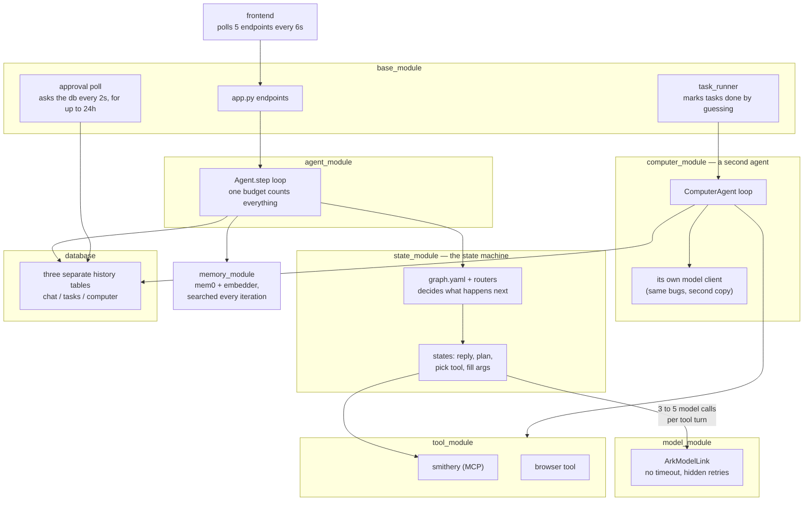

# Single-Loop Redesign — Native Tool Calling

## START HERE

This is the entry point. It tells you **what to build next**. It does NOT tell you
whether what you built is correct.

> **Gate: `docs/contracts.md` is law. Read it before writing code.**
> This document is a plan and it goes stale as tasks complete. Contracts states
> the invariants and does not. If the two ever disagree, contracts wins and this
> file is the bug.

Which question are you asking:

| Question | Doc |
|---|---|
| What do I build next, and in what order? | **this file** → Implementation Plan |
| What is guaranteed? (events, endpoints, lifecycle, IO) | `docs/contracts.md` |
| Why is it like this? Can I change it? | `docs/decisions.md` (D1-D26) |
| What happens at runtime in state X? | `docs/decision_tables.md` |
| What tables and columns exist? | `docs/schema.md` |
| Who is allowed to do what? | `docs/auth.md` |
| What does the user see? | `docs/looking_glass_spec.md` |
| What is still unresolved? | `docs/GAPS_2026-08-06.md` (Tier 2 and 3) |

**Never read `docs/deprecated/`.** It is the architecture this redesign deletes.

Two standing rules for any session picking this up. Gaps in `GAPS_2026-08-06.md`
are pinned to the task that forces them, so read that task's gaps before starting
it, not the whole file. And Task 0a is a measurement, not a formality: everything
downstream assumes native tool calling works on this model, so it gets measured
before Task 7 deletes the fallback machinery.

---

This document is the why and the build plan.

**Status:** Not started | **Author:** John Wallace | **Last updated:** 2026-07-24

---

# Problem

One "use a tool" turn today costs 3-5 sequential LLM calls (reply, plan, tool
choice, tool args, advance decision), each preceded by a Postgres read and a
vector search, routed through a state graph. On a self-hosted 8B this is the
difference between instant and tens of seconds.

Stacked on top: three nested retry loops (SDK 600s default x client retries x
agent-loop retries) give a worst-case turn of ~16.5 hours and 99 requests.
Streaming is fake (full completion, then per-char replay). The task runner conflates
transitions with retries and marks runaway tasks **completed**. Approvals poll
Postgres every 2s for up to 24h, then fail the task.

Success: first token < 1s, one LLM call per hop, warm tool calls in 1 round trip,
tasks that resume instead of re-executing, production code ~4.5k lines.

---

# Technical Background

**Native tool calling.** Our server is **SGLang** (`model_module/run.sh`:
`lmsysorg/sglang` running `Qwen/Qwen3-8B` on :30000), not vLLM.
SGLang's OpenAI-compatible endpoint returns `tool_calls` inside the same
completion that streams text, given `--tool-call-parser qwen25` at launch. The
chat template does in one call what ARKOS does in three. Routing is already in
the response shape: tool calls present → execute and loop; absent → done.

⚠️ **Launch-flag prerequisite:** the checked-in `run.sh` does NOT pass
`--tool-call-parser`. Without it SGLang returns tool calls as raw text instead
of a parsed `tool_calls` field, and the whole redesign has nothing to stand on.
Verify what the running server was actually launched with before Task 0a, and
fix `run.sh` if it drifted from production.

**Qwen3-8B thinks by default, and that is a launch-flag problem too.** Qwen3 is a
hybrid reasoning model: it emits `<think>` blocks unless told otherwise. Without
`--reasoning-parser qwen3` that reasoning is returned inside `content`, so it
streams into our `content` events and renders as the model's reply. It also
spends output tokens before the first useful one, which is the latency complaint
this redesign exists to fix. Two flags, not one:

```
--tool-call-parser qwen25      # NOT "qwen3" (that is the reasoning parser name);
                               # "qwen3_coder" is for the Coder variants only
--reasoning-parser qwen3       # splits <think> into reasoning_content
```

Task 0a measures both: malformed-call rate AND whether reasoning and tool calling
interact badly (a known Qwen3 failure is tool-call XML leaking into content when
both are on). If thinking costs more latency than it buys on our schemas, disable
it per-request rather than living with it.

**Why the state graph exists.** Enum-constrained selection was built to keep a small model
on rails. The rails cost 5x latency every turn to prevent a failure (malformed
tool call) that is rare and cheaply recovered with validate-and-retry.

**Four loops today:** the multiplicative LLM retry stack; the agent step loop
(budget conflates transitions with retries — simultaneously too tight and too
loose); the 2s/24h approval poll; and browser_use's internal loop behind one
blocking tool call.

**The computer agent already proves the design.** `ComputerAgent.run()` is the
target loop (message list, native tool calling, step cap) and it shipped. The
redesign generalizes it into THE loop and deletes the class. It carries the same
infra bugs fixed here (client per access, no timeout, zero retries, 24h blocking
ask, no persistence).

**Load-bearing and kept:** Smithery vault+proxy OAuth, the approvals table,
Pydantic at boundaries, the FastAPI surface, `browser_use` (behind the tool
boundary). Not kept, because it never existed: `emit_log` / `logging_module` —
CLAUDE.md mandates it, the repo has neither, so it gets built (D17).

---

# Proposed Approach

### Today



### Target


One loop (`run_turn`): in-memory message list, one streaming completion with
`tools=[...]`; execute tool calls (readonly in parallel), append results, call
again; no tool calls means done. ~200 lines with budgets and error handling.
All interfaces, invariants, and the event vocabulary: **contracts.md**.

- **States collapse into prompts and tools.** Every pause is a tool that parks:
  `ask` for a question, `request_approval` for consent (both park the session,
  event-driven resume). Completion = explicit `finish_task`. Graphs/routers/StateOutput are
  deleted, not ported.
- **One retry policy.** One cached client, timeout always set, the client is the
  only retry layer; the loop gets honest counters (hops, per-tool attempts).
- **Real streaming, structurally.** Client deltas re-yield as `content` events
  immediately; no accumulation step exists; pinned by conformance test.
- **Write-behind persistence.** The turn never re-reads Postgres mid-loop;
  events append as they happen; resume folds the log back into messages.
- **One agent, zero agent classes.** ComputerAgent deleted; computer_module
  dissolved — sandbox manager + toolset move to `tool_module/sandbox/`, next to
  `tool_module/browser/`. All hands live in tool_module. Browser stays a leashed
  third-party inner loop behind `browser_task`.
- **One session, two modes — nothing spawns.** The session you chat with plans,
  executes, and is the one you reopen. *Attended* (turn-taking) flips to
  *unattended* when you approve; approving is the handoff, inside one transcript.
  `create_session` and the word "subagent" are both gone. Parallelism is the
  project grid. New state `idle` = alive, waiting for you.
- **Long-term memory is REMOVED for now** (mem0, embedder service, extraction —
  all dropped; the transcript is the memory within a session). Reimplementation
  TBD, direction in contracts.md.
- **Context recovery, v1 = rungs 0-1 only.** Input budget =
  `llm.context_window - llm.max_tokens` (today 32768 - 8192 ≈ 24k; both are
  config, not constants — see the config contract). Rung 0, proactive: estimate
  the view per hop; over `context.recovery_threshold` (0.8) of budget → apply
  rung 1 preemptively. Rung 1, drop re-derivable: clear the oldest tool results
  whose tool is in `context.clearable_tools` from the VIEW, replaced with
  `[cleared, ref b_x, re-read if needed]`; full content stays in result_blobs. Every drop recorded as a `view_transform` event (invariant in
  contracts.md: view-only, log never rewritten, deterministic replay).
  Today's behavior this replaces: overflow surfaces as BadRequestError →
  non-retryable → turn dies; token estimates via cl100k on a Qwen tokenizer;
  char/token unit confusion in tool_result_budget; blind head+tail truncation
  that destroys data. *Future work (not v1):* rung 2 demote-to-preview+ref,
  rung 3 summarize-old-hops under a preservation contract, and the reactive
  arm (classify the server's context-length error as recoverable and re-enter
  the ladder one rung deeper, sticky flags + breakers) — adopt if rungs 0-1
  prove insufficient in practice.

**Not in scope:** model swap (config later), replacing browser_use, watching/
triggers (scrapped, own future feature), multi-worker leasing (Task 13).

**Deletion inventory:**

| Module | Now | After | Notes |
|---|---|---|---|
| state_module | 1,708 | ~0 | graphs, routers, discovery, both agent packages |
| agent_module | 535 | ~250 | loop.py + events.py replace step/step_stream/choose_transition |
| base_module | 2,564 | ~1,700 | lifecycle/session_log/runner/api consolidation |
| tool_module | 1,930 | ~1,950 | envelope+manifest over kept smithery; absorbs sandbox/ from computer_module; scoped.py deleted |
| model_module | 442 | ~150 | one client; llm_json mostly dies |
| computer_module | 1,757 | 0 | dissolved: agent/model/runner/router deleted; sandbox+tools → tool_module/sandbox/ |
| memory_module | 335 | ~0 | removed; mem0 + embedder out of the stack |
| (new) harness | — | ~600 | lifecycle · session_log · runner · api, consolidated from base_module |
| tests | 5,037 | ~2,200 | tests of deleted machinery go with it |
| **Total (py)** | **~14.9k** | **~6.3k** | production ~9.9k → ~4.3k |

Migration is replace-then-delete: `loop.py` behind a config flag; old modules
deleted one PR each once the new path carries chat + one real task end to end.

---

# Implementation Plan

## Task 0: Preflight (before any implementation)

**0a — model reliability harness (the load-bearing test).**
**Done when:** (i) one authoritative model config exists — `run.sh` launches
**Qwen3-8B** with `--tool-call-parser qwen25` AND `--reasoning-parser qwen3`,
`llm.model_name` matches the served name (not the stale `"tgi"`), and `computer_agent.llm` is deleted along with its wrong
`qwen3` tool-parser comment, while `computer_agent.sandbox` is PROMOTED to a
top-level `sandbox:` block in the same edit (deleting it wholesale breaks the live
sandbox, which `computer_module/sandbox.py` reads at runtime and which Task 8, the
last deletion, has not relocated yet); (ii) a script fires
~20 realistic prompts at the real SGLang endpoint with our actual tool schemas
and reports malformed-call rate + repair-retry success rate; (iii) the decision
is recorded in Implementation Notes (>~5% malformed → temp 0.2 for tool turns,
or SGLang constrained decoding / xgrammar). Everything downstream assumes this
passes; measure before building on it.
**Effort:** half day | **Blockers:** none

**0b — Quarantine the superseded guidance (do NOT rewrite CLAUDE.md yet).**
**Done when:** (i) a ~10-line note at the top of CLAUDE.md: redesign in progress,
`docs/contracts.md` supersedes the architecture contracts below, `state_module`
is deprecated, add no new states/routers; (ii) `docs/specs/` moved to
`docs/deprecated/` with a README that tells AI assistants never to open it, and
CLAUDE.md carries the same instruction. Without both, every AI-assisted session
reads instructions mandating the architecture being deleted. (iii) The docstrings
that route implementers there — `agent_module/agent.py:305,306,328`,
`computer_module/__init__.py:4`, `computer_module/agent.py:5`,
`spike_sandbox.py:100` — are deleted during Tasks 7/8, which delete or rewrite
those files anyway; `agent.py:306` points at `ENVIRONMENT_SPEC`, a doc that was
never written. Full CLAUDE.md rewrite stays in Task 7.
**Effort:** 30 min | **Blockers:** none
**Status:** (ii) done — `docs/deprecated/` exists, CLAUDE.md guardrail in place.

**0c — Database reset to migration 0** (full DDL in `schema.md`).
**Done when:** existing data cleared (zero users; **preserve the `waitlist`
table — it has real signups**), `db/migrations/0001`–`0007` **deleted** (done —
they described tables the redesign does not build; nothing migrates forward), and
a single migration 0 creates the target schema directly (`session_events`, `result_blobs`,
`tasks` + new cols, `projects`, `project_files`, `user_connections`, `users`,
`task_approvals`, `user_sandboxes`). No history migration — fresh cutover.
**Effort:** half day | **Blockers:** none (run before Task 4 cutover)

## Task 1: Model client rewrite
**Done when:** one cached client (timeout=90, max_retries=0); the only retry
layer (classified, ≤3, backoff; background source fails fast on overload);
streaming + tools through one path. Replaces ArkModelLink AND ToolCallingModel.
**Touch:** `model_module/client.py` | **P0, 1d** | **Blockers:** none
**Test:** hung endpoint → ≤3 requests, bounded wall clock, no event-loop stall.

## Task 2: Core loop
**Done when:** `run_turn` per contracts.md (generalized from ComputerAgent.run,
which is deleted); yields the event vocabulary; validates args with one repair
retry; honest hop/attempt counters; streams structurally.
**Touch:** `agent_module/loop.py`, `events.py` | **P0, 2-3d** | **Blockers:** 1
**Test:** mocked model, 2 tool calls then text → exactly 3 LLM calls, parallel
readonly execution, `done{completed}`.

## Task 3: Tool layer slim-down
**Done when:** envelope + manifest per contracts.md; one ClientSession; TTL
revalidation; `user_connections` persisted + rehydrated, keyed by `(user_id,
mcp_url)`; `_user_conn_id()`/`_shared_conn_id()` formulas DELETED — the id is
minted once and stored (D24); scoped.py deleted; tools/call timeout 120s.
**Touch:** `tool_module/` | **P0, 2d** | **Blockers:** none
**Test:** warm per-user tool call = exactly 1 HTTP request; restart = 1 DB read,
0 Smithery PUTs for connected servers; renaming a key under `mcp_servers:`
changes no row and prompts no reconnect.

## Task 4: Chat on the new loop, behind a flag
**Done when:** `loop_v2` routes chat through `run_turn`; first token before
completion (measured); memory auto-injection code DELETED (memory removed);
SSE error chunk on mid-stream failure; chat transcripts ride `session_events`;
an attended turn ends in `idle`.
**Touch:** `base_module/app.py` | **P0, 2d** | **Blockers:** 1-3
**Test:** first SSE chunk arrives before mocked model finishes; forced mid-stream
exception yields an error chunk, not truncation.

## Task 5: Unattended runs on the new loop
**Done when:** runner per contracts.md (wake/fold/lease); `POST /sessions/{id}/approve`
flips attended → unattended; completion ONLY via `finish_task` when unattended;
`idle` on an attended turn end; terminal reason recorded; budgets enforced;
cancel wins races.
**Touch:** `base_module` runner/task_store/tasks | **P1, 3d** | **Blockers:** 4
**Test:** kill mid-task → resume at cursor, no duplicate side effects; budget
exhaustion → `failed{max_hops}`, never completed.

## Task 6: Event-driven approvals
**Done when:** `request_approval` parks (no polling, no timeout-fail); respond
appends + wakes at cursor; reminder at 1h.
**Touch:** `base_module` | **P1, 2d** | **Blockers:** 5
**Test:** zero DB queries while parked; restart preserves the pending approval.

## Task 7: Delete the old machinery
**Done when:** state_module, old step/step_stream, llm_json repair, memory_module,
mem0/embedder deps, and their tests are gone; flag removed; CLAUDE.md rewritten;
production LOC ≤ ~4.5k.
**Touch:** everywhere | **P1, several small PRs** | **Blockers:** 4-6 stable 1 week
**Test:** suite green; grep for StateHandler/StateOutput/graph.yaml/mem0 = nothing.

## Task 8: Dissolve computer_module into tool_module/sandbox/
**Done when:** sandbox manager + toolset relocated to `tool_module/sandbox/`,
behind envelope, in the worker manifest; lazy provisioning on first sandbox
call; ComputerAgent/model.py/runner/router deleted; computer_module gone;
endpoints shimmed; no credentials in sandbox env.
**Touch:** `computer_module/` → `tool_module/sandbox/` | **P1, 3d** | **Blockers:** 1, 2, 6
**Test:** one task does MCP → sandbox code → browser in a single run, no
re-spawn, no upfront typing; sandbox boots only at first sandbox call.

## Task 9: Browser tool on a leash
**Done when:** per contracts.md browser section — step callback wired to
`status` events; frame stream keyed (user, session) + cookie-authed + announced by
event and rendered in the right-hand canvas (replacing the fixed corner pane); result is a real envelope from history (ok/errors/ref), never a bare
string; graceful-stop budget with `wait_for` backstop; config collapses to a
`browser:` yaml section; WARNING on dropped register_* kwargs.
**Touch:** `tool_module/browser_tool.py`, `browser_stream.py`,
`base_module/browser_routes.py` | **P2, 2d** | **Blockers:** 1
**Test:** budget kills at deadline with partial results; step events appear in
the session log; stream requires ownership; failure ≠ empty string.

## Tasks 10-11: moved to `docs/looking_glass_spec.md`
(Looking Glass v1; Projects + Command Center.)

## Task 12: Frontend modernization
**Done when:** Vite build (production React, no runtime Babel, sub-1s paint);
push everywhere (EventSource + Last-Event-ID), polling deleted; optimistic
commands; motion + skeletons.
**Touch:** `frontend/` | **P1, 4-5d** | **Blockers:** 4, LG spec Task 10
**Test:** cold load <1s no blank-then-pop; cancel reflects instantly and
reconciles; network drop resumes from last seq with no missed transitions.

## Task 13: Multi-worker safety (follow-up)
**Done when:** dispatch claims via conditional update / SKIP LOCKED; semaphore
per worker; stale leases expire.
**Touch:** runner | **P2, 1-2d** | **Blockers:** 5
**Test:** two workers, 10 tasks → each executes exactly once.

---

# Tests

See the conformance table in `contracts.md` — it is the definition of done for
the spine. Task-level acceptance tests live on each card above.

---

# Open Questions

1. **Qwen3-8B tool-calling reliability on SGLang** (`qwen25` parser, our real schemas):
   measure malformed-call rate BEFORE Task 7 deletes the fallback machinery.
   >~5% → temp 0.2 for tool turns or SGLang constrained decoding. *The load-bearing
   assumption of the redesign; test first.*
2. Browser inner-loop model: text-only Qwen grounding acceptable, or does the
   browser justify a small VL model? (Someday-fork; not this spec.)
3. Does anything downstream consume `StateOutput.structured_data` besides the
   runner and SSE layer? Grep before Task 7.
4. Hosted frontier model for workers (local 8B for chat)? Config change after
   Task 1; cost call, not architecture.
5. Naming: keep `base_module` or rename `harness/` (contracts.md pending item).

---

# Future Work (explicitly not v1)

- **`repl(code)` tool in the interactive manifest** — buddy currently has no
  sandbox by design (heavy work forks to a worker session), so it can't do quick
  math or parse a pasted CSV inline. If that proves annoying in real use, add a
  single ephemeral repl tool (no persistent sandbox). One-tool addition.
- Context recovery rungs 2-3 + the reactive arm (see Proposed Approach).
- Watching/triggers (scrapped from this redesign; own feature).
- Looking Glass two-way (operator tool takeover; hop-boundary arbitration).
- Long-term memory reimplementation (direction in contracts.md).
- Multi-process scale-out: N workers claiming tasks via leases (Task 13) +
  Postgres LISTEN/NOTIFY so any worker can serve any session's SSE stream.

---

# Decisions (alternatives considered — one line each, so nobody re-litigates blind)

- **Orchestration framework (LangGraph etc.): rejected.** A framework is a
  stale-assumption harness; our loop is ~200 owned lines.
- **Conversation FSM: deleted, not relocated.** Routing already exists in the
  tool-call response shape. The lifecycle FSM survives, in the harness.
- **Subagent return values / announce-back join: rejected.** Sessions are
  peers, fork-and-forget; results surface via table + log reads. Looking Glass
  exists because of this decision.
- **ComputerAgent: deleted; computer_module dissolved** into
  `tool_module/sandbox/` — it was our loop duplicated, with the same bugs.
- **browser_use: kept, leashed** behind one tool. Rebuilding DOM
  grounding/page-state is negative payoff.
- **mem0 / long-term memory: removed.** Explicit writes made auto-extraction
  dead weight; the transcript is session memory. Reimplementation TBD.
- **Enum-constrained tool choice: replaced** by native tool calling +
  validate-and-retry, gated on the Task 0a measurement.
- **Waitlist direct-to-Supabase from the browser: rejected** — shared DB with
  OAuth tokens; server-side proxy with an INSERT-only role instead.
- **Frontend type codegen: deferred** — hand-maintained `types.ts` + CI check
  at current team size.
- **Polling: banned.** Store-shape = wire-shape SSE with `Last-Event-ID` replay.
- **Threads for concurrency: rejected.** Sessions are asyncio coroutines; the
  rule is "never block the event loop"; the GPU is the real shared bottleneck.

---

# Implementation Notes

*Add entries as work lands.*
