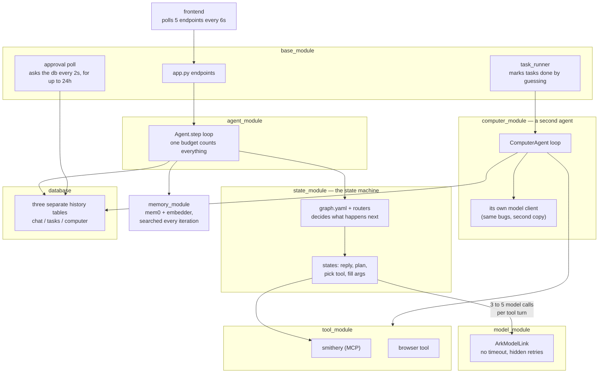
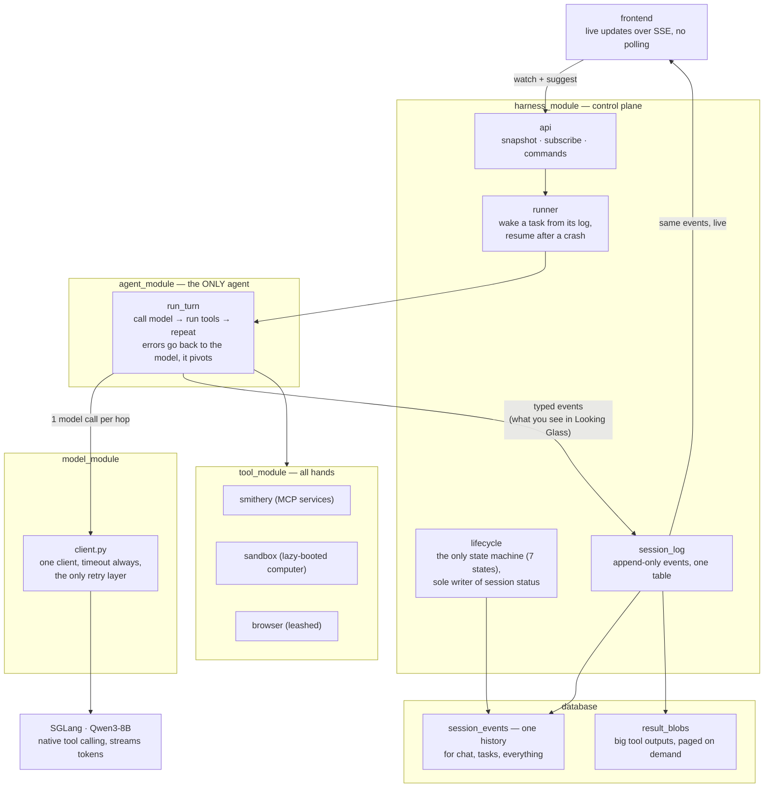

# Single-Loop Redesign — Native Tool Calling

## START HERE

This is the entry point. It tells you **what to build next**. It does NOT tell you
whether what you built is correct.

> **Gate: `docs/contracts.md` is law. Read it before writing code.**
> This document is a plan and it goes stale as tasks complete. Contracts states
> the invariants and does not. If the two ever disagree, contracts wins and this
> file is the bug.

Which question are you asking:

| Question | Doc |
|---|---|
| What do I build next, and in what order? | **this file** → Implementation Plan |
| What is guaranteed? (events, endpoints, lifecycle, IO) | `docs/contracts.md` |
| Why is it like this? Can I change it? | `docs/decisions.md` (D1-D26) |
| What happens at runtime in state X? | `docs/decision_tables.md` |
| What tables and columns exist? | `docs/schema.md` |
| Who is allowed to do what? | `docs/auth.md` |
| What does the user see? | `docs/looking_glass_spec.md` |
| What is still unresolved? | `docs/GAPS_2026-08-06.md` (Tier 2 and 3) |

**Never read `docs/deprecated/`.** It is the architecture this redesign deletes.

Two standing rules for any session picking this up. Gaps in `GAPS_2026-08-06.md`
are pinned to the task that forces them, so read that task's gaps before starting
it, not the whole file. And Task 0a is a measurement, not a formality: everything
downstream assumes native tool calling works on this model, so it gets measured
before Task 7 deletes the fallback machinery.

---

This document is the why and the build plan.

**Status:** Task 0 (preflight) in progress | **Author:** John Wallace | **Last updated:** 2026-08-13

---

# Problem

One "use a tool" turn today costs 3-5 sequential LLM calls (reply, plan, tool
choice, tool args, advance decision), each preceded by a Postgres read and a
vector search, routed through a state graph. On a self-hosted 8B this is the
difference between instant and tens of seconds.

Stacked on top: three nested retry loops (SDK 600s default x client retries x
agent-loop retries) give a worst-case turn of ~16.5 hours and 99 requests.
Streaming is fake (full completion, then per-char replay). The task runner conflates
transitions with retries and marks runaway tasks **completed**. Approvals poll
Postgres every 2s for up to 24h, then fail the task.

Success: first token < 1s, one LLM call per hop, warm tool calls in 1 round trip,
tasks that resume instead of re-executing, production code ~4.5k lines.

---

# Technical Background

**Native tool calling.** Our server is **SGLang** (`model_module/run.sh`:
`lmsysorg/sglang` running `Qwen/Qwen3-8B` on :30000), not vLLM.
SGLang's OpenAI-compatible endpoint returns `tool_calls` inside the same
completion that streams text, given `--tool-call-parser qwen25` at launch. The
chat template does in one call what ARKOS does in three. Routing is already in
the response shape: tool calls present → execute and loop; absent → done.

⚠️ **Launch-flag prerequisite:** the checked-in `run.sh` does NOT pass
`--tool-call-parser`. Without it SGLang returns tool calls as raw text instead
of a parsed `tool_calls` field, and the whole redesign has nothing to stand on.
Verify what the running server was actually launched with before Task 0a, and
fix `run.sh` if it drifted from production.

**Qwen3-8B thinks by default, and that is a launch-flag problem too.** Qwen3 is a
hybrid reasoning model: it emits `<think>` blocks unless told otherwise. Without
`--reasoning-parser qwen3` that reasoning is returned inside `content`, so it
streams into our `content` events and renders as the model's reply. It also
spends output tokens before the first useful one, which is the latency complaint
this redesign exists to fix. Two flags, not one:

```
--tool-call-parser qwen25      # NOT "qwen3" (that is the reasoning parser name);
                               # "qwen3_coder" is for the Coder variants only
--reasoning-parser qwen3       # splits <think> into reasoning_content
```

Task 0a measures both: malformed-call rate AND whether reasoning and tool calling
interact badly (a known Qwen3 failure is tool-call XML leaking into content when
both are on). If thinking costs more latency than it buys on our schemas, disable
it per-request rather than living with it.

**Why the state graph exists.** Enum-constrained selection was built to keep a small model
on rails. The rails cost 5x latency every turn to prevent a failure (malformed
tool call) that is rare and cheaply recovered with validate-and-retry.

**Four loops today:** the multiplicative LLM retry stack; the agent step loop
(budget conflates transitions with retries — simultaneously too tight and too
loose); the 2s/24h approval poll; and browser_use's internal loop behind one
blocking tool call.

**The computer agent already proves the design.** `ComputerAgent.run()` is the
target loop (message list, native tool calling, step cap) and it shipped. The
redesign generalizes it into THE loop and deletes the class. It carries the same
infra bugs fixed here (client per access, no timeout, zero retries, 24h blocking
ask, no persistence).

**Load-bearing and kept:** Smithery vault+proxy OAuth, the approvals table,
Pydantic at boundaries, the FastAPI surface, `browser_use` (behind the tool
boundary). Not kept, because it never existed: `emit_log` / `logging_module` —
CLAUDE.md mandates it, the repo has neither, so it gets built (D17).

---

# Proposed Approach

### Today



### Target




One loop (`run_turn`): in-memory message list, one streaming completion with
`tools=[...]`; execute tool calls (readonly in parallel), append results, call
again; no tool calls means done. ~200 lines with budgets and error handling.
All interfaces, invariants, and the event vocabulary: **contracts.md**.

- **States collapse into prompts and tools.** Every pause is a tool that parks:
  `ask` for a question, `request_approval` for consent (both park the session,
  event-driven resume). Completion = explicit `finish_task`. Graphs/routers/StateOutput are
  deleted, not ported.
- **One retry policy.** One cached client, timeout always set, the client is the
  only retry layer; the loop gets honest counters (hops, per-tool attempts).
- **Real streaming, structurally.** Client deltas re-yield as `content` events
  immediately; no accumulation step exists; pinned by conformance test.
- **Write-behind persistence.** The turn never re-reads Postgres mid-loop;
  events append as they happen; resume folds the log back into messages.
- **One agent, zero agent classes.** ComputerAgent deleted; computer_module
  dissolved — sandbox manager + toolset move to `tool_module/sandbox/`, next to
  `tool_module/browser/`. All hands live in tool_module. Browser stays a leashed
  third-party inner loop behind `browser_task`.
- **One session, two modes — nothing spawns.** The session you chat with plans,
  executes, and is the one you reopen. *Attended* (turn-taking) flips to
  *unattended* when you approve; approving is the handoff, inside one transcript.
  `create_session` and the word "subagent" are both gone. Parallelism is the
  project grid. New state `idle` = alive, waiting for you.
- **Long-term memory is REMOVED for now** (mem0, embedder service, extraction —
  all dropped; the transcript is the memory within a session). Reimplementation
  TBD, direction in contracts.md.
- **Context recovery, v1 = rungs 0-1 only.** Input budget =
  `llm.context_window - llm.max_tokens` (today 32768 - 8192 ≈ 24k; both are
  config, not constants — see the config contract). Rung 0, proactive: estimate
  the view per hop; over `context.recovery_threshold` (0.8) of budget → apply
  rung 1 preemptively. Rung 1, drop re-derivable: clear the oldest tool results
  whose tool is in `context.clearable_tools` from the VIEW, replaced with
  `[cleared, ref b_x, re-read if needed]`; full content stays in result_blobs. Every drop recorded as a `view_transform` event (invariant in
  contracts.md: view-only, log never rewritten, deterministic replay).
  Today's behavior this replaces: overflow surfaces as BadRequestError →
  non-retryable → turn dies; token estimates via cl100k on a Qwen tokenizer;
  char/token unit confusion in tool_result_budget; blind head+tail truncation
  that destroys data. *Future work (not v1):* rung 2 demote-to-preview+ref,
  rung 3 summarize-old-hops under a preservation contract, and the reactive
  arm (classify the server's context-length error as recoverable and re-enter
  the ladder one rung deeper, sticky flags + breakers) — adopt if rungs 0-1
  prove insufficient in practice.

**Not in scope:** model swap (config later), replacing browser_use, watching/
triggers (scrapped, own future feature), multi-worker leasing (Task 13).

**Deletion inventory:**

Estimated before, measured after Tasks 7+8 landed on 2026-08-13.

| Module | Before | Planned | **Actual** | Notes |
|---|---|---|---|---|
| state_module | 1,708 | ~0 | **0** | deleted: graphs, routers, discovery, both agent packages |
| memory_module | 335 | ~0 | **0** | deleted: mem0 + embedder out of the stack |
| computer_module | 1,757 | 0 | **0** | dissolved: agent/model/runner/router/store deleted; sandbox+tools → `tool_module/sandbox/` |
| base_module → harness_module | 2,564 | ~1,700 | **172** | app/task_runner/tasks/task_store/users deleted outright. Only `jwt_utils` + `browser_routes` survive; the four control-plane files are Tasks 4-5, not yet written |
| agent_module | 535 | ~250 | **629** | loop.py + events.py; `agent.py` deleted |
| model_module | 442 | ~150 | **363** | one client; ArkModelNew + llm_json deleted |
| tool_module | 1,930 | ~1,950 | **2,828** | envelope · registry · connections · smithery · tools/ · browser · sandbox (absorbed) |
| config_module + db | — | — | **515** | loader, migration 0, asyncpg pool |
| tests | 5,037 | ~2,200 | **3,894** | 14 test files went with their machinery |
| **Total (py)** | **~14.9k** | **~6.3k** | **8,576** | production 9.9k → **4,682** against a ~4.5k target |

Where the two big misses are, and why neither is alarming: `harness_module` is
172 instead of ~1,700 because its four files are not written yet, so that gap is
Tasks 4-5 arriving, not a saving. `tool_module` overshot ~900 because the
inventory assumed sandbox would arrive trimmed; it arrived as-is (Task 8's
integration is unfinished) and the browser tool is untouched until Task 9.

Migration is replace-then-delete, with no flag and no bridge: Tasks 1-3 build
the new path alongside the old, 0c wipes the database, Task 4 cuts over, and the
old modules are dead code deleted one PR each in Task 7. The app is down between
0c and Task 4 landing.

---

# Implementation Plan

## Task 0: Preflight (before any implementation)

**0a — model reliability harness (the load-bearing test).**
**Done when:** (i) one authoritative model config exists — `run.sh` launches
**Qwen3-8B** with `--tool-call-parser qwen25` AND `--reasoning-parser qwen3`,
`llm.model_name` matches the served name (not the stale `"tgi"`), and `computer_agent.llm` is deleted along with its wrong
`qwen3` tool-parser comment, while `computer_agent.sandbox` is PROMOTED to a
top-level `sandbox:` block in the same edit (deleting it wholesale breaks the live
sandbox, which `computer_module/sandbox.py` reads at runtime and which Task 8, the
last deletion, has not relocated yet); (ii) a script fires
~20 realistic prompts at the real SGLang endpoint with our actual tool schemas
and reports malformed-call rate + repair-retry success rate; (iii) the decision
is recorded in Implementation Notes (>~5% malformed → temp 0.2 for tool turns,
or SGLang constrained decoding / xgrammar). Everything downstream assumes this
passes; measure before building on it.
**Effort:** half day | **Blockers:** none
**Status:** done — (i) landed in `5f3705f`; (ii) measured 2026-08-11, passed;
(iii) recorded in Implementation Notes below. The probe script was a one-off and
was deleted rather than committed: it imported `computer_module.tools`, which
Task 8 removes. Re-measuring means rewriting it against the then-current tool
schemas, which is the correct amount of work for a check that only re-runs when
the served model or its parser flags change.

**0b — Quarantine the superseded guidance (do NOT rewrite CLAUDE.md yet).**
**Done when:** (i) a ~10-line note at the top of CLAUDE.md: redesign in progress,
`docs/contracts.md` supersedes the architecture contracts below, `state_module`
is deprecated, add no new states/routers; (ii) `docs/specs/` moved to
`docs/deprecated/` with a README that tells AI assistants never to open it, and
CLAUDE.md carries the same instruction. Without both, every AI-assisted session
reads instructions mandating the architecture being deleted. (iii) The docstrings
that route implementers there — `agent_module/agent.py:305,306,328`,
`computer_module/__init__.py:4`, `computer_module/agent.py:5`,
`spike_sandbox.py:100` — are deleted during Tasks 7/8, which delete or rewrite
those files anyway; `agent.py:306` points at `ENVIRONMENT_SPEC`, a doc that was
never written. Full CLAUDE.md rewrite stays in Task 7.
**Effort:** 30 min | **Blockers:** none
**Status:** (ii) done — `docs/deprecated/` exists, CLAUDE.md guardrail in place.

**0c — Database reset to migration 0** (full DDL in `schema.md`).
**Done when:** existing data cleared (zero users; **preserve the `waitlist`
table — it has real signups**), `db/migrations/0001`–`0007` **deleted** (done —
they described tables the redesign does not build; nothing migrates forward), and
a single migration 0 creates the target schema directly: `users`, `projects`,
`project_files`, `sessions`, `session_events`, `result_blobs`, `system_events`,
`approvals`, `resource_leases`, `user_sandboxes`, `user_connections`,
`shared_connections`. No history migration — fresh cutover. `repeat_tasks` is
carried over untouched alongside `waitlist`.
**Effort:** half day | **Blockers:** none to write; **RUNS AFTER TASK 3**
**Blocked by Task 14** (host hardening) unless that risk is accepted knowingly.
**Runs after Tasks 1-3, immediately before Task 4.** Those three build the
client, loop and tool layer and none of them need the new database. There is no
expand/contract and no bridge: this drops the old tables outright, so **the app
is DOWN from the moment 0c runs until Task 4 lands.** That is the price of a
clean overhaul, and it is accepted. Reap all e2b sandboxes first (see the
migration header).
**Status:** DONE — applied 2026-08-13. 15 tables in `public`, `waitlist` (8 rows)
and `repeat_tasks` preserved. Two teardown gaps found only by running it against
the real database; both fixed in the same commit (see Implementation Notes).

## Task 1: Model client rewrite
**Done when:** one cached client (timeout=90, max_retries=0); the only retry
layer (classified, ≤3, backoff; background source fails fast on overload);
streaming + tools through one path. Replaces ArkModelLink AND ToolCallingModel.
**Touch:** `model_module/client.py` | **P0, 1d** | **Blockers:** none
**Test:** hung endpoint → ≤3 requests, bounded wall clock, no event-loop stall.
**Status:** written + tested (`tests/test_model_client.py`, 12 tests). Nothing
calls it yet, and `ArkModelLink`/`ToolCallingModel` are still live for their
existing callers — they are deleted in Tasks 7/8, not here.

## Task 2: Core loop
**Done when:** `run_turn` per contracts.md (generalized from ComputerAgent.run,
which is deleted); yields the event vocabulary; validates args with one repair
retry; honest hop/attempt counters; streams structurally.
**Touch:** `agent_module/loop.py`, `events.py` | **P0, 2-3d** | **Blockers:** 1
**Test:** mocked model, 2 tool calls then text → exactly 3 LLM calls, parallel
readonly execution, `done{completed}`.
**Status:** done in commits 2a (events), 2b (run_turn), 2c (parallel readonly),
2d (review fixes). 45 tests. `run_turn` takes three parameters the contracts
signature omits: `dispatch` (required, or the loop must import `tool_module` and
stops being pure) plus `hops_used` and the model pass-throughs.
**Not done here:** `tool_result.ref` is only ever what the envelope supplies, so
an oversized result with no blob loses its tail. The blob store is Task 4/5.

## Task 3: Tool layer slim-down
**Done when:** envelope + manifest per contracts.md; one ClientSession; TTL
revalidation; `user_connections` persisted + rehydrated, keyed by `(user_id,
mcp_url)`; `_user_conn_id()`/`_shared_conn_id()` formulas DELETED — the id is
minted once and stored (D24); scoped.py deleted; tools/call timeout 120s.
**Touch:** `tool_module/` | **P0, 2d** | **Blockers:** none
**Test:** warm per-user tool call = exactly 1 HTTP request; restart = 1 DB read,
0 Smithery PUTs for connected servers; renaming a key under `mcp_servers:`
changes no row and prompts no reconnect.
**Status:** DONE. 3a envelope, 3b registry + manifest + the five control tools,
3c review fixes, 3d the Smithery half. `ToolSpec`/`ResultEnvelope` are defined
once in `tool_module/envelope.py` and imported by the loop, so the mirrors
cannot drift. `registry.bind()` adapts dispatch to the loop's `(name, args)`
shape. `smithery.py` is rewritten on D24: `tool_module/connections.py` stores
`user_connections` / `shared_connections`, ids are minted once and written
before the PUT, one `ClientSession`, TTL revalidation that never re-PUTs.
`scoped.py` and `tool_call.py` are deleted.
**Deviation resolved:** `manifest` now matches contracts —
`manifest(user_id, *, mcp=None)`. It is async (the MCP half is a DB read) and
takes the source by injection so the registry stays free of transport.
**Cost, accepted knowingly:** the old path is broken from here, not at Task 4.
`base_module/app.py`, `task_runner.py`, `state_module/*/state_tool.py` and
`computer_module/agent.py` still import the deleted names; 0c already dropped
the tables they read, so they were corpses regardless. `tests/test_scoped.py`,
`test_smithery_isolation.py`, `test_smithery_local_tools.py`,
`test_state_module.py` and `test_tasks.py` went with them (−55 tests).

## Task 4: Chat on the new loop
**No flag.** A flag whose off position 500s is not a rollback, it is dead config
pretending to be one: 0c has already dropped the tables the old path reads. This
is a straight cutover, and the app is down until it lands.
**Done when:** chat routes through `run_turn`; first token before
completion (measured); memory auto-injection code DELETED (memory removed);
SSE error chunk on mid-stream failure; chat transcripts ride `session_events`;
an attended turn ends in `idle`.
**Touch:** `harness_module/app.py` | **P0, 2d** | **Blockers:** 1-3, 0c applied
**Note:** `app.py` is DELETED (Task 7 ran early), so this is now "write
`harness/api.py`" rather than "untangle app.py". There is no HTTP server until
it lands. `harness_module/` currently holds only `jwt_utils.py` and
`browser_routes.py`; the naming question (Open Question 5) is now free to settle.
**Test:** first SSE chunk arrives before mocked model finishes; forced mid-stream
exception yields an error chunk, not truncation.

## Task 5: Unattended runs on the new loop
**Done when:** runner per contracts.md (wake/fold/lease); `POST /sessions/{id}/approve`
flips attended → unattended; completion ONLY via `finish_task` when unattended;
`idle` on an attended turn end; terminal reason recorded; budgets enforced;
cancel wins races.
**Touch:** `harness_module` runner/task_store/tasks | **P1, 3d** | **Blockers:** 4
**Test:** kill mid-task → resume at cursor, no duplicate side effects; budget
exhaustion → `failed{max_hops}`, never completed.

## Task 6: Event-driven approvals
**Done when:** `request_approval` parks (no polling, no timeout-fail); respond
appends + wakes at cursor; reminder at 1h.
**Touch:** `harness_module` | **P1, 2d** | **Blockers:** 5
**Test:** zero DB queries while parked; restart preserves the pending approval.

## Task 7: Delete the old machinery
**Done when:** state_module, old step/step_stream, llm_json repair, memory_module,
mem0/embedder deps, and their tests are gone; CLAUDE.md rewritten;
production LOC ≤ ~4.5k. No flag to remove, and everything here is already dead
code by now, so deletion is mechanical rather than a second cutover.
**Touch:** everywhere | **P1, several small PRs** | **Blockers:** 4-6 stable 1 week
**Test:** suite green; grep for StateHandler/StateOutput/graph.yaml/mem0 = nothing.
**Status:** DONE 2026-08-13, pulled forward ahead of Task 4. The stated blocker
("4-6 stable 1 week") was written when the old path still had to run; 0c dropped
the tables it reads, so waiting would only have preserved rubble. Deleted:
`state_module/`, `memory_module/`, `model_module/{ArkModelNew,llm_json,tests_arkmodel}`,
`agent_module/agent.py`, `base_module/{app,task_runner,tasks,task_store,users,
main_interface*,depricated}`, `tool_module/slack_notify.py` (its only caller was
`state_approval.py`, and approval reminders go by email now), and 13 test files.
**Production 9.9k → 4,682 lines; 17.4k → 8.6k with tests. Suite green at 231.**
CLAUDE.md rewrite is the one part NOT done.

## Task 8: Dissolve computer_module into tool_module/sandbox/
**Done when:** sandbox manager + toolset relocated to `tool_module/sandbox/`,
behind envelope, in the worker manifest; lazy provisioning on first sandbox
call; ComputerAgent/model.py/runner/router deleted; computer_module gone;
endpoints shimmed; no credentials in sandbox env.
**Touch:** `computer_module/` → `tool_module/sandbox/` | **P1, 3d** | **Blockers:** 1, 2, 6
**Test:** one task does MCP → sandbox code → browser in a single run, no
re-spawn, no upfront typing; sandbox boots only at first sandbox call.
**Status:** PARTIAL. `computer_module` is gone: agent/model/runner/router/store
deleted, `sandbox.py` → `tool_module/sandbox/manager.py` and `tools.py` →
`tool_module/sandbox/tools.py`. That is the dissolution, not the integration.
**Still to do, and nothing calls this code yet:** put the toolset behind
`envelope.execute`, register it in the manifest, lazy-provision on first sandbox
call, and move `manager.py` off psycopg2 onto `db.pool` — migration 0 rebuilt
`user_sandboxes` with a UUID `user_id` where it still expects TEXT, so its DB
half is broken until then. Both files carry a header saying so.

## Task 9: Browser tool on a leash
**Done when:** per contracts.md browser section — step callback wired to
`status` events; frame stream keyed (user, session) + cookie-authed + announced by
event and rendered in the right-hand canvas (replacing the fixed corner pane); result is a real envelope from history (ok/errors/ref), never a bare
string; graceful-stop budget with `wait_for` backstop; config collapses to a
`browser:` yaml section; WARNING on dropped register_* kwargs.
**Touch:** `tool_module/browser_tool.py`, `browser_stream.py`,
`harness_module/browser_routes.py` | **P2, 2d** | **Blockers:** 1
**Test:** budget kills at deadline with partial results; step events appear in
the session log; stream requires ownership; failure ≠ empty string.

## Tasks 10-11: moved to `docs/looking_glass_spec.md`
(Looking Glass v1; Projects + Command Center.)

## Task 12: Frontend modernization
**Done when:** Vite build (production React, no runtime Babel, sub-1s paint);
push everywhere (EventSource + Last-Event-ID), polling deleted; optimistic
commands; motion + skeletons.
**Touch:** `frontend/` | **P1, 4-5d** | **Blockers:** 4, LG spec Task 10
**Test:** cold load <1s no blank-then-pop; cancel reflects instantly and
reconciles; network drop resumes from last seq with no missed transitions.

## Task 14: Host and database hardening (deferred 2026-08-13)
**Why:** an unresolved infrastructure incident was found on the ark box while
validating migration 0. Details, evidence and the full checklist are
**deliberately not in this repo**: see `~/dev/vulnerabilities.md` on the ark
host. Do not copy its contents here.
**Done when:** the database is not reachable from the public internet; the
privilege path that made the incident possible is removed; every credential in
that file's rotation list is rotated; the persistence hunt is complete and its
findings recorded.
**Effort:** unknown, likely 1d + a rebuild decision | **P0**
**Blocks 0c and Task 4.** 0c wipes and rebuilds the database in place. Doing
that on a host whose integrity is unestablished rebuilds the schema on sand, and
Task 4 then puts live chat on it. Settle this first or accept the risk knowingly.
**Partly done already:** the immediately dangerous account and the live process
were removed on 2026-08-13. The network exposure was NOT closed; it needs host
root. Status is tracked in that file, not here.

## Task 13: Multi-worker safety (follow-up)
**Done when:** dispatch claims via conditional update / SKIP LOCKED; semaphore
per worker; stale leases expire.
**Touch:** runner | **P2, 1-2d** | **Blockers:** 5
**Test:** two workers, 10 tasks → each executes exactly once.

---

# Tests

See the conformance table in `contracts.md` — it is the definition of done for
the spine. Task-level acceptance tests live on each card above.

---

# Open Questions

1. **Qwen3-8B tool-calling reliability on SGLang** (`qwen25` parser, our real schemas):
   measure malformed-call rate BEFORE Task 7 deletes the fallback machinery.
   >~5% → temp 0.2 for tool turns or SGLang constrained decoding. *The load-bearing
   assumption of the redesign; test first.*
2. Browser inner-loop model: text-only Qwen grounding acceptable, or does the
   browser justify a small VL model? (Someday-fork; not this spec.)
3. ~~Does anything downstream consume `StateOutput.structured_data` besides the
   runner and SSE layer?~~ **Moot:** both the producer and every consumer were
   deleted with `state_module` in Task 7.
4. Hosted frontier model for workers (local 8B for chat)? Config change after
   Task 1; cost call, not architecture.
5. ~~Naming: keep `base_module` or rename?~~ **Settled 2026-08-13:** renamed
   **`harness_module`**, matching the repo's `*_module` convention. Done while
   the directory held two files; the four control-plane modules land there in
   Tasks 4-5.

---

# Future Work (explicitly not v1)

- **`repl(code)` tool in the interactive manifest** — buddy currently has no
  sandbox by design (heavy work forks to a worker session), so it can't do quick
  math or parse a pasted CSV inline. If that proves annoying in real use, add a
  single ephemeral repl tool (no persistent sandbox). One-tool addition.
- Context recovery rungs 2-3 + the reactive arm (see Proposed Approach).
- Watching/triggers (scrapped from this redesign; own feature).
- Looking Glass two-way (operator tool takeover; hop-boundary arbitration).
- Long-term memory reimplementation (direction in contracts.md).
- Multi-process scale-out: N workers claiming tasks via leases (Task 13) +
  Postgres LISTEN/NOTIFY so any worker can serve any session's SSE stream.

---

# Decisions (alternatives considered — one line each, so nobody re-litigates blind)

- **Orchestration framework (LangGraph etc.): rejected.** A framework is a
  stale-assumption harness; our loop is ~200 owned lines.
- **Conversation FSM: deleted, not relocated.** Routing already exists in the
  tool-call response shape. The lifecycle FSM survives, in the harness.
- **Subagent return values / announce-back join: rejected.** Sessions are
  peers, fork-and-forget; results surface via table + log reads. Looking Glass
  exists because of this decision.
- **ComputerAgent: deleted; computer_module dissolved** into
  `tool_module/sandbox/` — it was our loop duplicated, with the same bugs.
- **browser_use: kept, leashed** behind one tool. Rebuilding DOM
  grounding/page-state is negative payoff.
- **mem0 / long-term memory: removed.** Explicit writes made auto-extraction
  dead weight; the transcript is session memory. Reimplementation TBD.
- **Enum-constrained tool choice: replaced** by native tool calling +
  validate-and-retry, gated on the Task 0a measurement.
- **Waitlist direct-to-Supabase from the browser: rejected** — shared DB with
  OAuth tokens; server-side proxy with an INSERT-only role instead.
- **Frontend type codegen: deferred** — hand-maintained `types.ts` + CI check
  at current team size.
- **Polling: banned.** Store-shape = wire-shape SSE with `Last-Event-ID` replay.
- **Threads for concurrency: rejected.** Sessions are asyncio coroutines; the
  rule is "never block the event loop"; the GPU is the real shared bottleneck.

---

# Implementation Notes

Newest last. Keep entries short. An entry earns its place only if a later
session would otherwise re-derive it — a measurement and the decision it forced,
a deviation from the plan and why. `git log` is the changelog; this is not.

When work contradicts this document, **amend the document in the same commit.**

---

**2026-08-11 — Task 0a(i): config was lying about the served model.** `run.sh`
launched Qwen2.5-7B-Instruct with no parser flags; the live container serves
**Qwen/Qwen3-8B** with `--tool-call-parser qwen25 --reasoning-parser qwen3`
(verified via `docker ps` + `/get_server_info`). `llm.model_name` was the
placeholder `"tgi"`; context window 32768 → 40960 (native, no
`--context-length` override). `computer_agent.sandbox` was **promoted** to a
top-level `sandbox:` block rather than deleted — `computer_module/sandbox.py`
reads it at runtime and Task 8 has not relocated it yet. Commit `5f3705f`.

**2026-08-11 — Task 0a(ii)+(iii): native tool calling measured. It passes.**
22 realistic prompts, real SGLang endpoint, our actual tool schemas, default
temperature:

| | |
|---|---|
| malformed calls | **0 / 22** |
| tool-call XML leaking into `content` | 0 |
| transport/API errors | 0 |
| spurious calls (tool used when none needed) | 0 |
| answered in prose instead of calling a tool | 2 |
| latency | median 8.3s · mean 13.8s · **max 44.2s** |

**Decision: no temperature drop for tool turns, no constrained decoding, no
xgrammar.** Threshold was ~5% malformed; measured zero. The feared
`--reasoning-parser` × `--tool-call-parser` interaction did not appear.

Caveats worth carrying forward:

- **Bound to Qwen3-8B with those two parser flags.** Change either and
  re-measure before trusting this.
- Task 2's single repair retry stays regardless — it is cheap, and 22 prompts
  is not a proof.
- The 2 prose answers were the model declining to call a tool, not bad output.
  A Task 2 prompting concern, not a decoding one.
- Max 44.2s is the number for Task 1: under `timeout=90`, but not by the margin
  the median implies.

**2026-08-13 — Task 0c: migration 0 written, and the spec was wrong about it.**
`db/migrations/0000_migration_0.sql` is built from `schema.md` + contracts, not
from 0c's own table list — that list named `tasks`/`task_approvals` (renamed to
`sessions`/`approvals`) and omitted `sessions`, `system_events`,
`resource_leases`, `shared_connections`. Building from it would have shipped a
schema with no operational log and no lease table. 0c is now corrected; a sweep
of the other law docs for stale *table names* came back clean (that sweep did
not cover other stale values — `contracts.md` still had `context_window: 32768`,
found later by review and corrected to 40960).

Two details: the migration deletes the `schema_migrations` rows for
`0001`–`0007`, so a DB that ran the deleted chain does not report them applied;
and `repeat_tasks` has no FK to `users`, so it survives the `users` drop.

Verified by applying it to a throwaway DB — 12 tables, bookkeeping correct.
**Not yet applied to a real database:** it drops `users` and `tasks`, so it runs
at the Task 4 cutover.

**2026-08-13 — Task 1: a mid-stream failure is NOT retried by the client.**
The contract says the client retries within one `generate()` call, but a stream
that dies after emitting deltas cannot be replayed — the caller has already seen
the text, and retrying would duplicate it on screen and duplicate tool calls in
the transcript. So: retry only before the first delta; after that, raise
`retryable=True` and let the loop re-attempt the whole hop (Task 2). Still two
bounded layers, as contracts require. Pinned by
`test_midstream_failure_is_not_retried`.

Also settled here: `source` is `interactive | background` and changes exactly
one behaviour — `background` does not retry overload (429), so an unattended run
yields the GPU slot instead of queueing for it. Everything else retries
identically. New config keys under `llm:`: `timeout_s: 90` (0a measured max
44.2s), `max_attempts`, `retry_backoff_s`, `retry_backoff_max_s` — no magic
numbers in the client. `ModelError` gained `kind`; it defaults to `"unknown"`
only so the pre-redesign callers keep working until Tasks 7-8 delete them.

**2026-08-13 — review pass on Tasks 0-1; the teardown was the weak half.**
Migration 0 created the right schema but under-dropped. Added:
`computer_tasks` / `computer_task_events` (a DB that stopped at `0006` can never
run `0007` now the chain is deleted, so 0007's drops had to move here), mem0's
`memories` pgvector collection (memory_module pointed mem0 at *this* database),
and the orphaned `set_updated_at()`. Re-verified by seeding a realistic
pre-redesign DB — FKs, trigger, enum types, `waitlist` and `repeat_tasks` with
rows — then applying: zero leftovers, both preserved tables intact.

`user_sandboxes` is dropped rather than migrated (TEXT → UUID `user_id` cannot
carry across). That loses every live e2b handle, so sandboxes must be reaped
BEFORE the cutover or they keep billing to nobody. Now a WARNING in the
migration header.

Also corrected: `contracts.md` said `context_window: 32768` while config said
40960 — contracts contradicted its own rule that the value match the actual
SGLang launch, so contracts moves to 40960. And Task 1's config key was renamed
`max_attempts` → **`max_retries`** to match contracts, though the two halves of
contracts disagree on its meaning (the yaml block says "max_retries: 3", the
conformance test says "<=3 attempts"). Implemented as a cap on total attempts.
**Open question for the author: which did you mean?**

**2026-08-13 — sequencing settled: no flag, no bridge.** 0c runs after Tasks 1-3
and immediately before Task 4. The app is down in between. A flag was considered
and rejected: 0c drops the tables the old path reads, so the off position would
500 rather than roll back. Task 4's flag and Task 7's flag-removal step are gone
from the plan; Task 7 is now mechanical deletion of dead code.

**2026-08-13 — `append()` must hold `pg_advisory_xact_lock(session_id)`.**
BIGSERIAL assigns seq before commit, so an api transaction holding 100 can commit
after the loop's 101 and an SSE reader that already sent 101 never emits 100.
The lock makes commit order equal seq order within a session. D13 is untouched:
it argued against per-session counters, not per-session locking. The user-scoped
grid feed (G27) spans sessions and needs a hold-back window when it is built.
Pinned by a new conformance test, `test_append_ordering_under_concurrency`.

**2026-08-13 — schema.md amended while amendments are still free.** CHECK
constraints on `sessions.mode`, `sessions.status` and `session_events.kind`; a
partial unique on `approvals (session_id, tool_call_id) WHERE answered_at IS
NULL`; `ON DELETE CASCADE` on `resource_leases.session_id`; and the
`(user_id, created_at)` index the `new_sessions_per_hour` quota actually uses.
Verified against a live DB: bad status, double-park and bad kind all rejected.

Two known-wrong model declarations are recorded in the contracts violations
table rather than fixed: `app.py:67` (dies with Task 4) and `memory.py:58`
(dies with Task 7). Fixing scheduled corpses is wasted effort; leaving them
invisible is the actual risk.

**2026-08-13 — 0c applied, and only the real database found the last two holes.**
The migration had been verified against a seeded throwaway DB and reported clean.
Run against the actual one it failed on the first statement, and the second gap
would have passed silently:

- `public.memories` is a **VIEW** over `vecs.memories`. mem0 goes through the
  `vecs` extension, so the real vectors (500 rows) plus `memories_entities` and
  `mem0migrations` live in the `vecs` schema. `DROP TABLE memories` errored;
  dropping only the public name would have left every vector behind.
  `vecs.urop_benchmark*` is a different project's and is deliberately untouched.
- `user_oauth_tokens` — pre-Smithery OAuth storage, 3 rows of plaintext
  `access_token`/`refresh_token`, read by zero lines of code, dropped by no
  migration. It would have outlived the users keying it. Now dropped.

The lesson worth carrying: a seeded DB proves the migration handles what you
remembered to seed. Neither of these was in the seed.

Sandboxes were NOT reaped first. Four were alive (all paused since June); their
handles are `ij06czr3ca5fl784k5lbe`, `iic0cu1gr3aqn9vt7pvub`,
`ibwyx5gj6p8s9ieqohq88`, `i3u42o3ufy9ye7901yo1n` and the owner is killing them
in the e2b console. Task 14 was NOT done first either; the risk was accepted
knowingly, per the card.

**2026-08-13 — Task 3d: a tool call never opens an OAuth flow.** The old
`call_tool` scanned every per-user server with a PUT when it did not recognise a
tool name, which is both the N-request warm path and a redirect the model cannot
complete. Now an unconnected server fails the call with `auth_required` carrying
the setup URL and `retryable=False`. Connecting is a human action through
`connect()`, never a side effect of the model reaching for something.

Also settled here: MCP specs are always `readonly=False`. A remote server does
not tell us whether a tool mutates, and guessing wrong makes the loop run writes
in parallel. And `Smithery.call` stores the blob itself when a result is over
`tools.result_view_cap_chars` — the loop view-caps for the screen but hands the
model whatever the envelope holds, and `ref` only ever comes from the envelope,
so this is where the Task 2 "oversized result loses its tail" gap actually closes
for MCP.

**2026-08-13 — Tasks 7 and 8 pulled forward; the repo is now the new shape.**
Both were scheduled late for one reason: the old path had to keep running. 0c
ended that, and everything still standing was rubble — 18 files across
`state_module`/`computer_module`/`base_module` already imported names deleted in
3d. Deferring further would have preserved dead weight and made every session
re-derive what was safe to touch.

Production 9.9k → **4,682 lines**, against a ~4.5k target. Tests 6,047 → 3,894;
suite green at 231. What survived the cull and why: `tool_module/browser_*`
(Task 9 leashes it), `tool_module/sandbox/` (moved, not integrated),
`harness_module/{jwt_utils,browser_routes}`, `config_module`, `db/`, `frontend/`,
`landing/`.

Two consequences to carry forward. **There is no HTTP server** until Task 4
writes one — `app.py` is gone rather than half-alive. And `harness_module/` is down
to two files, so Open Question 5 (keep the name or rename to `harness/`) costs
nothing to settle now and should be settled before Task 4 puts an api.py in it.
