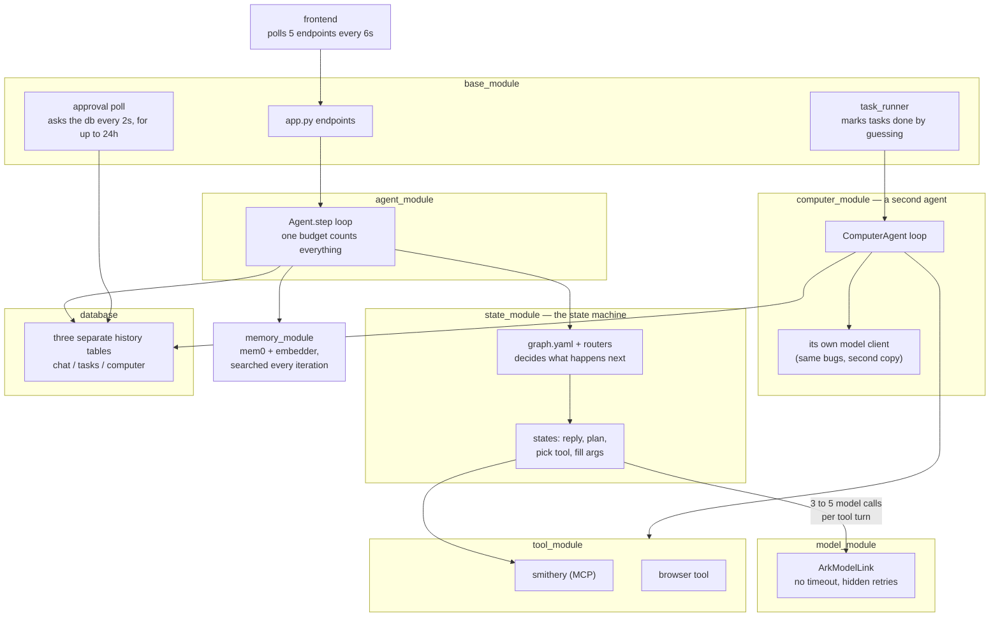
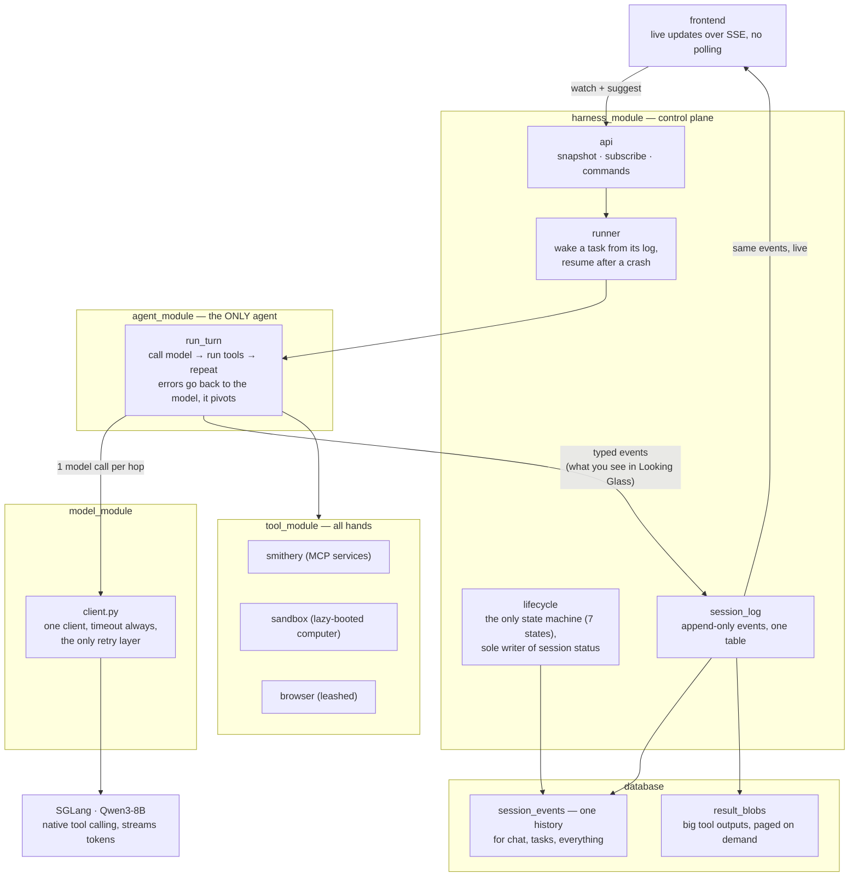

# Single-Loop Redesign — Native Tool Calling

## START HERE

This is the entry point. It tells you **what to build next**. It does NOT tell you
whether what you built is correct.

> **Gate: `docs/contracts.md` is law. Read it before writing code.**
> This document is a plan and it goes stale as tasks complete. Contracts states
> the invariants and does not. If the two ever disagree, contracts wins and this
> file is the bug.

Which question are you asking:

| Question | Doc |
|---|---|
| What do I build next, and in what order? | **this file** → Implementation Plan |
| What is guaranteed? (events, endpoints, lifecycle, IO) | `docs/contracts.md` |
| Why is it like this? Can I change it? | `docs/decisions.md` (D1-D26) |
| What happens at runtime in state X? | `docs/decision_tables.md` |
| What tables and columns exist? | `docs/schema.md` |
| Who is allowed to do what? | `docs/auth.md` |
| What does the user see? | `docs/looking_glass_spec.md` |
| What is still unresolved? | `docs/GAPS_2026-08-06.md` (Tier 2 and 3) |

**Never read `docs/deprecated/`.** It is the architecture this redesign deletes.

Two standing rules for any session picking this up. Gaps in `GAPS_2026-08-06.md`
are pinned to the task that forces them, so read that task's gaps before starting
it, not the whole file. And Task 0a is a measurement, not a formality: everything
downstream assumes native tool calling works on this model, so it gets measured
before Task 7 deletes the fallback machinery.

---

This document is the why and the build plan.

**Status:** Tasks 0-7 done · 8 partial · **Task 8 is next** |
**Author:** John Wallace | **Last updated:** 2026-08-17

**Where things actually stand, for a session picking this up cold:**

| | |
|---|---|
| Database | Supabase `sbtbbytesjobdpmqojlr`, migration 0 applied, 12 tables |
| Model | hosted OpenAI, `gpt-4.1-mini` — `run_turn` verified end to end against it |
| Suite | 383 passing; `pip install -r requirements-dev.txt` then `pytest` |
| HTTP server | `harness_module/api.py`, `uvicorn harness_module.api:app`. Needs `SUPABASE_JWT_SECRET` and `ARK_SESSION_SECRET` |
| Blocking decisions | none — endpoints, budgets, port, approval default, callback trigger all settled 2026-08-16/17 |

The 33 `tests/test_smithery.py` cases need a live `DB_URL` and skip without one,
so a green run of 219 is not the same as a green run of 252. Set `.env` first.

---

# Problem

One "use a tool" turn today costs 3-5 sequential LLM calls (reply, plan, tool
choice, tool args, advance decision), each preceded by a Postgres read and a
vector search, routed through a state graph. On a self-hosted 8B this is the
difference between instant and tens of seconds.

Stacked on top: three nested retry loops (SDK 600s default x client retries x
agent-loop retries) give a worst-case turn of ~16.5 hours and 99 requests.
Streaming is fake (full completion, then per-char replay). The task runner conflates
transitions with retries and marks runaway tasks **completed**. Approvals poll
Postgres every 2s for up to 24h, then fail the task.

Success: first token < 1s, one LLM call per hop, warm tool calls in 1 round trip,
tasks that resume instead of re-executing, production code ~4.5k lines.

---

# Technical Background

**Native tool calling.** Our server is **SGLang** (`model_module/run.sh`:
`lmsysorg/sglang` running `Qwen/Qwen3-8B` on :30000), not vLLM.
SGLang's OpenAI-compatible endpoint returns `tool_calls` inside the same
completion that streams text, given `--tool-call-parser qwen25` at launch. The
chat template does in one call what ARKOS does in three. Routing is already in
the response shape: tool calls present → execute and loop; absent → done.

⚠️ **Launch-flag prerequisite:** the checked-in `run.sh` does NOT pass
`--tool-call-parser`. Without it SGLang returns tool calls as raw text instead
of a parsed `tool_calls` field, and the whole redesign has nothing to stand on.
Verify what the running server was actually launched with before Task 0a, and
fix `run.sh` if it drifted from production.

**Qwen3-8B thinks by default, and that is a launch-flag problem too.** Qwen3 is a
hybrid reasoning model: it emits `<think>` blocks unless told otherwise. Without
`--reasoning-parser qwen3` that reasoning is returned inside `content`, so it
streams into our `content` events and renders as the model's reply. It also
spends output tokens before the first useful one, which is the latency complaint
this redesign exists to fix. Two flags, not one:

```
--tool-call-parser qwen25      # NOT "qwen3" (that is the reasoning parser name);
                               # "qwen3_coder" is for the Coder variants only
--reasoning-parser qwen3       # splits <think> into reasoning_content
```

Task 0a measures both: malformed-call rate AND whether reasoning and tool calling
interact badly (a known Qwen3 failure is tool-call XML leaking into content when
both are on). If thinking costs more latency than it buys on our schemas, disable
it per-request rather than living with it.

**Why the state graph exists.** Enum-constrained selection was built to keep a small model
on rails. The rails cost 5x latency every turn to prevent a failure (malformed
tool call) that is rare and cheaply recovered with validate-and-retry.

**Four loops today:** the multiplicative LLM retry stack; the agent step loop
(budget conflates transitions with retries — simultaneously too tight and too
loose); the 2s/24h approval poll; and browser_use's internal loop behind one
blocking tool call.

**The computer agent already proves the design.** `ComputerAgent.run()` is the
target loop (message list, native tool calling, step cap) and it shipped. The
redesign generalizes it into THE loop and deletes the class. It carries the same
infra bugs fixed here (client per access, no timeout, zero retries, 24h blocking
ask, no persistence).

**Load-bearing and kept:** Smithery vault+proxy OAuth, the approvals table,
Pydantic at boundaries, the FastAPI surface, `browser_use` (behind the tool
boundary). Not kept, because it never existed: `emit_log` / `logging_module` —
CLAUDE.md mandates it, the repo has neither, so it gets built (D17).

---

# Proposed Approach

### Today



### Target




One loop (`run_turn`): in-memory message list, one streaming completion with
`tools=[...]`; execute tool calls (readonly in parallel), append results, call
again; no tool calls means done. ~200 lines with budgets and error handling.
All interfaces, invariants, and the event vocabulary: **contracts.md**.

- **States collapse into prompts and tools.** Every pause is a tool that parks:
  `ask` for a question, `request_approval` for consent (both park the session,
  event-driven resume). Completion = explicit `finish_task`. Graphs/routers/StateOutput are
  deleted, not ported.
- **One retry policy.** One cached client, timeout always set, the client is the
  only retry layer; the loop gets honest counters (hops, per-tool attempts).
- **Real streaming, structurally.** Client deltas re-yield as `content` events
  immediately; no accumulation step exists; pinned by conformance test.
- **Write-behind persistence.** The turn never re-reads Postgres mid-loop;
  events append as they happen; resume folds the log back into messages.
- **One agent, zero agent classes.** ComputerAgent deleted; computer_module
  dissolved — sandbox manager + toolset move to `tool_module/sandbox/`, next to
  `tool_module/browser/`. All hands live in tool_module. Browser stays a leashed
  third-party inner loop behind `browser_task`.
- **One session, two modes — nothing spawns.** The session you chat with plans,
  executes, and is the one you reopen. *Attended* (turn-taking) flips to
  *unattended* when you approve; approving is the handoff, inside one transcript.
  `create_session` and the word "subagent" are both gone. Parallelism is the
  project grid. New state `idle` = alive, waiting for you.
- **Long-term memory is REMOVED for now** (mem0, embedder service, extraction —
  all dropped; the transcript is the memory within a session). Reimplementation
  TBD, direction in contracts.md.
- **Context recovery, v1 = rungs 0-1 only.** Input budget =
  `llm.context_window - llm.max_tokens` (today 32768 - 8192 ≈ 24k; both are
  config, not constants — see the config contract). Rung 0, proactive: estimate
  the view per hop; over `context.recovery_threshold` (0.8) of budget → apply
  rung 1 preemptively. Rung 1, drop re-derivable: clear the oldest tool results
  whose tool is in `context.clearable_tools` from the VIEW, replaced with
  `[cleared, ref b_x, re-read if needed]`; full content stays in result_blobs. Every drop recorded as a `view_transform` event (invariant in
  contracts.md: view-only, log never rewritten, deterministic replay).
  Today's behavior this replaces: overflow surfaces as BadRequestError →
  non-retryable → turn dies; token estimates via cl100k on a Qwen tokenizer;
  char/token unit confusion in tool_result_budget; blind head+tail truncation
  that destroys data. *Future work (not v1):* rung 2 demote-to-preview+ref,
  rung 3 summarize-old-hops under a preservation contract, and the reactive
  arm (classify the server's context-length error as recoverable and re-enter
  the ladder one rung deeper, sticky flags + breakers) — adopt if rungs 0-1
  prove insufficient in practice.

**Not in scope:** model swap (config later), replacing browser_use, watching/
triggers (scrapped, own future feature), multi-worker leasing (Task 13).

**Deletion inventory:**

Estimated before, measured after Tasks 7+8 landed on 2026-08-13.

| Module | Before | Planned | **Actual** | Notes |
|---|---|---|---|---|
| state_module | 1,708 | ~0 | **0** | deleted: graphs, routers, discovery, both agent packages |
| memory_module | 335 | ~0 | **0** | deleted: mem0 + embedder out of the stack |
| computer_module | 1,757 | 0 | **0** | dissolved: agent/model/runner/router/store deleted; sandbox+tools → `tool_module/sandbox/` |
| base_module → harness_module | 2,564 | ~1,700 | **172** | app/task_runner/tasks/task_store/users deleted outright. Only `jwt_utils` + `browser_routes` survive; the four control-plane files are Tasks 4-5, not yet written |
| agent_module | 535 | ~250 | **629** | loop.py + events.py; `agent.py` deleted |
| model_module | 442 | ~150 | **363** | one client; ArkModelNew + llm_json deleted |
| tool_module | 1,930 | ~1,950 | **2,828** | envelope · registry · connections · smithery · tools/ · browser · sandbox (absorbed) |
| config_module + db | — | — | **515** | loader, migration 0, asyncpg pool |
| tests | 5,037 | ~2,200 | **3,894** | 14 test files went with their machinery |
| **Total (py)** | **~14.9k** | **~6.3k** | **8,576** | production 9.9k → **4,682** against a ~4.5k target |

Where the two big misses are, and why neither is alarming: `harness_module` is
172 instead of ~1,700 because its four files are not written yet, so that gap is
Tasks 4-5 arriving, not a saving. `tool_module` overshot ~900 because the
inventory assumed sandbox would arrive trimmed; it arrived as-is (Task 8's
integration is unfinished) and the browser tool is untouched until Task 9.

Migration is replace-then-delete, with no flag and no bridge: Tasks 1-3 build
the new path alongside the old, 0c wipes the database, Task 4 cuts over, and the
old modules are dead code deleted one PR each in Task 7. The app is down between
0c and Task 4 landing.

---

# Implementation Plan

## Task 0: Preflight (before any implementation)

**0a — model reliability harness (the load-bearing test).**
**Done when:** (i) one authoritative model config exists — `run.sh` launches
**Qwen3-8B** with `--tool-call-parser qwen25` AND `--reasoning-parser qwen3`,
`llm.model_name` matches the served name (not the stale `"tgi"`), and `computer_agent.llm` is deleted along with its wrong
`qwen3` tool-parser comment, while `computer_agent.sandbox` is PROMOTED to a
top-level `sandbox:` block in the same edit (deleting it wholesale breaks the live
sandbox, which `computer_module/sandbox.py` reads at runtime and which Task 8, the
last deletion, has not relocated yet); (ii) a script fires
~20 realistic prompts at the real SGLang endpoint with our actual tool schemas
and reports malformed-call rate + repair-retry success rate; (iii) the decision
is recorded in Implementation Notes (>~5% malformed → temp 0.2 for tool turns,
or SGLang constrained decoding / xgrammar). Everything downstream assumes this
passes; measure before building on it.
**Effort:** half day | **Blockers:** none
**Status:** done — (i) landed in `5f3705f`; (ii) measured 2026-08-11, passed;
(iii) recorded in Implementation Notes below. The probe script was a one-off and
was deleted rather than committed: it imported `computer_module.tools`, which
Task 8 removes. Re-measuring means rewriting it against the then-current tool
schemas, which is the correct amount of work for a check that only re-runs when
the served model or its parser flags change.

**0b — Quarantine the superseded guidance (do NOT rewrite CLAUDE.md yet).**
**Done when:** (i) a ~10-line note at the top of CLAUDE.md: redesign in progress,
`docs/contracts.md` supersedes the architecture contracts below, `state_module`
is deprecated, add no new states/routers; (ii) `docs/specs/` moved to
`docs/deprecated/` with a README that tells AI assistants never to open it, and
CLAUDE.md carries the same instruction. Without both, every AI-assisted session
reads instructions mandating the architecture being deleted. (iii) The docstrings
that route implementers there — `agent_module/agent.py:305,306,328`,
`computer_module/__init__.py:4`, `computer_module/agent.py:5`,
`spike_sandbox.py:100` — are deleted during Tasks 7/8, which delete or rewrite
those files anyway; `agent.py:306` points at `ENVIRONMENT_SPEC`, a doc that was
never written. Full CLAUDE.md rewrite stays in Task 7.
**Effort:** 30 min | **Blockers:** none
**Status:** (ii) done — `docs/deprecated/` exists, CLAUDE.md guardrail in place.

**0c — Database reset to migration 0** (full DDL in `schema.md`).
**Done when:** existing data cleared (zero users; **preserve the `waitlist`
table — it has real signups**), `db/migrations/0001`–`0007` **deleted** (done —
they described tables the redesign does not build; nothing migrates forward), and
a single migration 0 creates the target schema directly: `users`, `projects`,
`project_files`, `sessions`, `session_events`, `result_blobs`, `system_events`,
`approvals`, `resource_leases`, `user_sandboxes`, `user_connections`,
`shared_connections`. No history migration — fresh cutover. `repeat_tasks` is
carried over untouched alongside `waitlist`.
**Effort:** half day | **Blockers:** none to write; **RUNS AFTER TASK 3**
**Blocked by Task 14** (host hardening) unless that risk is accepted knowingly.
**Runs after Tasks 1-3, immediately before Task 4.** Those three build the
client, loop and tool layer and none of them need the new database. There is no
expand/contract and no bridge: this drops the old tables outright, so **the app
is DOWN from the moment 0c runs until Task 4 lands.** That is the price of a
clean overhaul, and it is accepted. Reap all e2b sandboxes first (see the
migration header).
**Status:** DONE — applied 2026-08-13 to the ark box. 15 tables in `public`,
`waitlist` (8 rows) and `repeat_tasks` preserved. Two teardown gaps found only by
running it against the real database; both fixed in the same commit (see
Implementation Notes).
**Re-applied 2026-08-16 to a NEW Supabase project** — that ark database is no
longer the target. See the Implementation Note at the end of this file for the
project ref, what carried over and what did not.

## Task 1: Model client rewrite
**Done when:** one cached client (timeout=90, max_retries=0); the only retry
layer (classified, ≤3, backoff; background source fails fast on overload);
streaming + tools through one path. Replaces ArkModelLink AND ToolCallingModel.
**Touch:** `model_module/client.py` | **P0, 1d** | **Blockers:** none
**Test:** hung endpoint → ≤3 requests, bounded wall clock, no event-loop stall.
**Status:** written + tested (`tests/test_model_client.py`, 12 tests). Nothing
calls it yet, and `ArkModelLink`/`ToolCallingModel` are still live for their
existing callers — they are deleted in Tasks 7/8, not here.

## Task 2: Core loop
**Done when:** `run_turn` per contracts.md (generalized from ComputerAgent.run,
which is deleted); yields the event vocabulary; validates args with one repair
retry; honest hop/attempt counters; streams structurally.
**Touch:** `agent_module/loop.py`, `events.py` | **P0, 2-3d** | **Blockers:** 1
**Test:** mocked model, 2 tool calls then text → exactly 3 LLM calls, parallel
readonly execution, `done{completed}`.
**Status:** done in commits 2a (events), 2b (run_turn), 2c (parallel readonly),
2d (review fixes). 45 tests. `run_turn` takes three parameters the contracts
signature omits: `dispatch` (required, or the loop must import `tool_module` and
stops being pure) plus `hops_used` and the model pass-throughs.
**Not done here:** `tool_result.ref` is only ever what the envelope supplies, so
an oversized result with no blob loses its tail. The blob store is Task 4/5.

## Task 3: Tool layer slim-down
**Done when:** envelope + manifest per contracts.md; one ClientSession; TTL
revalidation; `user_connections` persisted + rehydrated, keyed by `(user_id,
mcp_url)`; `_user_conn_id()`/`_shared_conn_id()` formulas DELETED — the id is
minted once and stored (D24); scoped.py deleted; tools/call timeout 120s.
**Touch:** `tool_module/` | **P0, 2d** | **Blockers:** none
**Test:** warm per-user tool call = exactly 1 HTTP request; restart = 1 DB read,
0 Smithery PUTs for connected servers; renaming a key under `mcp_servers:`
changes no row and prompts no reconnect.
**Status:** DONE. 3a envelope, 3b registry + manifest + the five control tools,
3c review fixes, 3d the Smithery half. `ToolSpec`/`ResultEnvelope` are defined
once in `tool_module/envelope.py` and imported by the loop, so the mirrors
cannot drift. `registry.bind()` adapts dispatch to the loop's `(name, args)`
shape. `smithery.py` is rewritten on D24: `tool_module/connections.py` stores
`user_connections` / `shared_connections`, ids are minted once and written
before the PUT, one `ClientSession`, TTL revalidation that never re-PUTs.
`scoped.py` and `tool_call.py` are deleted.
**Deviation resolved:** `manifest` now matches contracts —
`manifest(user_id, *, mcp=None)`. It is async (the MCP half is a DB read) and
takes the source by injection so the registry stays free of transport.
**Cost, accepted knowingly:** the old path is broken from here, not at Task 4.
`base_module/app.py`, `task_runner.py`, `state_module/*/state_tool.py` and
`computer_module/agent.py` still import the deleted names; 0c already dropped
the tables they read, so they were corpses regardless. `tests/test_scoped.py`,
`test_smithery_isolation.py`, `test_smithery_local_tools.py`,
`test_state_module.py` and `test_tasks.py` went with them (−55 tests).

## Task 4: Chat on the new loop
**No flag.** A flag whose off position 500s is not a rollback, it is dead config
pretending to be one: 0c has already dropped the tables the old path reads. This
is a straight cutover, and the app is down until it lands.
**Done when:** chat routes through `run_turn`; first token before
completion (measured); memory auto-injection code DELETED (memory removed);
SSE error chunk on mid-stream failure; chat transcripts ride `session_events`;
an attended turn ends in `idle`; the five **`world` tools** ship in the manifest;
a **system prompt** exists and a file owns it; the **MCP connections surface** is
reachable over HTTP.
**Touch:** `harness_module/api.py` | **P0, 4d** | **Blockers:** 1-3, 0c applied
**Note:** `app.py` is DELETED (Task 7 ran early), so this is now "write
`harness/api.py`" rather than "untangle app.py". There is no HTTP server until
it lands. `harness_module/` currently holds only `jwt_utils.py` and
`browser_routes.py`; the naming question (Open Question 5) is now free to settle.
**Test:** first SSE chunk arrives before mocked model finishes; forced mid-stream
exception yields an error chunk, not truncation.
**Status:** DONE 2026-08-17, in four commits (4a lifecycle + session_log,
4b prompt + world tools, 4c runner + stream, 4d api). `harness_module/` now holds
`api · runner · lifecycle · session_log · stream · hands · jwt_utils`. Three
deviations from the card, each recorded in Implementation Notes below: the card
said "touch api.py" but chat needs the fold, so a Task 4 runner exists and Task 5
extends it; `Sink` writes behind the loop rather than inline; and `jwt_utils` was
rewritten around two secrets. Not built here, and absent rather than stubbed:
`/approve` (5), `/approvals/{id}/respond` (6), `/attention` and file upload
(Looking Glass), browser frames (9).

**Folded in 2026-08-16** — three pieces contracts requires that no card owned.
All three need the harness, so they belong here and nowhere earlier:

- **The five `world` tools** — `list_projects` · `get_project` · `list_sessions`
  · `get_session` · `list_files`. They appear once in the whole doc set
  (`contracts.md:376`) and Task 3 closed DONE having built only the control set,
  so the manifest ships 5 of the ~20 tools contracts promises. They are reads
  against `projects`/`sessions`, which is why they could not have been built
  before now.
- **The system prompt.** No system prompt exists in live code. `run_turn` takes
  `messages` already built, so whoever assembles the first message owns it — that
  is `api.py`. G44 pinned this to Task 2 and Task 2 shipped without it. The
  finishing contract (`finish_task` vs bare text), read-before-edit and the
  unique-`old_string` rule all have to be taught somewhere, and
  `tool_module/sandbox/tools.py`'s descriptions already assume they were. Port
  the surviving discipline from `git show cf27b08^:computer_module/prompt.py`
  (57 lines, the only prompt in repo history written for a native-tool-calling
  loop). Move the nudge text out of `agent_module/loop.py:175-178` in the same
  change: it is hardcoded English under a contract that bans magic values.
- **The MCP connections + OAuth surface.** `smithery.py` kept `connect()` /
  `disconnect()` / `status()` but every route that reached them died with
  `app.py`, and the endpoint table has no row for them — so D24's "the id is
  minted at connect time" has no path a human can walk, and `auth_required`'s
  setup URL points at a page that does not exist. Needs list · connect ·
  disconnect · `GET /oauth/callback/{service}`, plus one `Smithery` constructed
  at startup (nothing in production constructs one today), `initialize_shared()`
  called so no-auth servers come up, and `close()` on shutdown. Endpoint rows
  landed in `contracts.md` on 2026-08-16.
  **The callback must fire the verification**, as a post-response background
  task — Starlette's `BackgroundTask` runs after the response is sent, which is
  exactly one attempt that blocks nothing:
  ```python
  return HTMLResponse(POPUP_CLOSE_HTML, background=BackgroundTask(_verify_once, user_id, label))
  # _verify_once: await smithery.connect(user_id, label)
  # swallow AuthRequiredError (OAuth did not finish; read-repair covers it), log the rest
  ```
  `connect()` is already idempotent — `claim()`'s ON CONFLICT reuses the id and
  the PUT is a no-op re-assert — so this needs no new machinery. Without it the
  card can be completed and still strand a connection: dispatch never re-verifies
  (D24 — a tool call must not open OAuth) and revalidation skips unconnected rows,
  so a popup closed before the opener re-fetches leaves a row reading
  `auth_required` forever after a successful authorization.
  Prior art: `git show cf27b08^:base_module/app.py:302-511`. It retried
  `_ensure_user_server` 3× at 1.5s INSIDE the callback because Smithery's token
  is not always live when the redirect fires — do not copy that. It is a poll on
  the request path, and losing the race showed the user a failure for a
  connection that became valid moments later with nothing re-checking.
  Deliberately NOT repaired in dispatch or the manifest build: revalidation never
  re-PUTs (a restart costs zero Smithery writes), and repair belongs at the two
  human-triggered edges, where a human is present anyway.

## Task 5: Unattended runs on the new loop
**Done when:** runner per contracts.md (wake/fold/lease); `POST /sessions/{id}/approve`
flips attended → unattended; completion ONLY via `finish_task` when unattended;
`idle` on an attended turn end; terminal reason recorded; budgets enforced;
cancel wins races; **context-recovery ladder rungs 0-1 live in the fold**.
**Touch:** `harness_module` runner/task_store/tasks | **P1, 4d** | **Blockers:** 4
**Test:** kill mid-task → resume at cursor, no duplicate side effects; budget
exhaustion → `failed{max_hops}`, never completed; a log that overflows the input
budget folds to a view under it by clearing the oldest results that hold a blob
ref, and the same log folds byte-identically twice.

**Status:** DONE 2026-08-17, in three commits (5a approve + quota, 5b overflow +
blobbing, 5c the ladder). Not built here: the `resource_leases` machinery, moved
to Task 8 with owner sign-off (below), and the incremental wake-at-cursor fold —
the fold rebuilds the whole log every time, which is what makes replay
deterministic and what the ladder now bounds. `sessions.cursor_seq` is written
and still read by nothing.

**Two things called "lease", and only one of them is here.** The SESSION claim —
the conditional UPDATE in `lifecycle.transition`, which the lifecycle table calls
"the runner claims the lease" — is live and stays in this card's scope. The
`resource_leases` TABLE, and `acquire`/`release` around the sandbox and the
browser, move to **Task 8**: their first caller is the sandbox toolset, which
that card registers. Building them here would ship a mechanism nothing calls.

**Folded in 2026-08-16 — the context-recovery ladder.** Scoped into v1 at
Proposed Approach above, given an invariant at `contracts.md:161-165`, and built
by no card. It lands here rather than in Task 4 because the fold is this task's,
because rung 1 needs the `result_blobs` Task 4 delivers, and because a 6-hop
attended turn rarely overflows while a 15-hop worker run is where it actually
bites. Required: estimate the view per hop; over `context.recovery_threshold`
(0.8) of `llm.context_window - llm.max_tokens`, clear the oldest tool results
that hold a blob ref — regardless of which tool produced them, and never a
result without a ref — replaced in the VIEW with a pointer to `read_result`;
full content stays in `result_blobs`; every drop appended as a `view_transform`
event; the log is never rewritten. (Owner sign-off 2026-08-17 replaced the
`clearable_tools` whitelist with the ref rule; see contracts.)
Two prerequisites, both currently missing: `config.yaml` has no `context:` block
at all, and `llm.context_window` is read by zero lines of code. Fix
`done{context_overflow}` in the same change — `agent_module/loop.py:157` only
fires on `finish_reason == "length"` (output truncation), so real input overflow
still returns `bad_request` → `done{model_error}`, which is the exact violation
contracts declared resolved by deletion.

**Carried forward from the Task 4 review — NOT done in Task 5.** These were
carded here to interleave and did not get picked up before the card closed; they
are listed under Task 5 only because that is where they were filed. None blocks
anything. None permanently kills a session, falsifies the record or breaches
consent, which is the bar the review batches used. Take them with the next piece
of harness work:

- **MOVED to LG-1** (owner, 2026-08-17): the SSE backlog paging bug and the
  unpublished `lifecycle` event. Both are invisible without a browser rendering
  the stream, so they are scheduled as LG-1's first commit and tested against
  the consumer that shows them.
- ~~**`projects.updated_at` is written by nothing.**~~ **DONE 2026-08-17:**
  `lifecycle.touch_project` runs inside `transition`'s transaction, and
  `POST /sessions` touches at create time. A code-side touch rather than a
  restored trigger: the trigger was dropped deliberately in migration 0, and a
  write in code is greppable.
- ~~**Local tools never blob an oversized result.**~~ **DONE in Task 5b:**
  `run_turn` takes `store_blob`, and an oversized result from one of our own
  tools now carries a ref. Note what this did NOT change: the message appended
  to history still holds the full envelope text, capped only in the event. The
  cap bounds the screen, not the context window, which is the behaviour the
  2026-08-13 Smithery note describes. A local oversized result therefore reaches
  the model in full for the rest of that turn, and the ladder can only clear it
  at the next fold.
- **`system_events` has zero writers** repo-wide, while `contracts.md:167-176`
  makes it half the logging contract. **Deferred to Task 8, with its decision
  made (owner, 2026-08-17)** so it stops being an open question. The rule is the
  one contracts already gives: record what you would query during an incident,
  and nothing else. For v1 that is three writers — fold duration per wake (the
  measurement that would justify the incremental-fold card), terminal-reaper
  attempts (each retry is an incident breadcrumb), and lease waits and expiries
  once Task 8 creates them. Batched, best-effort, never blocking, per the
  contract. Three call sites; it rides with Task 8 because that is when the
  third writer exists.
- **Three conformance gaps.** `test_retry_budget_bounded` does not exist by that
  name (its substance is spread across `test_model_client.py` and
  `test_loop.py`). `test_streaming_first_token` pins only the SSE fan-out — its
  fake model appends straight to the log, so nothing pins the thing the sink
  exists for; drive `run_turn` with a slow fake append and assert the model
  stream never stalls. `test_event_replay_deterministic` folds a two-event log
  twice in one process and can only fail on a clock read; fold a log containing
  mid-call steering twice and assert byte equality, which pins the one place the
  fold has ordering freedom. The missing name and the thin replay test ride with
  the next cleanup commit.

## Task 6: Event-driven approvals
**Done when:** `request_approval` parks (no polling, no timeout-fail); respond
appends + wakes at cursor; **the park closes its own tool_call before parking**.
**Touch:** `harness_module` | **P1, 2d** | **Blockers:** 5
**Test:** zero DB queries while parked; restart preserves the pending approval;
a parked session's transcript has no open `tool_call`, and folds cleanly on wake.

**Status:** DONE 2026-08-17. The park lives in the harness, not the tool: the
control tools return an ordinary result so the call closes, and the sink parks
on seeing that result. Tests in `tests/test_approvals.py`.

**The 1h reminder is cut, 2026-08-17 (owner).** It was specified to go out by
email, and this system sends no mail: there is no mailer, no provider, no
sending address, and adding one is a feature with its own spec rather than a
line on this card. A parked session is already visible where a human is looking
— the project dot turns ochre and the session appears in `GET /attention` — so
the wait is surfaced by pull, not push. `users.email` stays for identity;
`schema.md` no longer justifies it by a reminder that does not exist.

Two earlier passes reached the same place and neither was actioned: G46 named
deleting the line as "the minimum acceptable alternative", and the review reply
on "why are we firing reminder notifications" recommended cutting it, noting
that 1h is the same species of magic number as the 2s poll — nothing makes it
right, and the first question is why not 15m. If a nudge is wanted later, build
it against real response-time data once the attention surface ships.

**Settled 2026-08-16 (owner): a tool call is never left open.**
`decision_tables.md` used to call an open call across a park "parked, healthy",
contradicting `contracts.md:52`. The owner ruled for contracts, and the mechanics
agree: SGLang's chat template rejects a request whose `tool_call` id has no
matching tool message, so parking with the call open makes the session
unwakeable on the next load — the park would brick the session it exists to
suspend. So `request_approval` / `ask` return a real result ("asked, awaiting a
human"), the call closes, and the session parks with a clean transcript. The
answer arrives later as a `user` event, which is what wakes the run; respond
never back-fills a `tool_result`, and no resume has to reconcile one. Full
rationale in `decision_tables.md:37-49`. Note the current stubs at
`tool_module/tools/control.py:45-46,64-65` already return `ok()` immediately,
which is the correct half — what is missing is the park itself.

## Task 7: Delete the old machinery
**Done when:** state_module, old step/step_stream, llm_json repair, memory_module,
mem0/embedder deps, and their tests are gone; CLAUDE.md rewritten;
production LOC ≤ ~4.5k. No flag to remove, and everything here is already dead
code by now, so deletion is mechanical rather than a second cutover.
**Touch:** everywhere | **P1, several small PRs** | **Blockers:** 4-6 stable 1 week
**Test:** suite green; grep for StateHandler/StateOutput/graph.yaml/mem0 = nothing.
**Status:** DONE 2026-08-13, pulled forward ahead of Task 4. The stated blocker
("4-6 stable 1 week") was written when the old path still had to run; 0c dropped
the tables it reads, so waiting would only have preserved rubble. Deleted:
`state_module/`, `memory_module/`, `model_module/{ArkModelNew,llm_json,tests_arkmodel}`,
`agent_module/agent.py`, `base_module/{app,task_runner,tasks,task_store,users,
main_interface*,depricated}`, `tool_module/slack_notify.py` (its only caller was
`state_approval.py`, and nothing notifies out-of-band now), and 13 test files.
**Production 9.9k → 4,682 lines; 17.4k → 8.6k with tests. Suite green at 231.**
CLAUDE.md rewrite is the one part NOT done.

## Task 8: Dissolve computer_module into tool_module/sandbox/
**Done when:** sandbox manager + toolset relocated to `tool_module/sandbox/`,
behind envelope, in the worker manifest; lazy provisioning on first sandbox
call; ComputerAgent/model.py/runner/router deleted; computer_module gone;
endpoints shimmed; no credentials in sandbox env; **`resource_leases`
acquire/release around sandbox use, a contended wait emitting
`status{label:"waiting for the sandbox"}` while staying `running`, and the lease
released on terminal and on park.**
**Touch:** `computer_module/` → `tool_module/sandbox/` | **P1, 3d** | **Blockers:** 1, 2, 6
**Test:** one task does MCP → sandbox code → browser in a single run, no
re-spawn, no upfront typing; sandbox boots only at first sandbox call.
**Status:** PARTIAL. `computer_module` is gone: agent/model/runner/router/store
deleted, `sandbox.py` → `tool_module/sandbox/manager.py` and `tools.py` →
`tool_module/sandbox/tools.py`. That is the dissolution, not the integration.
**Still to do, and nothing calls this code yet:** put the toolset behind
`envelope.execute`, register it in the manifest, lazy-provision on first sandbox
call, and move `manager.py` off psycopg2 onto `db.pool` — migration 0 rebuilt
`user_sandboxes` with a UUID `user_id` where it still expects TEXT, so its DB
half is broken until then. Both files carry a header saying so.

**Moved here from Task 5, 2026-08-17:** the first `system_events` writers, and
the `resource_leases` machinery. The operational log gets three writers, decided
2026-08-17 and scoped by the contracts rule "record what you would query during
an incident": fold duration per wake, terminal-reaper attempts, and the lease
waits and expiries this card creates. Batched, best-effort, never blocking.

The `resource_leases` machinery. Task 5
owns the SESSION claim (the conditional UPDATE in `lifecycle.transition`); what
lands here is `acquire`/`release` for `sandbox:{user}` and `browser:{user}`,
because the sandbox toolset this card registers is their first caller. Held for
the whole session, not per call; released on terminal and on park; a contended
session stays `running` and says so with a `status` event rather than parking.
It is in the done-when above so the card cannot close with it unreachable.

## Task 9: Browser tool on a leash
**Done when:** per contracts.md browser section — step callback wired to
`status` events; frame stream keyed (user, session) + cookie-authed + announced by
event and rendered in the right-hand canvas (replacing the fixed corner pane); result is a real envelope from history (ok/errors/ref), never a bare
string; graceful-stop budget with `wait_for` backstop; config collapses to a
`browser:` yaml section; WARNING on dropped register_* kwargs; **`browser_task`
is in the manifest and reachable from `run_turn`**.
**Touch:** `tool_module/browser_tool.py`, `browser_stream.py`,
`harness_module/browser_routes.py` | **P2, 2d** | **Blockers:** 1
**Test:** budget kills at deadline with partial results; step events appear in
the session log; stream requires ownership; failure ≠ empty string;
`manifest()` contains `browser_task`.

**Carded from the Task 4 review, 2026-08-17.** `harness_module/browser_routes.py`
is now mounted by no application — `api.py` deliberately leaves it out, because
`_resolve_user_id` still trusts a client-supplied id. It is dead code carrying a
live violations row, and the line numbers cited at `contracts.md:551` are stale.
Delete it when this card lands its replacement.

**Folded in 2026-08-16 — registration was missing from the done-when.** Every
other item above leashes a browser the model cannot currently reach:
`register_browser_tool()` (`browser_tool.py:365-389`) calls
`tool_manager.register_local_tool()`, an API that died with the ToolManager in
Task 3, so no class in the repo defines it and `browser_task` appears in no
manifest. Task 8 states its equivalent explicitly ("register it in the
manifest"); this card did not, and a card can be completed exactly as written
while leaving the tool unreachable. Registration is now part of done.

## Tasks 10-11: moved to `docs/looking_glass_spec.md`
(Looking Glass v1; Projects + Command Center.)

## Task 12: Frontend modernization
**Done when:** Vite build (production React, no runtime Babel, sub-1s paint);
push everywhere (EventSource + Last-Event-ID), polling deleted; optimistic
commands; motion + skeletons.
**Touch:** `frontend/` | **P1, 4-5d** | **Blockers:** 4, LG spec Task 10
**Test:** cold load <1s no blank-then-pop; cancel reflects instantly and
reconciles; network drop resumes from last seq with no missed transitions.

## Task 14: Host and database hardening (deferred 2026-08-13)
**Why:** an unresolved infrastructure incident was found on the ark box while
validating migration 0. Details, evidence and the full checklist are
**deliberately not in this repo**: see `~/dev/vulnerabilities.md` on the ark
host. Do not copy its contents here.
**Done when:** the database is not reachable from the public internet; the
privilege path that made the incident possible is removed; every credential in
that file's rotation list is rotated; the persistence hunt is complete and its
findings recorded.
**Effort:** unknown, likely 1d + a rebuild decision | **P0**
**Blocks 0c and Task 4.** 0c wipes and rebuilds the database in place. Doing
that on a host whose integrity is unestablished rebuilds the schema on sand, and
Task 4 then puts live chat on it. Settle this first or accept the risk knowingly.
**Partly done already:** the immediately dangerous account and the live process
were removed on 2026-08-13. The network exposure was NOT closed; it needs host
root. Status is tracked in that file, not here.

## Task 13: Multi-worker safety (follow-up)
**Done when:** dispatch claims via conditional update / SKIP LOCKED; semaphore
per worker; stale leases expire; **connection-cache invalidation crosses
processes**.
**Touch:** runner | **P2, 1-2d** | **Blockers:** 5
**Test:** two workers, 10 tasks → each executes exactly once; a connection
authorized on one worker is visible to another without restarting it.

**Added 2026-08-16.** `Smithery._invalidate` is per-process. The OAuth callback
can land on worker B and flip a row to `connected` while worker A's in-memory
cache still reads `auth_required` — and because `_revalidate` skips unconnected
rows, A never re-reads it for the life of the process. The user authorizes a
server and one worker keeps refusing to use it, indefinitely. Harmless at one
process, which is why it is filed here rather than on Task 4. Two ways out:
Postgres LISTEN/NOTIFY (which the scale-out plan wants anyway), or simply let
unconnected cached rows expire on the same TTL clock the connected ones already
use. The second is a two-line change and is probably enough.

---

# Tests

See the conformance table in `contracts.md` — it is the definition of done for
the spine. Task-level acceptance tests live on each card above.

---

# Open Questions

1. **Qwen3-8B tool-calling reliability on SGLang** (`qwen25` parser, our real schemas):
   measure malformed-call rate BEFORE Task 7 deletes the fallback machinery.
   >~5% → temp 0.2 for tool turns or SGLang constrained decoding. *The load-bearing
   assumption of the redesign; test first.*
2. Browser inner-loop model: text-only Qwen grounding acceptable, or does the
   browser justify a small VL model? (Someday-fork; not this spec.)
3. ~~Does anything downstream consume `StateOutput.structured_data` besides the
   runner and SSE layer?~~ **Moot:** both the producer and every consumer were
   deleted with `state_module` in Task 7.
4. Hosted frontier model for workers (local 8B for chat)? Config change after
   Task 1; cost call, not architecture.
5. ~~Naming: keep `base_module` or rename?~~ **Settled 2026-08-13:** renamed
   **`harness_module`**, matching the repo's `*_module` convention. Done while
   the directory held two files; the four control-plane modules land there in
   Tasks 4-5.

---

# Future Work (explicitly not v1)

- **`repl(code)` tool in the interactive manifest** — buddy currently has no
  sandbox by design (heavy work forks to a worker session), so it can't do quick
  math or parse a pasted CSV inline. If that proves annoying in real use, add a
  single ephemeral repl tool (no persistent sandbox). One-tool addition.
- **Session-scoped approval grants at the mode flip.** `mcp_*` tools require
  approval by default as of 2026-08-16, and `mcp_servers.<label>.auto_approve`
  is the only escape — all-or-nothing per server, decided in config by whoever
  edits the file rather than by the person running the task. An unattended run
  that parks on every `create_comment` is useless, and the answer to that is
  scoping approvals, not removing them. The seam already exists: mode flips to
  unattended when a human approves the plan (decision_tables 2b), which is the
  natural place to grant "this run may use these write tools", shown once, at
  the moment someone is already reading. Blocked by Task 6.
- Context recovery rungs 2-3 + the reactive arm (see Proposed Approach).
- Watching/triggers (scrapped from this redesign; own feature).
- Looking Glass two-way (operator tool takeover; hop-boundary arbitration).
- Long-term memory reimplementation (direction in contracts.md).
- Multi-process scale-out: N workers claiming tasks via leases (Task 13) +
  Postgres LISTEN/NOTIFY so any worker can serve any session's SSE stream.

---

# Decisions (alternatives considered — one line each, so nobody re-litigates blind)

- **Orchestration framework (LangGraph etc.): rejected.** A framework is a
  stale-assumption harness; our loop is ~200 owned lines.
- **Conversation FSM: deleted, not relocated.** Routing already exists in the
  tool-call response shape. The lifecycle FSM survives, in the harness.
- **Subagent return values / announce-back join: rejected.** Sessions are
  peers, fork-and-forget; results surface via table + log reads. Looking Glass
  exists because of this decision.
- **ComputerAgent: deleted; computer_module dissolved** into
  `tool_module/sandbox/` — it was our loop duplicated, with the same bugs.
- **browser_use: kept, leashed** behind one tool. Rebuilding DOM
  grounding/page-state is negative payoff.
- **mem0 / long-term memory: removed.** Explicit writes made auto-extraction
  dead weight; the transcript is session memory. Reimplementation TBD.
- **Enum-constrained tool choice: replaced** by native tool calling +
  validate-and-retry, gated on the Task 0a measurement.
- **Waitlist direct-to-Supabase from the browser: rejected** — shared DB with
  OAuth tokens; server-side proxy with an INSERT-only role instead.
- **Frontend type codegen: deferred** — hand-maintained `types.ts` + CI check
  at current team size.
- **Polling: banned.** Store-shape = wire-shape SSE with `Last-Event-ID` replay.
- **Threads for concurrency: rejected.** Sessions are asyncio coroutines; the
  rule is "never block the event loop"; the GPU is the real shared bottleneck.

---

# Implementation Notes

Newest last. Keep entries short. An entry earns its place only if a later
session would otherwise re-derive it — a measurement and the decision it forced,
a deviation from the plan and why. `git log` is the changelog; this is not.

When work contradicts this document, **amend the document in the same commit.**

---

**2026-08-11 — Task 0a(i): config was lying about the served model.** `run.sh`
launched Qwen2.5-7B-Instruct with no parser flags; the live container serves
**Qwen/Qwen3-8B** with `--tool-call-parser qwen25 --reasoning-parser qwen3`
(verified via `docker ps` + `/get_server_info`). `llm.model_name` was the
placeholder `"tgi"`; context window 32768 → 40960 (native, no
`--context-length` override). `computer_agent.sandbox` was **promoted** to a
top-level `sandbox:` block rather than deleted — `computer_module/sandbox.py`
reads it at runtime and Task 8 has not relocated it yet. Commit `5f3705f`.

**2026-08-11 — Task 0a(ii)+(iii): native tool calling measured. It passes.**
22 realistic prompts, real SGLang endpoint, our actual tool schemas, default
temperature:

| | |
|---|---|
| malformed calls | **0 / 22** |
| tool-call XML leaking into `content` | 0 |
| transport/API errors | 0 |
| spurious calls (tool used when none needed) | 0 |
| answered in prose instead of calling a tool | 2 |
| latency | median 8.3s · mean 13.8s · **max 44.2s** |

**Decision: no temperature drop for tool turns, no constrained decoding, no
xgrammar.** Threshold was ~5% malformed; measured zero. The feared
`--reasoning-parser` × `--tool-call-parser` interaction did not appear.

Caveats worth carrying forward:

- **Bound to Qwen3-8B with those two parser flags.** Change either and
  re-measure before trusting this.
- Task 2's single repair retry stays regardless — it is cheap, and 22 prompts
  is not a proof.
- The 2 prose answers were the model declining to call a tool, not bad output.
  A Task 2 prompting concern, not a decoding one.
- Max 44.2s is the number for Task 1: under `timeout=90`, but not by the margin
  the median implies.

**2026-08-13 — Task 0c: migration 0 written, and the spec was wrong about it.**
`db/migrations/0000_migration_0.sql` is built from `schema.md` + contracts, not
from 0c's own table list — that list named `tasks`/`task_approvals` (renamed to
`sessions`/`approvals`) and omitted `sessions`, `system_events`,
`resource_leases`, `shared_connections`. Building from it would have shipped a
schema with no operational log and no lease table. 0c is now corrected; a sweep
of the other law docs for stale *table names* came back clean (that sweep did
not cover other stale values — `contracts.md` still had `context_window: 32768`,
found later by review and corrected to 40960).

Two details: the migration deletes the `schema_migrations` rows for
`0001`–`0007`, so a DB that ran the deleted chain does not report them applied;
and `repeat_tasks` has no FK to `users`, so it survives the `users` drop.

Verified by applying it to a throwaway DB — 12 tables, bookkeeping correct.
**Not yet applied to a real database:** it drops `users` and `tasks`, so it runs
at the Task 4 cutover.

**2026-08-13 — Task 1: a mid-stream failure is NOT retried by the client.**
The contract says the client retries within one `generate()` call, but a stream
that dies after emitting deltas cannot be replayed — the caller has already seen
the text, and retrying would duplicate it on screen and duplicate tool calls in
the transcript. So: retry only before the first delta; after that, raise
`retryable=True` and let the loop re-attempt the whole hop (Task 2). Still two
bounded layers, as contracts require. Pinned by
`test_midstream_failure_is_not_retried`.

Also settled here: `source` is `interactive | background` and changes exactly
one behaviour — `background` does not retry overload (429), so an unattended run
yields the GPU slot instead of queueing for it. Everything else retries
identically. New config keys under `llm:`: `timeout_s: 90` (0a measured max
44.2s), `max_attempts`, `retry_backoff_s`, `retry_backoff_max_s` — no magic
numbers in the client. `ModelError` gained `kind`; it defaults to `"unknown"`
only so the pre-redesign callers keep working until Tasks 7-8 delete them.

**2026-08-13 — review pass on Tasks 0-1; the teardown was the weak half.**
Migration 0 created the right schema but under-dropped. Added:
`computer_tasks` / `computer_task_events` (a DB that stopped at `0006` can never
run `0007` now the chain is deleted, so 0007's drops had to move here), mem0's
`memories` pgvector collection (memory_module pointed mem0 at *this* database),
and the orphaned `set_updated_at()`. Re-verified by seeding a realistic
pre-redesign DB — FKs, trigger, enum types, `waitlist` and `repeat_tasks` with
rows — then applying: zero leftovers, both preserved tables intact.

`user_sandboxes` is dropped rather than migrated (TEXT → UUID `user_id` cannot
carry across). That loses every live e2b handle, so sandboxes must be reaped
BEFORE the cutover or they keep billing to nobody. Now a WARNING in the
migration header.

Also corrected: `contracts.md` said `context_window: 32768` while config said
40960 — contracts contradicted its own rule that the value match the actual
SGLang launch, so contracts moves to 40960. And Task 1's config key was renamed
`max_attempts` → **`max_retries`** to match contracts, though the two halves of
contracts disagree on its meaning (the yaml block says "max_retries: 3", the
conformance test says "<=3 attempts"). Implemented as a cap on total attempts.
**Open question for the author: which did you mean?**

**2026-08-13 — sequencing settled: no flag, no bridge.** 0c runs after Tasks 1-3
and immediately before Task 4. The app is down in between. A flag was considered
and rejected: 0c drops the tables the old path reads, so the off position would
500 rather than roll back. Task 4's flag and Task 7's flag-removal step are gone
from the plan; Task 7 is now mechanical deletion of dead code.

**2026-08-13 — `append()` must hold `pg_advisory_xact_lock(session_id)`.**
BIGSERIAL assigns seq before commit, so an api transaction holding 100 can commit
after the loop's 101 and an SSE reader that already sent 101 never emits 100.
The lock makes commit order equal seq order within a session. D13 is untouched:
it argued against per-session counters, not per-session locking. The user-scoped
grid feed (G27) spans sessions and needs a hold-back window when it is built.
Pinned by a new conformance test, `test_append_ordering_under_concurrency`.

**2026-08-13 — schema.md amended while amendments are still free.** CHECK
constraints on `sessions.mode`, `sessions.status` and `session_events.kind`; a
partial unique on `approvals (session_id, tool_call_id) WHERE answered_at IS
NULL`; `ON DELETE CASCADE` on `resource_leases.session_id`; and the
`(user_id, created_at)` index the `new_sessions_per_hour` quota actually uses.
Verified against a live DB: bad status, double-park and bad kind all rejected.

Two known-wrong model declarations are recorded in the contracts violations
table rather than fixed: `app.py:67` (dies with Task 4) and `memory.py:58`
(dies with Task 7). Fixing scheduled corpses is wasted effort; leaving them
invisible is the actual risk.

**2026-08-13 — 0c applied, and only the real database found the last two holes.**
The migration had been verified against a seeded throwaway DB and reported clean.
Run against the actual one it failed on the first statement, and the second gap
would have passed silently:

- `public.memories` is a **VIEW** over `vecs.memories`. mem0 goes through the
  `vecs` extension, so the real vectors (500 rows) plus `memories_entities` and
  `mem0migrations` live in the `vecs` schema. `DROP TABLE memories` errored;
  dropping only the public name would have left every vector behind.
  `vecs.urop_benchmark*` is a different project's and is deliberately untouched.
- `user_oauth_tokens` — pre-Smithery OAuth storage, 3 rows of plaintext
  `access_token`/`refresh_token`, read by zero lines of code, dropped by no
  migration. It would have outlived the users keying it. Now dropped.

The lesson worth carrying: a seeded DB proves the migration handles what you
remembered to seed. Neither of these was in the seed.

Sandboxes were NOT reaped first. Four were alive (all paused since June); their
handles are `ij06czr3ca5fl784k5lbe`, `iic0cu1gr3aqn9vt7pvub`,
`ibwyx5gj6p8s9ieqohq88`, `i3u42o3ufy9ye7901yo1n` and the owner is killing them
in the e2b console. Task 14 was NOT done first either; the risk was accepted
knowingly, per the card.

**2026-08-13 — Task 3d: a tool call never opens an OAuth flow.** The old
`call_tool` scanned every per-user server with a PUT when it did not recognise a
tool name, which is both the N-request warm path and a redirect the model cannot
complete. Now an unconnected server fails the call with `auth_required` carrying
the setup URL and `retryable=False`. Connecting is a human action through
`connect()`, never a side effect of the model reaching for something.

Also settled here: MCP specs are always `readonly=False`. A remote server does
not tell us whether a tool mutates, and guessing wrong makes the loop run writes
in parallel. And `Smithery.call` stores the blob itself when a result is over
`tools.result_view_cap_chars` — the loop view-caps for the screen but hands the
model whatever the envelope holds, and `ref` only ever comes from the envelope,
so this is where the Task 2 "oversized result loses its tail" gap actually closes
for MCP.

**2026-08-13 — Tasks 7 and 8 pulled forward; the repo is now the new shape.**
Both were scheduled late for one reason: the old path had to keep running. 0c
ended that, and everything still standing was rubble — 18 files across
`state_module`/`computer_module`/`base_module` already imported names deleted in
3d. Deferring further would have preserved dead weight and made every session
re-derive what was safe to touch.

Production 9.9k → **4,682 lines**, against a ~4.5k target. Tests 6,047 → 3,894;
suite green at 231. What survived the cull and why: `tool_module/browser_*`
(Task 9 leashes it), `tool_module/sandbox/` (moved, not integrated),
`harness_module/{jwt_utils,browser_routes}`, `config_module`, `db/`, `frontend/`,
`landing/`.

Two consequences to carry forward. **There is no HTTP server** until Task 4
writes one — `app.py` is gone rather than half-alive. And `harness_module/` is down
to two files, so Open Question 5 (keep the name or rename to `harness/`) costs
nothing to settle now and should be settled before Task 4 puts an api.py in it.

**2026-08-16 — five orphans folded into existing cards; no new task.** A
full-repo audit against contracts found five things contracts requires that no
card owned. Written up on the cards themselves (Task 4 ×3, Task 5, Task 9)
rather than as a new task, because each one belongs to work already scheduled and
a sixth card would have been a second place to look.

What the audit says about them as a group is the part worth keeping: **none was
a coding mistake.** Each is a seam between two cards where neither card's
done-when claimed it. The world tools fell between Task 3 (built the tool layer,
before `projects`/`sessions` existed) and Task 4 (builds the tables, was not
asked for the tools). The prompt fell between Task 2 (takes `messages` already
built) and Task 4 (builds them). The connections surface fell between Task 3
(kept the business logic) and Task 7 (deleted the routes). Browser registration
fell between Task 9 (leashes the tool) and Task 3 (deleted the API it registers
through). The ladder was scoped in prose and given an invariant, but prose is not
a card.

The lesson for the remaining cards: **a done-when that does not say "reachable"
does not make it reachable.** Task 8 said "register it in the manifest" and is
the only integration card that cannot be completed while leaving its code
unwired. Every other card should be read against that bar before it is started.

Two estimates moved with the scope: Task 4 2d → 4d, Task 5 3d → 4d.

All three of the decisions this note left open were settled on 2026-08-16.
`contracts.md` gained the auth and MCP connection endpoint rows (G36/G37). The
app port is whatever `config_module/config.yaml` says: the 1113 frontend fallback
and the README's 1114 are gone, and the Dockerfile's 1112 is left for the
container refactor. And the budget vocabulary collapsed rather than being mapped
— see the note below.

**2026-08-16 — three names for one question, now one.** `sessions.mode`
(`attended|unattended`), the `budgets:` keys (`interactive|worker`) and
`client.Source` (`interactive|background`) were three vocabularies for a single
predicate: is a human waiting? They arrived from different documents at
different times — mode from D5, the budget keys from the config block, `source`
from Task 1 — and nothing had ever consumed all three at once, so nobody
reconciled them. `runner.py` is the first code that would have had to, which is
why this surfaced at the Task 4 boundary and not earlier.

Resolved by deleting a vocabulary, not by writing the mapping down: the budget
keys are now `attended` / `unattended`, so `Budgets.load(mode)` takes what the
caller already has. `mode` could not move — it is a CHECK constraint in
migration 0, the lifecycle table's trigger column, and the name in
`max_unattended_sessions` — and the budget keys were two lines of yaml.

`client.Source` deliberately stays `interactive | background`. `model_module`
must not know what a session is, so that is a layer boundary rather than a third
vocabulary; `agent_module/loop.py:123` derives it from `mode` in one line. The
word `interactive` now appears in exactly three places, all of them that one
concept.

**2026-08-17 — the model is hosted OpenAI for now.** `llm.base_url` is
`https://api.openai.com/v1` and `model_name` is `gpt-4.1-mini`. Self-hosting
needs an NVIDIA GPU and there is not one on the machine doing the work; nothing
in the loop cares, because `client.py` is an `AsyncOpenAI` pointed at
`base_url`. `model_module/run.sh` still launches Qwen3-8B with the right parser
flags for when the box comes back.

Verified end to end through `run_turn`, not through a hand-rolled request: a
tool turn ran get_weather and finish_task and ended `done{completed}`, and a text
turn streamed 41 `content` events with a 1.66s TTFT and ended `done{turn_end}`.
Both tool calls arrived in ONE hop — OpenAI does parallel tool calling, and
`_batch_by_readonly` split them correctly since `finish_task` is not readonly.

Three things this exposed:

- **`llm.api_key` did not exist.** `client.py` falls back to `"-"`, which SGLang
  ignores and a real provider answers with a 401 that names no cause. It is now
  `${OPENAI_API_KEY}` in config, like every other secret.
- **gpt-5.x cannot be selected without a client change.** It rejects
  `max_tokens` in favour of `max_completion_tokens` and pins temperature. The
  4.1 family takes the parameters `client.py` already sends; gpt-4.1-nano and
  gpt-4o-mini were verified working too, if cost matters more than quality.
- **`context_window` is deliberately 128000, under the model's ~1M ceiling.**
  Self-hosted, contracts requires it to MATCH the SGLang launch flag. Hosted, the
  rule inverts to must-not-EXCEED: understating is free and bounds spend, while
  overstating buys a hard failure mid-run.

**Task 0a's measurement does not transfer.** 0/22 malformed calls was Qwen3-8B
with `--tool-call-parser qwen25 --reasoning-parser qwen3`, and its own note says
to re-measure if either changes. This changes both. The direction is favourable
and the repair retry stays regardless, so nothing is blocked — but do not cite
that number as evidence about this configuration. `reasoning` events simply stop
occurring: `reasoning_content` is SGLang's field, and the fold drops reasoning
anyway.

**2026-08-17 — Task 4: three deviations, and one of them was a latency bug.**

**The sink writes behind the loop, and the flush-window config key is gone.**
The first cut coalesced streamed `content` events on a timer before appending.
It did nothing, because the producer is serialized behind the consumer: the loop
yields a chunk, awaits the append, and only then produces the next one. So the
buffer never held more than one chunk, and every delta paid a full round trip —
about 150ms to the Supabase primary, which is thirty seconds of pure latency on
a 200-chunk reply. `Sink.emit` is now synchronous: it queues the event and a
writer task drains it, merging whatever piled up behind an in-flight append.
Coalescing became adaptive rather than tuned, so `harness.content_flush_ms` was
removed rather than defaulted. This is what contracts already called
write-behind persistence; the timer version was write-through wearing its name.

A consequence worth knowing: a failed append is now discovered one event late.
The writer records it and the drive loop raises on the next `emit`, so the run
still halts rather than continuing unrecorded — one event of lag is the price of
keeping Postgres off the token path.

**A Task 4 runner exists.** The card says "touch `api.py`", but chat transcripts
riding `session_events` means the second message of a conversation is rebuilt
from the log, and that is the fold. `runner.py` is here with the attended half
(fold · drive · translate · cancel · verify-on-wake); Task 5 adds leases,
wake-at-cursor, the approve path and the ladder. Its seams are marked in the
module docstring.

**Found by a test, and it was real:** a cancel landing during turn SETUP — the
wake repair, the fold, the manifest build, all network awaits — left the row
`running` with no task behind it, and `start()` refuses to touch a running
session, so only a restart cleared it. Every exit path now records a terminal,
with or without a sink.

**`jwt_utils` was rewritten around two secrets**, replacing `ARK_JWT_SECRET`.
`SUPABASE_JWT_SECRET` verifies a token somebody else issued and never signs.
`ARK_SESSION_SECRET` signs the cookie we issue, reachable only from
`POST /auth/session` after that verification returns. One secret for both would
have meant a token we verify and a token we mint being interchangeable, which is
the shape `demo-login` had. Supabase stamps `aud=authenticated` and PyJWT
refuses an audience the caller did not ask for, so it is named in config rather
than switched off.

**Approvals, attended:** `mcp_*` tools require approval by default (2026-08-16)
and Task 6 owns the park, so Task 4 had to answer them somehow. Attended
auto-approves, per G38 — the human is watching the stream and can cancel
mid-call — behind `approvals.attended_auto_approve` so it is a config edit, not
a code change. Unattended refuses and logs, rather than guessing yes.

**Config cleanup in the same commit:** `memory:`, `embedding:` and `state:` were
blocks describing deleted modules, and `app.system_prompt` was the pre-redesign
ARK prompt that `prompts.py` now owns. All four are gone.
`browser_routes.py:27` was the only live reader of any of them.

**2026-08-17 — Task 4 reviewed, and the transcript was the weak half.** Twelve
findings, worked in three batches; the rest carded onto Tasks 5, 9 and LG-1
rather than fixed. What is worth carrying forward is the shape of the failures:
four of the five in batch 1 ended in a session that could never be loaded again,
and none of them was reachable by reading a single file. Each needed the log
format, the fold and the chat template held in mind at once.

- **A tool_result closed a call it did not answer.** `_OPEN_CALLS` bounded the
  call side to the current run but left the result side unbounded, and the loop
  minted `call_0_1` as the first synthetic id of EVERY turn (`seen_ids` is
  per-turn). So turn 2's call was matched by turn 1's result, the legitimate
  result was refused, the run died, and `close_dangling` could not see the call
  either. Fixed both halves: `r.seq > c.seq`, and a uuid suffix on synthetic ids.
- **A user message stranded a call.** `post_message` appended the user event
  before `_drive` ran the wake repair, so the log read `tool_call / user /
  tool_result` and the fold emitted `assistant(tool_calls) → user → tool`, which
  OpenAI rejects. Fixed at both ends: the endpoint closes dangling calls first,
  and the fold holds a user event that lands mid-call until the results close.
  The second half is what covers steering, which no write-side ordering can
  prevent. It is view-only, so replay stays deterministic.
- **The advisory lock keyed off the caller's spelling of the session id.**
  Postgres compares uuids case-insensitively and hashes text exactly, so an
  uppercased id in a URL took a different lock and serialized against nothing —
  silently un-doing the one guarantee that append exists to give.
- **The consent gate was unreachable.** `registry.dispatch` returned before
  `envelope.execute` for every `mcp_*` name, and `execute` is where
  `requires_approval` is read. Every MCP tool ran ungated and `_Sink._approve`
  was dead code, which made the Task 4 note about attended auto-approval false
  when it was written. The mcp branch now runs through `execute` like anything
  else.

Two bugs were found by writing the test rather than by reading. A cancel landing
during turn SETUP (fold, manifest, wake repair — all network awaits) left the
row `running` with no task, which `start` then refuses forever. And a `_finish`
interrupted after appending its `done` but before the transition would later be
completed by an abort carrying a DIFFERENT reason, so the transcript said
`turn_end` beside a status saying `failed`; the first reason to reach `_finish`
now owns the ending.

**2026-08-16 — the database moved. 0c re-applied to a new Supabase project.**
The target is now project **`sbtbbytesjobdpmqojlr`** (`db.sbtbbytesjobdpmqojlr.
supabase.co:5432`, PostgreSQL 17.6). The ark box database that 0c ran against on
2026-08-13 is no longer the backend's database, so every row count and table
inventory recorded in the 08-13 notes describes a machine we have moved off.

Migration 0 applied cleanly on the first run: all 12 contract tables created,
nothing missing. Verified afterwards — the three CHECK constraints
(`sessions_mode_check`, `sessions_status_check`, `session_events_kind_check`) and
both `approvals` indexes including `idx_approvals_one_open_per_call`, the partial
unique that makes a double-park impossible.

The whole teardown half was a no-op, because the project was clean: no `vecs`
schema, no mem0 `memories` view, no `user_oauth_tokens`, no old chain. The two
holes that only the real ark database exposed on 08-13 (see that note) could not
have been found here. Keep the teardown anyway — it is what makes the migration
safe to run against a database that HAS that history, and the drops are all
`IF EXISTS`.

**What did NOT come across, and this is the part to remember:**

- **The 8 waitlist signups.** Migration 0 preserves a `waitlist` table, it does
  not create one, so the rows do not travel. This project has its own `waitlist`
  with **3 rows** and they are unrelated to the ark box's 8. If those 8 are real
  signups, they are still on the old host and nobody is reading them.
- **`repeat_tasks`.** Absent here. It was out of scope anyway (watching was
  scrapped) but the "carried over untouched" line in the 0c card is now only half
  true.

Settled by running it, not by argument: the Vercel waitlist function
authenticates as **`waitlist_writer`**, not `anon`. The `waitlist_insert` RLS
policy and that role's INSERT grant were intact before and after the migration,
which is why live signups never noticed. So `003_waitlist_anon_insert.sql` on
`origin/vercel-landing` is NOT needed here, and should not be applied — the
role-based grant is the stricter of the two. G-note for whoever revisits: do not
"fix" this by granting anon.

Two operational facts about this database, both written into `.env.example`
because they cost an hour each to rediscover:

- **The password must be percent-encoded.** Supabase passwords routinely contain
  `@`, and a raw `@` does not error — the DSN silently reparses and everything
  after it becomes the host.
- **`db.<ref>.supabase.co` resolves AAAA-only.** Fine from a dev machine; a
  default Docker bridge and most CI runners are IPv4-only and fail with "Network
  is unreachable". The transaction pooler is the way out, and `db/pool.py`'s
  `statement_cache_size=0` is already exactly what the pooler requires.

**Consequence for Task 14.** That card is P0 and blocks 0c and Task 4 because the
ark host's integrity was unestablished. The database half of that concern is now
moot — this is a fresh managed project, not the box in question. The host-side
items in `~/dev/vulnerabilities.md` stand on their own and are not addressed by
the move. Task 14 should be re-scoped to what is actually left rather than
carried as a blanket blocker on Task 4.

Side effect worth knowing: with a live database reachable from `.env`, the 33
`tests/test_smithery.py` cases that skip without one now run. The suite went from
222 passing with 33 skipped to 250 passing with none — so Task 3d had, until
now, no verified coverage on any machine without a database.
