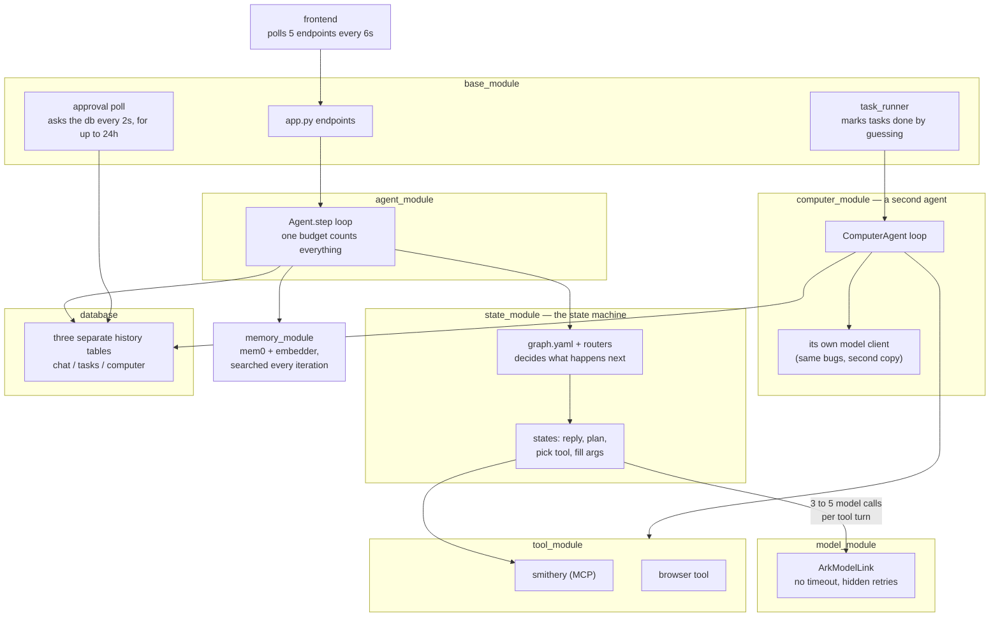
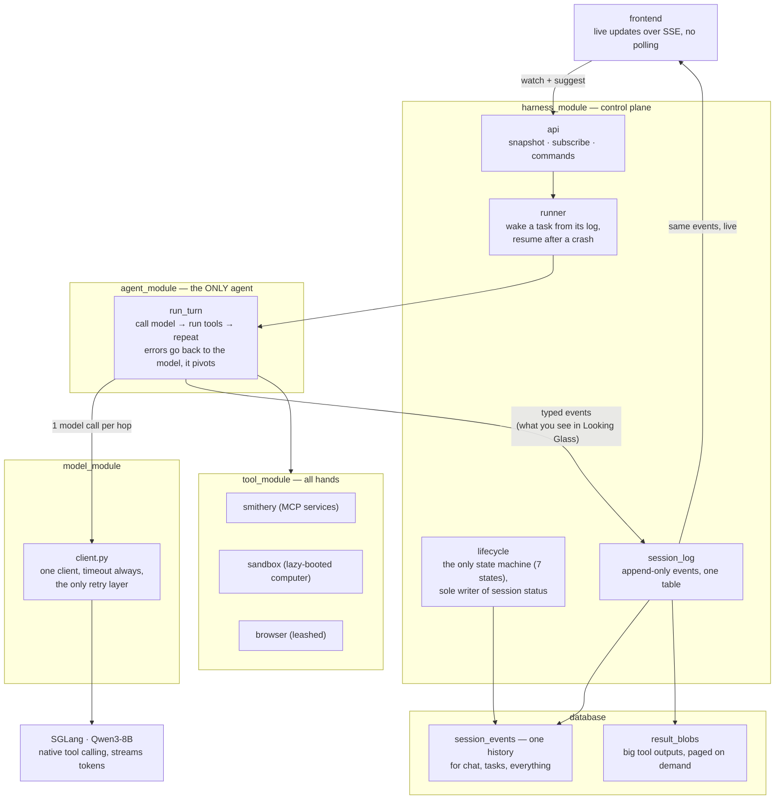

# Single-Loop Redesign — Native Tool Calling

> **SPLIT 2026-08-21 (owner):** this spec is two files. **This one (`_01`) is
> the live plan: Tasks 11.x onward, plus the Status header, Tests, Open
> Questions, Future Work, and Decisions.** Implementation Notes live in
> `implementation_notes.md`. Tasks 0-10
> (all done) live in `single_loop_redesign_spec_00.md`. The background sections
> (Problem, Technical Background, Proposed Approach) are duplicated verbatim in
> both so either file reads alone; when they must change, change them in BOTH
> or the copies drift.


## START HERE

This is the entry point. It tells you **what to build next**. It does NOT tell you
whether what you built is correct.

> **Gate: `docs/contracts.md` is law. Read it before writing code.**
> This document is a plan and it goes stale as tasks complete. Contracts states
> the invariants and does not. If the two ever disagree, contracts wins and this
> file is the bug.

Which question are you asking:

| Question | Doc |
|---|---|
| What do I build next, and in what order? | **this file** → Implementation Plan |
| What is guaranteed? (events, endpoints, lifecycle, IO) | `docs/contracts.md` |
| Why is it like this? Can I change it? | `docs/decisions.md` (D1-D26) |
| What happens at runtime in state X? | `docs/decision_tables.md` |
| What tables and columns exist? | `docs/schema.md` |
| Who is allowed to do what? | `docs/auth.md` |
| What does the user see? | the current design export (`designs/new-frontend/`) + Tasks 11.8, 12.1-12.3 |
| What is still unresolved? | `docs/GAPS_2026-08-06.md` (Tier 2 and 3) |

**Never read `docs/deprecated/`.** It is the architecture this redesign deletes.

Two standing rules for any session picking this up. Gaps in `GAPS_2026-08-06.md`
are pinned to the task that forces them, so read that task's gaps before starting
it, not the whole file. And Task 0a is a measurement, not a formality: everything
downstream assumes native tool calling works on this model, so it gets measured
before Task 7 deletes the fallback machinery.

---

This document is the why and the build plan.

**Status:** Tasks 0-8, 8.1-8.10, 9, LG-1 (+1.5-1.8) and LG-2 done ·
Tasks **11.4, 11.5, 11.6, 11.7, 11.8.5, 11.8.6, 11.9 DONE 2026-08-20** (session window + tools
popover + surface endpoints; backend MCP wiring; clock + tool-result timestamps;
the approval gate parks on the gated call; the plan gate — `propose_plan`, the
three-answer `plan` park, the stall rule, the split terminal taxonomy and the
plan card; Stop holds a run instead of killing it; **11.9 — the store rekeyed to
ONE flat namespace per user, folders derived from paths, projects LINK them**) ·
next **11.10 → 11.11 → 11.12 → 12.1 → 12.2 → 12.3 → 13** (11.8 closed out 2026-08-21 — absorbed by 11.9/`590ea90`/the chat removal) (renumbered 2026-08-21 so numbers ascend in build order: Arcade wiring 11.10 ex-11.9.5, attention stream 11.11 ex-11.8.9, plan pin 11.12 ex-11.9.1; 11.7.5 and 11.8 keep their numbers — contracts, schema and code comments cite them as landed work) (11.12 added
2026-08-21: the plan pin keys off run liveness instead of rendering
forever (localStorage dismiss deleted), and transcript text blocks get
`overflow-wrap: anywhere` with the feed clipped so no token can grow a
sideways scrollbar; 11.11 added
2026-08-21 from the calendar run: approvals announce themselves on a
per-user stream — the pane was event-starved, refetching only on a
mounted window's pulse — and the todo block stops saying "no plan yet"
beside a v6 plan, seeding from the plan's steps instead; 11.8.8 added
2026-08-20, the store trim: store.py splits into blobs/memory/tree (the
loop-bound httpx client flake dies in the split), destructive
store-side ops 409 against a held folder lease instead of chasing live
boxes (`move_through` deleted, `write_through` kept), snapshot tables
dropped; 11.9 was taken OUT OF
ORDER, ahead of 11.7.5/11.8/11.8.7: the migration is at its cheapest pre-launch
and it touches nothing 11.8.7 rewrites — that card is stop/resume, this one is
the store. What 11.8 still owes it: the create modal it edits is the one 11.9
rebuilt as a multi-pick checklist, so 11.8's delta amends that rather than the
dropdown it was written against. 11.8.7 added
2026-08-20: stop simplified to a soft teardown — one cancel path, two
landings (`done{stopped}` -> idle, mode kept) — deleting 11.8.6's
flag/registry/backstop/resume-park after first live use raced;
11.8.5 and 11.8.6 were taken
out of order: it had no blockers and the Marketplace post-mortem was live.
Its frontend landed against the CURRENT session window, so 11.8's delta
inherits the plan lane rather than replacing it; 11.8.6 added 2026-08-20
from first live use of the plan gate: the run control goes two-stage —
Stop cancels the in-flight step and parks on a `resume` row with the
plan's approval standing, Cancel from stopped is the terminal it always
was — land it before 11.9's store rekey while the approvals code is
warm; 11.7.5 added 2026-08-20: the code review's P0 fixes + trim, see
`docs/code_review_2026-08-20.md`; 11.8 added 2026-08-20, delta-only: project
create + rename, chat removed; 11.8.5 added 2026-08-20 from the
Marketplace run post-mortem, renumbered from 11.9 same day: the
`propose_plan` tool + plan gate (play button and model-initiated
proposals both funnel through it) + stall rule + terminal taxonomy +
plan card UI, export checked in at `designs/planning-card/`; 11.9 added
2026-08-20, renumbered from 11.8.5 same day, rewritten same day against
the `designs/filesystem_revamp/` export and DONE the same day; 12.1-12.3 added 2026-08-20, split from
one card against the `designs/sign-up/` export: auth screen + Google OAuth, on-brand
auth emails, buddy rebrand) |
**Author:** John Wallace | **Last updated:** 2026-08-20

**Where things actually stand, for a session picking this up cold:**

| | |
|---|---|
| Database | Supabase `sbtbbytesjobdpmqojlr`, migration 0 applied, 12 tables |
| Model | hosted OpenAI, `gpt-4.1-mini` — `run_turn` verified end to end against it |
| Suite | 509 collected. `integration`-marked tests (real e2b sandbox, real Supabase Storage) are deselected by default; `pytest -m integration` runs them |
| Store | Supabase Storage, private bucket `arkos`, created 2026-08-18. Project URL derives from `DB_URL`; `SUPABASE_SECRET_KEY` must be an `sb_secret_` key |
| HTTP server | `harness_module/api.py`, `uvicorn harness_module.api:app`. Needs `SUPABASE_JWT_SECRET` and `ARK_SESSION_SECRET` |
| Blocking decisions | none — endpoints, budgets, port, approval default, callback trigger all settled 2026-08-16/17 |

The 33 `tests/test_smithery.py` cases need a live `DB_URL` and skip without one,
so a green run of 219 is not the same as a green run of 252. Set `.env` first.

---

# Problem

One "use a tool" turn today costs 3-5 sequential LLM calls (reply, plan, tool
choice, tool args, advance decision), each preceded by a Postgres read and a
vector search, routed through a state graph. On a self-hosted 8B this is the
difference between instant and tens of seconds.

Stacked on top: three nested retry loops (SDK 600s default x client retries x
agent-loop retries) give a worst-case turn of ~16.5 hours and 99 requests.
Streaming is fake (full completion, then per-char replay). The task runner conflates
transitions with retries and marks runaway tasks **completed**. Approvals poll
Postgres every 2s for up to 24h, then fail the task.

Success: first token < 1s, one LLM call per hop, warm tool calls in 1 round trip,
tasks that resume instead of re-executing, production code ~4.5k lines.

---

# Technical Background

**Native tool calling.** Our server is **SGLang** (`model_module/run.sh`:
`lmsysorg/sglang` running `Qwen/Qwen3-8B` on :30000), not vLLM.
SGLang's OpenAI-compatible endpoint returns `tool_calls` inside the same
completion that streams text, given `--tool-call-parser qwen25` at launch. The
chat template does in one call what ARKOS does in three. Routing is already in
the response shape: tool calls present → execute and loop; absent → done.

⚠️ **Launch-flag prerequisite:** the checked-in `run.sh` does NOT pass
`--tool-call-parser`. Without it SGLang returns tool calls as raw text instead
of a parsed `tool_calls` field, and the whole redesign has nothing to stand on.
Verify what the running server was actually launched with before Task 0a, and
fix `run.sh` if it drifted from production.

**Qwen3-8B thinks by default, and that is a launch-flag problem too.** Qwen3 is a
hybrid reasoning model: it emits `<think>` blocks unless told otherwise. Without
`--reasoning-parser qwen3` that reasoning is returned inside `content`, so it
streams into our `content` events and renders as the model's reply. It also
spends output tokens before the first useful one, which is the latency complaint
this redesign exists to fix. Two flags, not one:

```
--tool-call-parser qwen25      # NOT "qwen3" (that is the reasoning parser name);
                               # "qwen3_coder" is for the Coder variants only
--reasoning-parser qwen3       # splits <think> into reasoning_content
```

Task 0a measures both: malformed-call rate AND whether reasoning and tool calling
interact badly (a known Qwen3 failure is tool-call XML leaking into content when
both are on). If thinking costs more latency than it buys on our schemas, disable
it per-request rather than living with it.

**Why the state graph exists.** Enum-constrained selection was built to keep a small model
on rails. The rails cost 5x latency every turn to prevent a failure (malformed
tool call) that is rare and cheaply recovered with validate-and-retry.

**Four loops today:** the multiplicative LLM retry stack; the agent step loop
(budget conflates transitions with retries — simultaneously too tight and too
loose); the 2s/24h approval poll; and browser_use's internal loop behind one
blocking tool call.

**The computer agent already proves the design.** `ComputerAgent.run()` is the
target loop (message list, native tool calling, step cap) and it shipped. The
redesign generalizes it into THE loop and deletes the class. It carries the same
infra bugs fixed here (client per access, no timeout, zero retries, 24h blocking
ask, no persistence).

**Load-bearing and kept:** Smithery vault+proxy OAuth, the approvals table,
Pydantic at boundaries, the FastAPI surface, `browser_use` (behind the tool
boundary). Not kept, because it never existed: `emit_log` / `logging_module` —
CLAUDE.md mandates it, the repo has neither, so it gets built (D17).

---

# Proposed Approach

### Today



### Target




One loop (`run_turn`): in-memory message list, one streaming completion with
`tools=[...]`; execute tool calls (readonly in parallel), append results, call
again; no tool calls means done. ~200 lines with budgets and error handling.
All interfaces, invariants, and the event vocabulary: **contracts.md**.

- **States collapse into prompts and tools.** Every pause is a tool that parks:
  `ask` for a question, `request_approval` for consent (both park the session,
  event-driven resume). Completion = explicit `finish_task`. Graphs/routers/StateOutput are
  deleted, not ported.
- **One retry policy.** One cached client, timeout always set, the client is the
  only retry layer; the loop gets honest counters (hops, per-tool attempts).
- **Real streaming, structurally.** Client deltas re-yield as `content` events
  immediately; no accumulation step exists; pinned by conformance test.
- **Write-behind persistence.** The turn never re-reads Postgres mid-loop;
  events append as they happen; resume folds the log back into messages.
- **One agent, zero agent classes.** ComputerAgent deleted; computer_module
  dissolved — sandbox manager + toolset move to `tool_module/sandbox/`, next to
  `tool_module/browser/`. All hands live in tool_module. Browser stays a leashed
  third-party inner loop behind `browser_task`.
- **One session, two modes — nothing spawns.** The session you chat with plans,
  executes, and is the one you reopen. *Attended* (turn-taking) flips to
  *unattended* when you approve; approving is the handoff, inside one transcript.
  `create_session` and the word "subagent" are both gone. Parallelism is the
  project grid. New state `idle` = alive, waiting for you.
- **Long-term memory is REMOVED for now** (mem0, embedder service, extraction —
  all dropped; the transcript is the memory within a session). Reimplementation
  TBD, direction in contracts.md.
- **Context recovery, v1 = rungs 0-1 only.** Input budget =
  `llm.context_window - llm.max_tokens` (today 32768 - 8192 ≈ 24k; both are
  config, not constants — see the config contract). Rung 0, proactive: estimate
  the view per hop; over `context.recovery_threshold` (0.8) of budget → apply
  rung 1 preemptively. Rung 1, drop re-derivable: clear the oldest tool results
  whose tool is in `context.clearable_tools` from the VIEW, replaced with
  `[cleared, ref b_x, re-read if needed]`; full content stays in result_blobs. Every drop recorded as a `view_transform` event (invariant in
  contracts.md: view-only, log never rewritten, deterministic replay).
  Today's behavior this replaces: overflow surfaces as BadRequestError →
  non-retryable → turn dies; token estimates via cl100k on a Qwen tokenizer;
  char/token unit confusion in tool_result_budget; blind head+tail truncation
  that destroys data. *Future work (not v1):* rung 2 demote-to-preview+ref,
  rung 3 summarize-old-hops under a preservation contract, and the reactive
  arm (classify the server's context-length error as recoverable and re-enter
  the ladder one rung deeper, sticky flags + breakers) — adopt if rungs 0-1
  prove insufficient in practice.

**Not in scope:** model swap (config later), replacing browser_use, watching/
triggers (scrapped, own future feature), multi-worker leasing (Task 15).

**Deletion inventory:**

Estimated before, measured after Tasks 7+8 landed on 2026-08-13.

| Module | Before | Planned | **Actual** | Notes |
|---|---|---|---|---|
| state_module | 1,708 | ~0 | **0** | deleted: graphs, routers, discovery, both agent packages |
| memory_module | 335 | ~0 | **0** | deleted: mem0 + embedder out of the stack |
| computer_module | 1,757 | 0 | **0** | dissolved: agent/model/runner/router/store deleted; sandbox+tools → `tool_module/sandbox/` |
| base_module → harness_module | 2,564 | ~1,700 | **172** | app/task_runner/tasks/task_store/users deleted outright. Only `jwt_utils` + `browser_routes` survive; the four control-plane files are Tasks 4-5, not yet written |
| agent_module | 535 | ~250 | **629** | loop.py + events.py; `agent.py` deleted |
| model_module | 442 | ~150 | **363** | one client; ArkModelNew + llm_json deleted |
| tool_module | 1,930 | ~1,950 | **2,828** | envelope · registry · connections · smithery · tools/ · browser · sandbox (absorbed) |
| config_module + db | — | — | **515** | loader, migration 0, asyncpg pool |
| tests | 5,037 | ~2,200 | **3,894** | 14 test files went with their machinery |
| **Total (py)** | **~14.9k** | **~6.3k** | **8,576** | production 9.9k → **4,682** against a ~4.5k target |

**Measured again after Task 8.10, 2026-08-18.** The 08-13 row above is the
redesign's own cull; this one is what the 08-17 audit found still standing
behind no import path, plus what Tasks 4-8.9 added in between.

| | Before 8.10 | **After** | |
|---|---|---|---|
| production (py, excl. `landing/` and `frontend/`) | 9,546 | **8,289** | −1,257: the four browser files, `browser_routes`, a superseded config test, `scripts/debug/` |
| tests | 10,822 | **9,415** | −1,407: the four browser test files, which pinned `register_local_tool` and bare-string returns |

Production is up from 4,682 because Tasks 4 through 8.9 wrote the control plane,
the store and memory; the ~4.5k target described a repo with no HTTP server, no
store and no memory in it. What 8.10 removed is dead weight, not function: every
deleted file was reachable from no import path in the repo, which is why a
deletions-only commit leaves the suite green.

Where the two big misses are, and why neither is alarming: `harness_module` is
172 instead of ~1,700 because its four files are not written yet, so that gap is
Tasks 4-5 arriving, not a saving. `tool_module` overshot ~900 because the
inventory assumed sandbox would arrive trimmed; it arrived as-is (Task 8's
integration is unfinished) and the browser tool is untouched until Task 9.

Migration is replace-then-delete, with no flag and no bridge: Tasks 1-3 build
the new path alongside the old, 0c wipes the database, Task 4 cuts over, and the
old modules are dead code deleted one PR each in Task 7. The app is down between
0c and Task 4 landing.

---

# Implementation Plan


> Tasks 0-10 (all done): `single_loop_redesign_spec_00.md`.

## Task 11.4: The new frontend — the designed surface lands, with the endpoints it reads
**Why (owner, 2026-08-19):** the tool-budget affordance got designed for real —
a rendered mock in Claude Design, in the existing paper/mono language, checked
into this repo as `designs/new-frontend/` — and designing it moved the control from
"beside where claims render" (11.5's original amendment 2) into the composer,
where choosing your reach sits next to asking. Implementing that design is
frontend work plus the endpoints the refreshed surface reads, and leaving all
of it inside 11.5 made one card carry a surface and an enforcement regime at
once. Split (owner, 2026-08-19): **this card is the surface and its
endpoints; 11.5 is the backend that makes the numbers true.** This card runs
first; the popover renders real recorded state before 11.5 gives that state
teeth.

**The design is ground truth (owner, 2026-08-19)** — the export checked in
under `designs/new-frontend/`; if it and the live Claude Design project ever disagree,
the checked-in copy is what was approved. **Refreshed 2026-08-20:** an earlier
stale export briefly sat in the repo and was deleted; the current copy is the
2026-08-20 export, which grew past this card — the full IA (desk landing, five
views, project creation) is Task 11.8; THIS card remains the session window,
its tools popover, and the endpoint families below. Where the design and the current
`frontend/` disagree, the design wins and `frontend/` is amended to match, not
the other way around. Beyond the popover it carries surface-wide changes, all
in scope here: spacing fixed throughout; the "looking glass" nav item renamed
**"projects"** (finishing what LG-1.7's amendment already said in prose);
"computer" renamed **"files"**; the leftmost bar's spacing corrected, with the
green running indicator below the label; and the browser view is now a
**popout in Projects** rather than a fixed canvas tab — where that contradicts
LG-2's right-panel wording, the design supersedes it and the looking-glass
spec gets the amendment when this card lands.

**The MCP tool selector in the chat window must not get lost in the refresh**
(owner, 2026-08-19). It is one item among the renames and spacing above, but
it is the item with a backend card waiting on it and the piece the buddy's
"X is not enabled in this session" line will point at — implement it as the
design renders it, not approximately, and do not ship this card without it.
The session window is unchanged in language, with a
`tools 32/52` box sitting left of the `ark>` prompt in the composer. Clicking
it opens a popover: the meter at the top reads `enabled / (llm.max_tools −
ours)` and moves green → amber → red as it fills; below it one row per
connected MCP server with its tool count; a row whose enabling would overflow
the cap renders dim with "would exceed the cap" — refused visibly in the
panel, not by a failing request. Header and footer are pinned and only the
server list scrolls, so the meter stays visible at short viewport heights. In
the rail, the green running indicator spans the full label height rather than
a fixed 26px. Deliberately absent (owner, 2026-08-19): any mention of
`registry.manifest` in the popover — enforcement language belongs to the spec,
the `status` event and `system_events`, never to the human. The mock's
per-server tool counts are placeholders; the real numbers come from the
manifest.

Design import, verbatim for the implementing session:

> Use the claude_design MCP (https://api.anthropic.com/v1/design/mcp, auth via
> /design-login) to import this project:
> https://claude.ai/design/p/c43f95b8-1af4-4c74-bfed-fe5c8e023959?file=Looking+Glass+-+Tool+Budget.dc.html
> Focus on these files (the whole project is readable):
> `Looking Glass - Tool Budget.dc.html`. Also read these files the selection
> imports: `support.js`. Implement: `Looking Glass - Tool Budget.dc.html`.

**Done when:** the session window carries the composer chip and popover as
designed, wired to real state, and the two endpoint families the surface was
missing exist, each with its contracts rows in the same commit:

1. **Session tools state.** `GET /sessions/{id}/tools` — servers with
   per-server tool counts, enabled flags, and the meter's numbers — and a
   toggle write per server. This card lands storage and truthful reads and
   writes; it does NOT land enforcement. Until 11.5, a toggle is recorded and
   displayed but the loop does not read it: the popover is honest about state
   before it is honest about effect, and the card boundary says so out loud.
   The migration residue from 11.5's stopped first build resolves here —
   reuse the applied `0009_session_tools.sql` table or drop and re-issue it
   (destructive DDL, owner's call); do not leave a second tools table beside
   it.
2. **Filesystem browse.** The LG-2 deferral comes due: `list_dir` and
   `read_file` exist as model tools and not as endpoints, so the computer view
   lists the store and cannot walk the live sandbox disk. HTTP over the box —
   a list endpoint and a read endpoint per session, ownership-checked the way
   the frame stream is, 404 when the box is parked or gone.

**NOT this card:** pointing the files view at the disk endpoints. LG-2's
warning stands — a filesystem that dies with the session shown beside one that
does not wants its own deliberate design pass, and the `designs/new-frontend/` design,
broad as it is, does not answer that question. This card supplies the
endpoints that pass will need.
Also not this card: everything enforcement — the manifest cap, the per-turn
prompt, benching, quota coherence are 11.5.
**Touch:** `designs/new-frontend/` → `frontend/`, `api.py` + contracts (both endpoint
families), migration, `looking_glass_spec.md` (rename + browser-popout
amendments) | **P1, 1.5-2d** | **Blockers:** none
**Test:** the chip shows enabled/allowed and updates when a toggle commits; a
toggle that would exceed the cap is dim with the numbers in the panel and
fires no request; at a short viewport the header and footer stay pinned and
only the list scrolls; the rail indicator spans the label; the fs endpoints
return only the caller's session's box and 404 on a parked one; contracts
rows exist for every endpoint added.

**Status: DONE 2026-08-20** (built in the coding session; spot-checked here:
`GET`/`PUT /sessions/{id}/tools` and `GET /sessions/{id}/fs` + `/fs/file`
live in `api.py`, migration re-issued as `0010_session_tools.sql`, tools
panel in `frontend/lookingglass.jsx`).

## Task 11.5: The tool budget — the session chooses what it can reach
**Why (found in use, 2026-08-19):** connecting a few MCP servers put 164 tool
schemas in the request and OpenAI refused it — `array too long. Expected an
array with maximum length 128` — so every turn died at `bad_request` before a
token was generated, with no diagnosis anywhere near the connection that caused
it. Nothing in the harness counts tools. contracts has described the answer
since the first law commit ("MCP tools are the ONLY ones deferred when the
schema budget is tight") and `load_tools` exists nowhere.

Three costs, not one: the provider's hard cap, the tokens every schema spends on
every hop (decisive on a 40,960-window self-hosted model, where 164 schemas are
most of the budget), and selection accuracy — with 38 Slack tools loaded, a
small model asked to open a GitHub issue reached for `mcp_GoogleCalendar_WhoAmI`.

**Done when:** a session reaches only the servers it has been given. Ours are
always loaded and never counted against the human's budget; the meter reads
`enabled / (llm.max_tools - ours)`, so it moves on its own if we add a local
tool. **The default is ours alone** — a connected server is not a reachable one
until it is toggled into a session, which is what makes an accidental 400
impossible rather than unlikely. The system prompt is rebuilt per turn from the
toggles and names both what is enabled and what is connected but off, so the
model says "Slack is not enabled in this session" instead of improvising. The
cap is enforced in `registry.manifest` regardless of what any toggle says: a
stale set, or a server that grows its tool list overnight, must not be able to
produce a request the API will reject — which is exactly how 164 appeared
without anyone changing anything.

**Re-scoped (owner, 2026-08-19): this card is now backend only.** The surface
and the state it displays moved to Task 11.4 — the composer chip and popover,
the `GET /sessions/{id}/tools` reads and toggle writes, and the
`session_tools` migration all land there, against the `designs/new-frontend/` design
(which relocated the control from "beside the claims" to the composer;
amendment 2 below reads accordingly). What remains here is the wiring that
makes the recorded toggles TRUE for the model: the cap enforced in
`registry.manifest`, the per-turn system prompt generated from the shipped
manifest, the benching backstop with its `status` event and `system_events`
record, `assert_coherent`, and the loop actually reading the toggles 11.4
records. 11.4 runs first; until this card lands, a toggle is display, not
reach.

**Amended on review (owner, 2026-08-19), two changes before build:**

1. **The prompt is generated from the manifest actually shipped that turn,
   never from the toggles.** The card's own backstop scenario otherwise
   reintroduces the prompt-doesn't-match-manifest bug through the emergency
   exit: a server grows its tool list overnight, the toggles still say
   "enabled", the manifest truncates to stay under budget — and a prompt built
   from toggles now promises tools the manifest quietly dropped. And the
   backstop's drop rule is SPECIFIED, not implied: whole servers only (never a
   subset of one server's tools), most-recently-enabled first, surfaced as a
   `status` event in the session and a `system_events` record, so a benched
   server is a visible fact rather than a mystery.
2. **The affordance is named:** a per-session tools control in the session
   window, beside where claims render — they are siblings; a server toggle is a
   claim in the D29 sense (same default of nothing-until-granted, same
   visibility rule: the human can always see the session's reach). It shows the
   meter and per-server toggles; an over-budget toggle is refused with the
   numbers in the panel, not only at the API; and the model's "X is not enabled
   in this session" line points at the panel, so the buddy's first
   "check my Slack" is one click from working rather than a dead end.

Also: `ours < llm.max_tools` joins `assert_coherent`.

**Residue from the stopped first build (2026-08-19):** the initial
implementation was halted and reverted (its code sits in `git stash@{0}`), but
migration `0009_session_tools.sql` had already been APPLIED to the dev
database: an empty `session_tools` table exists and `schema_migrations` has its
row. Nothing reads it while the code is reverted. **Resolves in 11.4** (which
now owns the migration): either reuse that migration number/table or clean up
first — `DROP TABLE session_tools; DELETE FROM schema_migrations WHERE name =
'0009_session_tools.sql';` — destructive DDL, owner's call, do not leave a
second tools table beside it.

**Not seeded (owner, 2026-08-19):** existing sessions lose their MCP tools when
this lands and re-enable them by hand. The new rule is true everywhere
immediately rather than true for new sessions and grandfathered elsewhere.
Note this includes every HOME session (LG-1.7): each user's landing chat wakes
up MCP-less until they toggle servers back in.
**NOT this card:** `load_tools` self-service. The prompt naming disabled servers
leaves that door open without designing for it now. (When it comes, the model
asking to enable a server is naturally an `ask` through the attention
machinery — a prompt change, not a mechanism.)
**Touch:** `registry.manifest`, `prompts.py`, `config.yaml`, contracts (the
migration, `api.py` endpoints and frontend moved to 11.4) | **P1, 0.5-1d** |
**Blockers:** 11.4
**Test:** a session with nothing enabled gets exactly our tools; enabling a
server adds only its tools; the manifest never exceeds the budget even when the
toggles say it should; the prompt names enabled and disabled servers and changes
between turns when a toggle does — and is generated from the shipped manifest,
pinned by a test where a server grows past budget overnight, gets benched
wholly, and that turn's prompt names it unavailable while the human sees why.
(The panel-side refusal of an over-budget toggle is 11.4's test; this card's
half is that the API refuses it too, with the numbers in the message.)

**Status: DONE 2026-08-20** (built in the coding session; spot-checked here:
`connected_services`/`Reach` in `prompts.py` generate the prompt from the
shipped manifest, and the runner builds the manifest before the fold).

## Task 11.6
**Title:** Give the agent a clock and timestamped tool results
**Problem:** The model cannot see the current time or when a tool result was
fetched, so it presents week-old reads as current and cannot notice it slept.
**Done when:** The system prompt carries the current date-time, rebuilt every
turn; every tool result the fold renders carries its fetch time, taken from
the event's own timestamp, with stored events byte-identical (presentation
only — no API, wire, or tool-schema change; the stamp is text in the rendered
result content); and the prompt keeps the snapshot rule with its termination
anchor (results fetched this turn are fresh; one re-check before acting
satisfies it).
**Touch point:** `agent_module/prompts.py` (`system_prompt` gains the clock
and the sentence), the fold in `harness_module/runner.py` (the stamps).
**Acceptance test:** A fold test over a log holding an old tool result: the
built messages show the fetch time on the result and the current date-time in
the prompt, and the stored events compare byte-identical before and after.
Manually: resume a days-old session and ask "how long since my last message?"
— it answers from the clock and the last event's stamp.
**Not this card:** push — a world that announces its changes (webhooks, MCP
`subscriptions/listen`). Open question to settle first: what may wake an idle
session. | **P2, 0.5d, no blockers** — pairs with 11.5's prompt work.

**Status: DONE 2026-08-20** (built in the coding session).

## Task 11.7
**Title:** Park the turn on the gated call itself
**Problem:** `_approve` (`harness_module/runner.py`) refuses gated calls with
a promise it never keeps — it does not read the approvals table — so every
gated MCP call loops forever, consent binds to prose instead of the call, the
refusal is logged as `invalid_args` (spending the per-tool failure cap on
asking correctly), and the "human declined" path is unreachable.
**Done when:** A call hitting `requires_approval` with no grant parks the
turn with that call open, after the hop's other calls close, with the
approvals row bound to the call's own id carrying the real (name, args); the
parked call renders inline in the chat window with its args and its age, and
is answered there (prose pre-grants remain non-binding); approve → the
resumed run executes exactly that call through NORMAL dispatch, exactly once
(consume latch in `answer()`'s conditional-update pattern, plus a repair rule
for consumed-but-unclosed); decline → the call closes with the existing
"human declined; choose another approach" failure; contracts is amended in
the same commit to permit exactly one open tool call across a park (fold,
reaper, LG-1.8 steering, renderer each checked against it); the refusal path
is deleted. `request_approval`/`ask` remain for plan-level questions only.
**Touch point:** `harness_module/runner.py` (`_approve`, emit/park, resume),
`harness_module/approvals.py` (consume latch), `docs/contracts.md`, frontend
(pending-call card).
**Acceptance test:** pytest: gated call parks with the row bound to its call
id; concurrent wakes admit one executor; a consumed-but-unclosed call repairs
without re-executing; decline closes the call and the model routes around it;
parallel ungated calls close before the park; steering during the park is
carried per LG-1.8; no `invalid_args` anywhere in the flow. Manually: trigger
`mcp_create_pull_request` in an attended session, approve on the inline card,
observe exactly one PR.
**Not this card:** session-scoped standing grants ("this session may send
Slack without asking") — Future Work; this card's grant machinery is their
substrate. | **P1, 1-1.5d, no blockers** — a Task 6 defect, take it early.

## Task 11.7.5 — DONE 2026-08-21
**Title:** Fix the review's P0s and trim the duplication
**Problem:** The 2026-08-20 code review (`docs/code_review_2026-08-20.md` —
the working list for this card, file:line for every item) found one real bug
in the fresh 11.7 code, one standing contracts violation, one missed publish,
~600-700 lines of duplication and dead code, and three files the review
could not see.
**Done when:** (1) the three P0s are fixed — `_answer_by_message` refuses
`kind == "call"` so composer prose can never silently decline a gated call
(pin with a test: a message to a call-parked session 409s); the settings
panel's 2s OAuth poll is replaced with recheck-on-popup-close +
focus/visibility; `close_dangling` publishes at all five sites via one
`publish_all` helper. (2) The P1 lists land: `_uuid` (12 copies) and `_cfg`
(8 copies) each get one home; the dead store plumbing (snapshots section,
`diff_tree`, `read_notes`, unused lease/stream/event members) is deleted
after confirming no out-of-tree caller; api.py's copy-pasted shaping and
ownership checks collapse into the helpers that already exist; the frontend's
shared primitives (file tree, list row, snapshot-on-pulse hook, modal/scrim,
escape/scroll hooks, one Dot) move to components.jsx and the 4x attention
fetch becomes one. (3) The review re-runs over the three unseen files —
`smithery.py`, `components.jsx`, `api.jsx` — and its findings are fixed or
carded. P2 items (runner/store splits, blocking JWKS fetch, missing hints,
`GET /health` contracts row) are done as encountered, not gated on.
**Touch point:** per the review doc — `harness_module/*`, `tool_module/*`,
`frontend/*`, `docs/contracts.md` (health row), tests.
**Acceptance test:** the P0 pin tests pass; `grep -rn "def _uuid\|def _cfg"`
returns one definition each; no `setInterval`/`setTimeout`-driven refetch
anywhere in `frontend/`; the deleted store functions have no references;
suite green; production line count reported before/after in the commit
message.
**Not this card:** restructuring beyond the named splits, and any new
feature riding along.
| **P1, 1-1.5d** | **Blockers:** 11.7 settled (its mid-flight residue is
part of the trim).

**Landed 2026-08-21, and most of it had already landed piecemeal.** The
card sat in the queue while 11.7-11.8.8 absorbed it, so this pass was
an AUDIT first: every item checked against the tree rather than assumed
outstanding. Already done when it started — the three P0s (the composer
refuses `call`/`approval`/`plan`, the OAuth poll is
popup-close + focus/visibility, `publish_all` is used at all five
`close_dangling` sites); `_uuid` down to one home (`db.ids.as_uuid`,
with `api._uuid` surviving as a different function — it turns a bad id
into a 404 with the noun in it); `_cfg` never was eight definitions, it
is one import alias per module pointing at `config_module.loader`; the
snapshots section, `diff_tree` and `read_notes` deleted; the store
split; `write_through` calling `_live_boxes` instead of inlining its
query; and the whole frontend list — one `@keyframes pop`, one `Dot`,
one `useEscape`, one file tree, ONE `api.attention()` fetch where there
were four.

Done in this pass:

* **One view-cap rule.** `loop._cap_view` became `loop.cap_view` and
  both other copies call it — `runner._result_event`, and a THIRD copy
  the original review never saw in `smithery._envelope`.
  `grep -rn result_view_cap_chars` now returns one read in the tree.
* **`_park_calls` deleted.** It held only the park-kind calls while
  `_calls` held every call of the turn; the park check reads the name
  out of `_calls` instead. The review guessed "mid-flight leftover" and
  was right.
* **The JWKS fetch moved off the event loop.** `verify_supabase` does a
  synchronous urllib fetch on the asymmetric path, and PyJWT refetches
  on any unknown `kid`, so it is not a cost a warm cache retires. It was
  called straight from `POST /auth/session` — blocking the ONE loop
  every session shares, which is the concurrency law's plainest
  violation, filed as a P2. `verify_supabase_off_loop` wraps it in
  `asyncio.to_thread`.
* **`connections.py` collapsed.** Five functions each written twice
  (shared vs user table) became five, with `_target` returning the
  table, its key columns and the leading key values — the one thing that
  differs. **A real bug came out of writing it**: the INSERT
  placeholder count was one short, caught not by reading the generated
  SQL (which I did, and missed it) but by exercising both tables against
  the live database.
* **`GET /health` has a contracts row.** It was the only route/contracts
  drift; a check of all 38 routes now shows the four undocumented ones
  are FastAPI's own docs pages.
* **The review re-run** over `smithery.py`, `session_tools.py`,
  `control.py`, `components.jsx` and `api.jsx` — clause 3, the card's
  real outstanding work — is appended to
  `docs/code_review_2026-08-20.md`, with what was checked and found
  sound as well as what was found wrong. Two findings carded below.

**Line count: 11,824 -> 11,961 across 11.8.7/11.8.8/11.7.5** (+137).
The card asks for it in the commit message and it went UP, for the
reason 11.8.8 records: these three cards folded in repairs — two
loop-keyed HTTP clients, an advisory lock, a thread hop for JWKS, a
lease check at four endpoints — that cost more than the deletions saved.
The 4.5k target in the original review is stale by a different order of
magnitude and wants its own decision, which is follow-up 3 and remains
open.

**Carded out of the re-run** (both in `smithery.py`, both to be taken
with 11.10 (the Arcade wiring) rather than ahead of it):

* **F1 · `SmitheryClient` caches an `aiohttp.ClientSession`** on the
  instance — the same loop-binding class 11.8.8 fixed for httpx and the
  OpenAI SDK. Latent rather than live, because `hands.start`/`stop` are
  lifespan-managed; it bites anything constructing a `Smithery` outside
  that lifespan.
* **F2 · `Smithery`'s per-owner state is unbounded.** `_cache`,
  `_locks`, `_generation` and `_setup_urls` grow one entry per user who
  has touched MCP in the process, each holding that user's connections
  and every `tools_cache` — the thing that reached 164 schemas. Nothing
  evicts. Needs an eviction policy, which is a design decision.

## Task 11.8 — DONE 2026-08-21
**Status:** DONE, absorbed piecewise rather than built as one card — closed
out on review 2026-08-21. Chat removal landed first (app.jsx/views.jsx
comments cite 11.8 for it). The create modal and `POST /projects` landed
with 11.9's commit (`a93c098`) — and NOT as this card's original
name-plus-directory-dropdown, which 11.9's folder model superseded: what
shipped is the multi-pick folder checklist with file counts and the
"links: triage/, notes/" vs "makes: ski-trip/" footer, none-picked creating
a project-named folder. Rename landed as `PATCH /projects/{id}` with
double-click on the index card AND the session header (`590ea90` — a rename
moves the label only, never the folder). Verified in the tree: both
endpoints in api.py, `picked`/checklist and both rename affordances in
lookingglass.jsx, no ChatView anywhere. Residue, deliberately named: the
card's live acceptance pass (create both ways in a browser, rename from
both spots, watch the change propagate to grid and desk) has not been run
as a scripted whole — it rides the next real use of the app rather than a
build day.

**Title:** Add project create and rename; remove chat
**Problem:** Projects cannot be created deliberately (only as a side effect
of `POST /sessions`) or renamed at all, and the chat view + ambient bar still
ship though the current design export removes them.
**Done when:** Three deltas against the ACTIVE frontend (which already has
the five-view nav, desk, approvals, files, projects grid, and session detail
from 11.4 — none of that is this card), matching the second 2026-08-20
export under `designs/new-frontend/`:

1. **Create:** the corner plus and the dashed new-project card open the
   modal — name; "a new directory" (start empty) vs "an existing directory"
   (store dirs dropdown); slug preview — backed by `POST /projects`
   (contracts row in the same commit), landing in the new project's session
   view with the export's empty states.
2. **Rename:** double-click the project name on the index card or the
   session header (plus the hover "rename" button); Enter/blur commits,
   Escape cancels — backed by `PATCH /projects/{id}` (contracts row).
3. **Remove chat:** "chat" leaves the nav, `ChatView` and the ambient bar
   (and the `bare`/no-ambient plumbing) are deleted. The home session
   (LG-1.7 machinery) keeps existing backend-side with NO surface — the
   buddy's return or retirement is a future card; recorded here so the
   orphan is a fact, not a surprise.

**Touch point:** `frontend/lookingglass.jsx` (modal, rename), `app.jsx`
(nav, ambient removal), `api.py` + contracts (`POST /projects`,
`PATCH /projects/{id}`).
**Acceptance test:** Create a project from the modal both ways and land in
its empty session view; double-click its name on the card AND in the header,
rename, and see the change in grid, desk, and header; no chat nav item and
no ambient bar renders anywhere; the home session receives nothing from any
surface.
**Not this card:** everything 11.4 already shipped (nav, desk, approvals,
files view, tools popover); approval-flow mechanics (11.7).
| **P1, 0.5-1d** | **Blockers:** none.

## Task 11.8.5
**Status:** DONE 2026-08-20, taken out of order (no blockers). All seven deltas
landed: `propose_plan` in `PARK_KINDS` (migration `0013_plan_park.sql` adds the
`plan` kind and the history index), the three-answer respond arm with the
`plan.md` write and the moved mode flip, the play button reduced to a handoff
event, the bare-text stall rule, `stalled_progress` + `internal_error`, the
park-don't-fail principle in contracts, and the plan lane in the session window
plus the desk's plan card. Pinned by `tests/test_plan_gate.py` and the amended
`tests/test_loop.py` / `test_api.py` / `test_runner.py`.

A `/code-review high` pass over the diff found nine, all fixed in the same
commit. Three are worth carrying forward as facts rather than as history: the
near-cap nudge and the bare-text streak need SEPARATE latches (one flag let the
streak spend the nudge, and a run that went bare early then bare again on its
last hop died `max_hops` with no summary); everything that can refuse a plan
approval has to be checked BEFORE the row is answered, and a start that then
loses the status race has to REOPEN it, or the plan is stamped approved with
nothing run and nothing able to approve it again; and a surface must read a
plan's version from the server, never by counting `propose_plan` calls in
`recent_events`, because that window is capped.

Amended 2026-08-20 after using it. Four things the export specced that did not
survive contact: the "changed since v{n-1}" diff is GONE, plumbing and all
(`previous_args` / `last_ask` off `/attention`) — edits stack, so by v3 the list
was longer than the plan and said less than the plan does. The revising banner
and the in-place workshop state went with it: a reply now closes the card, and
the next plan arrives as a whole new card. `user{source: system}` events are no
longer RENDERED anywhere — the handoff read as a leaked prompt sitting among the
human's own messages. And a reply is followed by an unrendered
`user{source: system}` instruction to propose again, because without it the
model answered inline and the session went idle with the card gone and nothing
to approve. The card itself is narrower than the pane, its body scrolls, and the
✕ moved to the header where a way out is looked for.
**Title:** The plan gate: unattended runs start from an approved plan, and
never die confused
**Problem:** The play arrow hands the model a transcript, not a task. The
2026-08-20 Marketplace run went unattended with the model's own unanswered
question as the last event, burned a browser run and five bare-text hops
greeting nobody, then ended `failed{model_error}` though nothing errored:
the empty-reply path in `loop.py` shares that label with real API failure
AND with `_drive`'s catch-all, so a Postgres blip, an OpenAI outage, and a
model that said nothing are indistinguishable on the pill. Bare text in
unattended mode loops with nothing injected, so the tail becomes
consecutive assistant messages and the model degenerates; the prompt
promises "you will simply be asked to continue" and nothing keeps it; the
one nudge sits at max_hops-1 and never fired.
**Done when:** Seven deltas. The gate has two entries — the play button,
and the model proposing when the transcript already specs the work — and
both funnel through ONE tool, so there is exactly one way an unattended
run starts:

1. **The plan tool.** `propose_plan` joins `PARK_KINDS`
   (`tool_module/tools/control.py`): a park tool the model may call AT ANY
   TIME, whose args are the plan itself, matching the export's card
   fields — `goal`, `done_when`, `steps` (the numbered outline the desk's
   pending card renders), `inputs` (label + note pairs), and `missing`, a
   list of the open questions the plan still needs answered. (The earlier
   sketch's `if_blocked` field is gone: the export dropped it and the
   design wins; "blocked means ask" lives in the standing prompt copy
   instead.) Calling it parks the session on an approvals row of kind
   `plan` carrying those args (the 11.7 pattern: consent binds to the
   artifact, not to prose about it). Each call is a VERSION: re-proposing
   supersedes the open row and bumps v{n}, and the card diffs the new
   args against the previous ones for its "changed since v{n-1}" list.
   Proposing is the model's judgement; deciding is never — it cannot
   start the run itself. An under-informed plan is still a plan:
   `missing` is how insufficiency renders INSIDE the card as named
   questions, so the card doubles as the intake form rather than the
   model asking in chat prose beside it.
2. **Answering a plan.** On `/approvals/{id}/respond`, kind `plan` takes
   three answers. The approve word: the harness writes the approved args
   to `plan.md` through the store path (what was approved is what is
   saved, byte for byte), runs `_check_unattended_quota`, flips mode to
   unattended in the SAME transition that wakes it, and the run begins.
   The decline word: the park closes, the session stays attended chat.
   Anything else is workshop feedback: appended as a `user` event, the
   session wakes attended, the model revises and proposes again — as many
   rounds as it takes. Kind `plan` joins `approval` and `call` in
   `_answer_by_message`'s 409, so composer prose never answers it.
3. **The play button rides the tool.** `POST /sessions/{id}/approve` no
   longer flips mode. It appends a `user{source: system}` handoff event —
   draft the plan from this transcript and call `propose_plan`, ALWAYS,
   even when the transcript is thin or empty: put what you cannot fill in
   `missing` and leave the fields honest, never ask in prose instead of
   calling the tool — and starts an ordinary attended turn. So play "off
   the rip" on a fresh session still yields a plan card, opening as an
   intake form ("not enough to plan yet: what is the goal? what does done
   look like?"), and the workshop loop fills it from there. Mode now
   flips in exactly one place: plan approval. Transition table: the
   `idle -> running` approve row loses its mode flip;
   `awaiting_approval -> running` gains one for kind `plan`. Prompt copy
   (`_SHARED` gains the tool's standing description, `_UNATTENDED`
   references the plan) updated to match.
4. **Stall rule.** In unattended mode a bare-text hop is answered, keeping
   the prompt's promise: the first appends a `user{source: system}`
   continuation; a second consecutive one gets the finish nudge immediately
   (the near-cap nudge stays); a third consecutive bare-text hop, or any
   empty reply, ends the run `done{stalled_progress}`. A tool-calling hop
   resets the streak.
5. **Terminal taxonomy.** `done.reason` gains `stalled_progress` and
   `internal_error`. `model_error` narrows to its name: a real `ModelError`
   after both retry layers. `_drive`'s catch-all writes `internal_error`.
   Contracts' event vocabulary, the termination rule, and the transition
   table's `running -> failed` row amend in the same commit; the status
   pill renders the new reasons.
6. **Park, don't fail.** Contracts gains the principle the mechanics above
   serve: an unattended run ends by `finish_task`, by parking, or by a
   named budget/stall reason. There is no "confused" terminal.
7. **The plan card UI, from the export.** Delta against the active
   frontend, per the checked-in export (see the design note): the
   composer's run button with its tooltip ("buddy drafts a plan first.
   nothing runs until you approve it."); the drafting bar with abandon;
   the open card — version chip, "nothing runs until you approve", the
   fields above, `missing` rendered as questions, the "update the plan"
   input ON the card, "approve and run", and the ✕ dismiss; the revising
   banner ("revising v{n}: {last ask}") and the "changed since v{n-1}"
   diff with "you asked: {ask}" echoed; the collapsed pinned card once
   approved (goal line, v{n}, "plan.md saved to the project") and the
   run-start line ("starting from plan.md v{n}. i will keep everything in
   {dir}..."); the abandoned state ("plan v{n} dismissed, nothing ran"
   with "draft again"); the plan status chip with the working directory;
   and the desk's "waiting on you" list rendering a pending plan with its
   `steps` and approve/decline. Card actions route to
   `/approvals/{id}/respond` ("update the plan" = feedback prose,
   "approve and run" = the approve word, dismiss = the decline word).
   The export's copy says buddy; until 12.3 lands the implementation
   substitutes the current name.

**Touch point:** `tool_module/tools/control.py` (`propose_plan`),
`harness_module/api.py` (`respond_to_approval` kind-`plan` arm,
`_answer_by_message`, `approve_session`), `harness_module/approvals.py`
(kind), `agent_module/prompts.py` (tool copy, handoff copy, continuation),
`agent_module/loop.py` (stall streak, reason split),
`harness_module/runner.py` (`_drive` catch-all, plan.md write on approve),
`docs/contracts.md` (reason vocabulary, TERMINATION rule, transition rows,
park-kind table), frontend (pill labels only).
**Acceptance test:** pytest: `propose_plan` parks kind `plan` with the
args on the row; approve writes `plan.md` matching the args, checks the
unattended quota, and flips mode+status in one conditional UPDATE; prose
feedback wakes the session attended with the event appended; decline
closes the park attended; a composer message to a plan-parked session
409s; play appends the handoff event and does NOT flip mode; unattended
bare text draws the continuation, then the nudge, then
`done{stalled_progress}` on the third; an empty reply ends
`done{stalled_progress}` directly; an exhausted retryable `ModelError`
still ends `done{model_error}`; a setup failure raised in `_drive` ends
`done{internal_error}`; attended behavior otherwise byte-identical.
The card is not done while contracts lags: `docs/contracts.md` must show
`stalled_progress` and `internal_error` in the `done.reason` vocabulary
and the `running -> failed` row, kind `plan` in the park/approvals
machinery, the moved mode flip in the transition table's approve and
respond rows, and the rewritten TERMINATION rule — grep for
`stalled_progress` and `propose_plan` in contracts as the cheap check;
absence of either means the amendment was skipped and the card is open.
A second `propose_plan` supersedes the open row, bumps the version, and
the card shows the changed-since diff; a pending plan appears on the
desk with its steps and approve/decline. Manually, three entries: say
"sell my keyboard, $40, photos attached" in chat and watch the model
propose unprompted; press play on an underspecified chat, workshop one
round on the card's "update the plan" input, approve, observe `plan.md`
in the project and the run start; press play on a FRESH session with no
conversation and get a plan card whose `missing` names the gaps, not a
chat message asking questions.
**Design note:** the export is checked in at `designs/planning-card/` (2026-08-20,
drafted on the arkos Claude Design canvas — its `.dc.html` still carries
the stale "Looking Glass - Tool Budget" title, ignore that; the plan
states are in it, rendered inline in the projects view alongside the
rest of the UI). That checked-in export is ground truth for delta 7, per
the 11.4/11.8 convention.
**Not this card:** exempting workshop rounds from `max_hops`; re-planning
mid-run beyond simply calling `propose_plan` again; browser_task's
structured "blocked on a login" outcome.
| **P1, 2-2.5d** | **Blockers:** none — the design export is checked in.

**Amendment 2026-08-20** (filesystem revamp, see 11.9 and the
`designs/filesystem_revamp/` export): "this project's directory" no longer
exists anywhere on the card. Inputs render one row per linked folder
("triage/ · linked folder" — five folders, five rows), the goal and
run-start copy name "its linked folders (triage/, notes/)" rather than
one directory, and `plan.md` saves into the project's FIRST linked
folder. Implementation order: this card may ship against the
pre-revamp single-directory reality; 11.9 carries the copy and target
change, and the `designs/filesystem_revamp/` export supersedes `designs/planning-card/`
where the two disagree on the card's folder rows.

## Task 11.8.6
**Status:** DONE 2026-08-20, backend and frontend. Migration
`0014_stop_resume.sql` adds kind `resume`; `POST /sessions/{id}/stop` holds a
turn on it with no `done` and no mode flip; the dispatch wrapper registers each
call's task so Stop closes exactly those as `cancelled_by_user` (which the loop
excludes from the attempt cap) and refuses the rest of the hop;
`harness.stop_grace_s` (45s) degrades a wedged hop to the old full cancel; the
respond arm and the composer exemption land the three answers. Pinned by
`tests/test_stop_resume.py`.

**Two things this card touched that it did not list.** `POST /cancel` on a
parked session never flipped `mode` back to attended — harmless while only
`running` sessions reached a terminal, and wrong the moment a STOPPED
(unattended, `awaiting_approval`) session could be cancelled: it stayed recorded
unattended forever, holding a quota slot for a run nobody was running. Fixed
here because this card created the path. And `/cancel` now closes an open
`resume` row, so nothing offers to restart a terminal session.

**The designed frontend landed 2026-08-20** against the canvas pass now checked
in at `designs/planning-card/` (`Form responses needed (10)`, replacing the 11.8.5
export). The control has THREE faces, never two at once: `▶ autopilot` when
nothing is pending, `■ stop` while running, `✕ cancel` while stopped — and on a
CANCELLED run the first reads `▶ resume` and drafts a continuation rather than a
fresh v1, which needed `approve_session` widened to accept a terminal status.
The stopped state adds no surface: an amber `stopped · holding at hop n/m` pill,
one transcript row ("stopped at step {n}. in-flight calls closed, nothing counts
against the plan.") with resume and a small red cancel, the plan pin's dot going
amber and losing its ping, and the composer placeholder becoming "type to
resume. your note is the next thing ark reads" — typing resumes, and the note
echoes as a "resumed with your note" line. A spent plan gets a dashed row with
`draft a continuation` and `dismiss`; a dismissed one gets `draft again` and
`dismiss`; `dismiss` clears the plan from the surface (per browser, in
localStorage — the row is a permanent fact and is never deleted) and the control
reverts to `▶ autopilot`.

**And the overlap is gone.** The whole plan lane moved INSIDE the scrolling
transcript. It was docked above the composer when 11.8.5 shipped, overlaying the
conversation; the transcript is the only surface now, and nothing docks or
floats.

**Title:** Stop, then cancel: the run control is two-stage
**Problem:** The only control on a run is `POST /sessions/{id}/cancel` —
`task.cancel()` on the WHOLE turn, `done{cancelled}`, terminal status,
mode flipped back to attended, plan approval spent. Stopping one slow
step therefore nukes an approved plan (happened 2026-08-20, the plan
gate's first day of use). The loop can already survive a single step
dying — `_envelope_of` maps a cancelled dispatch task to an interrupted
envelope, `_settle` closes the call, the hop continues — but nothing
exercises that path; the whole-turn nuke is the only caller of cancel.
**Done when:** One control with two faces — **Stop while running,
Cancel while stopped** — and a stopped run that resumes:

1. **Stop (running → stopped).** `POST /sessions/{id}/stop`: the
   runner's dispatch wrapper registers each in-flight call's task
   (`asyncio.current_task()` at dispatch entry, per session; `loop.py`
   stays pure). Stop cancels the registered tasks — each call closes
   with `error_kind: cancelled_by_user`, which does NOT count toward
   the per-tool failure streak — refuses any further dispatch this hop
   the same way, and sets the pause: at the hop boundary the sink parks
   exactly as 11.7 parks (leases released, box hibernated with
   `keep_box`, `running -> awaiting_approval`) on an approvals row of
   kind `resume` ("Run stopped. Resume the plan?"). Mode is UNCHANGED —
   a park is not a terminal, so the plan's standing approval survives,
   and the hop budget carries because the fold counts from the last
   `done` and a park appends none.
2. **The stopped state, three answers, ZERO new surfaces.** Same
   three-answer shape on the respond endpoint: the approve word wakes
   the run unattended, same plan, same budget, picking up where it
   held; prose wakes it unattended WITH the message appended, so "skip
   that step, do X instead" is the resume ("errors are model input"
   applied to the human's stop: the closed call plus the message is
   what the model reads next hop); the decline word is the hard cancel
   below. There is NO stopped card. The stop renders as an ordinary
   inline transcript row ("stopped at step {n}", with resume and
   cancel as its two small actions) that scrolls away like any row,
   the plan's inline element carries a stopped badge for the
   glance-back, and the COMPOSER is the prose input: unlike `call` and `plan`, kind
   `resume` is EXEMPT from `_answer_by_message`'s 409 — typing into a
   stopped run resumes it with that message, because the plan's
   consent already stands and prose here approves nothing new (the
   exact decline word stays card-action-only, so prose can never
   accidentally cancel). A park kind is a wire fact, not a UI
   component: the approvals card family does not grow.
3. **Cancel (stopped → terminal).** The same button now reads Cancel
   and drives the EXISTING `awaiting_approval -> cancelled` transition;
   the resume row closes with it and the plan approval is spent.
   Resuming after that is play → `propose_plan` v{n+1}, and the handoff
   copy gains one line: read `plan.md` and the transcript first, and
   propose a CONTINUATION ("steps 1-3 verified done; resume at 4"), not
   a fresh plan.
4. **The backstop.** If the park cannot land — a hung hop never reaches
   its boundary — the button degrades to the old full cancel after
   `harness.stop_grace_s`, so a runaway run is still killable.
   `POST /cancel` survives for that path and for sessions with no live
   turn; it is no longer the button's first face.

**Touch point:** `harness_module/runner.py` (dispatch-task registry,
pause flag on the sink, park kind `resume`), `harness_module/api.py`
(stop endpoint, respond arm for kind `resume`, cancel-from-stopped
closes the row), `agent_module/loop.py` (`cancelled_by_user` skips the
failure streak), `harness_module/approvals.py` (kind),
`agent_module/prompts.py` (the continuation line in the handoff copy),
`docs/contracts.md` (park-kind table, the stop trigger row for
`running -> awaiting_approval`, the two-face button fact, the resume
exemption from the composer 409), frontend (button faces, the inline
stopped row, the stopped badge on the plan strip; needs a small canvas
pass first — the current exports have no stop affordance on a running
step, and that export lands before the frontend delta, per
convention). The same canvas pass fixes the overlap 11.8.5 shipped:
the collapsed plan reference stops floating over the transcript and
becomes an INLINE element in the conversation flow — nearly a chat
bubble, but more intricate, keeping the card UI it has now — so it
scrolls with everything else and nothing overlaps content. That
inline element is where the stopped badge lives. Nothing is docked
and nothing floats: the transcript is the only surface.
**Acceptance test:** pytest: stop mid-dispatch closes the open call
`cancelled_by_user` with no streak increment, parks on kind `resume`
with mode still unattended and hops preserved; approve resumes and the
run completes; a composer message to a resume-parked session does NOT
409 — it resumes with the message in the next fold (while `call` and
`plan` parks still 409); decline via the row/strip action lands
`cancelled` and the plan is spent; prose containing the word "decline"
mid-sentence still resumes (the word acts only as the card action's
exact answer); a dispatch issued after stop refuses without running;
the hung-hop path degrades to full cancel after the grace; the
transition rows amend in contracts (grep for `cancelled_by_user` and
kind `resume` as the cheap check). Manually, replay today's wound:
stop a slow browser step — an inline "stopped" row appears and the
inline plan element badges, nothing overlays the transcript — type
"skip the browser, do it another way" straight into the composer,
watch it resume; stop again, hit Cancel on the row, and get exactly
today's hard stop.
**Not this card:** aborting the model stream mid-generation (stop takes
effect at the tool call and hop boundary); rolling back a stopped
tool's partial effects (interrupted means unknown — the
verify-before-retry rule stands); the canvas/design export itself.
| **P1, 1-1.5d** | **Blockers:** 11.8.5 landed (it edits the plan
gate's respond arm — do it while that code is warm, BEFORE 11.9's
store rekey).

**Amendment 2026-08-20:** superseded by 11.8.7. First live use raced
three ways (the backstop nuked a legitimate slow generation, the button
face raced the 202, stop-during-a-parking-hop had no defined winner),
and the diagnosis is that this card built a second authority over the
turn's end. 11.8.7 deletes this card's mechanics; its UI deltas (button
faces, the inline stopped row, the badge on the inline plan element)
survive unchanged.

## Task 11.8.7 — DONE 2026-08-21
**Title:** Stop is cancel with a gentler landing
**Problem:** 11.8.6 built stop as a second authority over how a turn
ends — a sink flag, a dispatch-task registry, a boundary wait, a
wall-clock backstop, a `resume` park — all coordinating with a loop
that runs on event time. Every coordination point was a race, and first
live use found three of them in one afternoon. The complexity is the
bug; no patch fixes it. Meanwhile the one teardown path the harness has
always had (cancel) is immediate, race-free, and already closes every
open call on the way down.
**Done when:** Stop rides that one path, and 11.8.6's machinery is
DELETED, not repaired:

1. **One teardown, two landings.** `_cancelling` generalizes to a
   per-session teardown intent (`stopped` or `cancelled`), set by the
   endpoint, read where the ending is recorded. Both faces signal the
   turn identically (`task.cancel()`). Cancel lands as it always has:
   `done{cancelled}`, terminal, box reaped, mode handed back to
   attended. Stop lands gently: `done{stopped}`, `running -> idle`,
   mode KEPT, plan approval untouched, leases released, box HIBERNATED
   (`keep_box`), in-flight calls closed by the existing interrupted
   synthesis. Immediate — no boundary wait, no window, no timer.
   `loop.py` is expected to need nothing: the teardown reason is chosen
   in `_ending`, and the generator's own `done{cancelled}` is not
   consumed on this path today (verify, don't assume).
2. **Resume is code that already exists.** An idle session starts on a
   message — and the mode was kept, so the run resumes UNATTENDED with
   the user's words in the fold, which is the resume-with-guidance
   behavior, free. The inline row's Resume action is a plain start.
   Hops re-budget from zero: every `done` resets, no special case. No
   approvals row, no kind, no respond arm, no composer exception.
3. **The delete list** (the card's real payoff — each of these is a
   race retired): kind `resume` and `park_stopped`; `request_stop`,
   `_stopping`, the `_dispatching` registry, `_stopped_envelope`, and
   `guarded`'s refusal branch; `_arm_stop_backstop`, `_force_stop`,
   `harness.stop_grace_s`, and the degrade contract;
   `cancelled_by_user` and its streak exemption (the streak is
   per-turn state and a stop ends the turn — it protected nothing);
   the composer-409 exemption and `_answer_by_message`'s resume arm;
   the stop-vs-park collision rule (no window exists to collide in).
4. **Facts are injected, never discovered.** The handoff event carries
   the plan state itself — plan.md's content when it exists, "no plan
   exists yet" when it does not — and the "read plan.md FIRST" sentence
   is deleted from the prompt copy. Contracts records the principle:
   a fact the harness knows is injected into the transcript, never
   left for the model to discover by tool call (that discovery was a
   guaranteed FileNotFound after every declined plan).
5. **Contracts, in the same commit:** `done.reason` gains `stopped`,
   NON-terminal like `turn_end`; new row `running -> idle` via
   `done{stopped}`, mode untouched, with idle+unattended defined as "a
   stopped run — a message or start resumes it unattended"; the 11.8.6
   rows come OUT (park kind `resume`, the stop trigger for
   `running -> awaiting_approval`, the degrade, `cancelled_by_user`);
   direct-write terminals (the no-sink `_ending` path) also hand mode
   back to attended, closing the pre-existing gap where cancelling an
   idle unattended session left `mode=unattended` on a terminal row;
   and the button-face rule: faces key off STATUS from the lifecycle
   stream, never off an endpoint's 202.

**Touch point:** `harness_module/runner.py` (`stop()` becomes the soft
variant of `cancel()`; `_ending`/`_finish` take the landing; the
machinery deleted), `harness_module/api.py` (stop endpoint simplified;
resume arm and 409 exemption deleted), `agent_module/prompts.py` (plan
state injected; read-first sentence deleted), `docs/contracts.md` (the
rows above), frontend (Resume action = start; face rule; everything
else survives 11.8.6 as shipped).
**Acceptance test:** `grep -rn "request_stop\|park_stopped\|_force_stop\|
stop_grace_s\|cancelled_by_user\|_stopped_envelope" harness_module
agent_module tool_module` returns NOTHING — the delete list is the
test. pytest: stop mid-hop lands `idle` with `done{stopped}`, mode
unattended, calls closed interrupted, box hibernated; a message to that
session resumes unattended with the message in the fold; plain start
resumes without one; cancel from stopped lands `cancelled` with mode
attended; a direct-write cancel of an idle unattended session also
lands mode attended; a fresh replan transcript contains NO read of
plan.md (the handoff event carries the plan state); suite green.
Manually: stop a slow browser step — instant hold, plan intact — type
"skip the browser, do it another way", watch it resume unattended;
stop again, press Cancel, terminal.
**Not this card:** salvaging the partial generation a stop discards; a
pause that preserves hop budget (every done resets); any UI redesign —
11.8.6's inline row, badge, and faces ship as they are.

**Landed 2026-08-21.** `_cancelling` became `_teardown`, a per-session
intent read where the ending is recorded; `stop()` and `cancel()` both
route through `_teardown_turn`, and `_ending` chooses the landing from
that intent. `_finish` hibernates the box when the reason is `stopped`
and reaps it otherwise, and the mode is kept because `idle` is not
terminal.

**`loop.py` needed nothing, and the card was right to say verify.** It
DOES `yield DoneEvent(reason="cancelled")` from its own
`except CancelledError` — so the question was whether `_drive`'s
`async for` consumes that yield before the cancellation reaches its
handler. It does not: a task cancelled while awaiting `__anext__` gets
the CancelledError at that await, and the generator's parting yield is
never delivered to the body. Pinned by
`test_a_live_stop_lands_stopped_and_not_the_loops_cancelled`, which
drives a real turn through `run_turn` and stops it mid-hop — the case
every other test in the file reaches by calling `abort` directly.

The delete list is gone in full and the acceptance grep is empty:
`request_stop`, `_stopping`, `_dispatching`, `_stopped_envelope`,
`guarded`'s refusal branch, `_arm_stop_backstop`, `_force_stop`,
`_stop_backstops`, `harness.stop_grace_s`, `park_stopped`, the `_sinks`
registry, kind `resume` (with `is_resume` and `_answer_resume`), the
composer-409 exemption, and `cancelled_by_user` with its streak
exemption. Migration 0017 closes any open `resume` row, lands the
sessions they held at `idle`, and tightens the kind CHECK to three.

**Item 5's mode hand-back was under-implemented at first, and a flake
found it.** `cancel` passed the mode explicitly for a session with no
turn, so that case worked; the no-sink `_ending` path itself did not,
and a cancel landing before `_drive` builds its sink goes through there
with no mode argument — writing `cancelled` on a row that still said
unattended, holding a quota slot for a run nobody is running. It showed
up as an intermittent failure of the live-cancel test, which is how
races usually ask to be noticed. `_ending` now hands the mode back for
EVERY terminal reason it writes directly, and `stopped` is excluded by
being non-terminal rather than by being named.

Two things the card did not spell out. `POST /sessions/{id}/resume` is
new — "the Resume action is a plain start" needs an endpoint that only
starts, since `/approve` asks for a plan and `/messages` adds words. And
the faces key off `idle` + `unattended`, a pair reachable no other way:
an ordinary idle session is attended, an unattended one is running or
parked. That is what makes the button right after a reload.

`plan_handoff(plan)` takes the plan's content and the read-first
sentence is gone; `runner.read_plan` fetches it from the STORE, where it
was written, because the box is hibernated or gone by the time anyone
presses run again. A session with no plan is told so rather than sent to
find out — after a declined plan that read was a guaranteed
FileNotFound.
| **P1, 0.5-1d — mostly deletion** | **Blockers:** none. 11.9 is in
flight on the store; this touches runner/api/prompts only — coordinate
the merge, land whichever is ready first.

## Task 11.8.8 — DONE 2026-08-21
**Title:** The store trim: one idea per file, prevention over
synchronization
**Problem:** The filesystem harness post-11.9 is architecturally sound
— store knows nothing of sandboxes, workspace is the only bridge,
leases is 83 clean lines — but the mass sits in two places. `store.py`
is three modules wearing one filename (blob backends ~250 lines
including a hand-rolled Supabase client, the tree ~380, memory ~160
that is explicitly not a filesystem and never mounted). And
`workspace.py` carries live-box coherency protocols — `move_through`,
`_live_boxes`, the stale-session accounting — that chase a moving
cache with remote `mv`/`rm` so a flush does not undo a store-side move;
`move_through`'s own docstring is a confession. The subsystem's
scariest path exists to synchronize what a lease check could simply
prevent.
**Done when:** Three deltas, all trims:

1. **Split `store.py` by idea.** `blobs.py` (the `Blobs` protocol,
   `FilesystemBlobs`, `SupabaseBlobs`, `put_blob`/`get_blob`/
   `missing_blobs`, `build_tar`), `memory.py` (notes, the curated
   core, FTS search, the advisory lock), and `store.py` keeps the tree
   alone (read/commit/move/folders/paths/sentinel). Mechanical, zero
   behavior change — with ONE exception, folded in because this is its
   natural home: `blobs.py` owns the HTTP client's lifecycle
   (lifespan-managed or per-running-loop, old client closed on swap),
   which retires the loop-bound `httpx.AsyncClient` flake from the
   11.7.5 list ("Event loop is closed" in test_approvals/test_api).
   The model client's identical shape (`model_module/client.py`)
   is fixed the same way in the same commit, or the flake just moves.
2. **Prevention over synchronization.** A DESTRUCTIVE store-side
   operation (move, delete) touching a folder whose write lease is
   held returns 409 "in use by a running session" — one lease check
   (`leases.holder`) at the endpoints — instead of being propagated
   into live boxes. DELETE: `move_through`, the stale-session
   accounting, and `_live_boxes`'s only remaining callers shrink to
   one. KEEP: `write_through`, alone — additive, safe, and it serves
   the real flow of uploading files into a folder an agent is
   actively working in. `workspace.py` becomes a single-purpose
   transfer engine (materialize/flush/seal), which is the module the
   docstring already describes.
3. **Drop the snapshot tables.** 11.7.5 removed the capability;
   0015 dutifully rekeyed the dormant data. Pre-launch the tables are
   empty, and carrying correctly-migrated tables for a feature that
   does not exist is maintenance on a ghost. `project_snapshots` and
   `snapshot_files` drop by migration; when snapshots return they get
   designed against the folder store natively, and git remembers the
   DDL.

Folded-in small fix: `unique_folder` is check-then-act, so two
projects created concurrently can pick the same name and both succeed
silently — take the advisory-lock or retry-on-conflict route while in
the file.
Explicitly NOT trimmed, on purpose and recorded so nobody "simplifies"
them later: the seal/nonce machinery (the only thing between a
replaced box and a flush that commits an empty tree), the
hash-sweep-both-directions design, and `DIR_SENTINEL` — all earned.
**Touch point:** `harness_module/store.py` → `blobs.py` + `memory.py`
+ `store.py`, `model_module/client.py` (client lifecycle),
`harness_module/workspace.py` (deletions), `harness_module/api.py`
(lease check on move/delete endpoints; import paths), `db/migrations`
(snapshot drop), `docs/contracts.md` (the 409 rule on destructive ops
against a leased folder; the module map), tests (imports, the two
flaky files pinned green).
**Acceptance test:** `grep -rn "move_through\|_live_boxes" --include
"*.py" | grep -v write_through` finds only `write_through`'s own use;
`test_approvals` and `test_api` pass 20 consecutive runs with no
"Event loop is closed"; a move against a folder whose lease is held
409s and the same move succeeds after release; `project_snapshots`
does not exist in the schema; each new module's imports go one way
(blobs ← store ← workspace, memory standing alone); suite green;
production line count before/after in the commit message, and it went
DOWN.
**Not this card:** merge-aware flush (replace-subtree stands); folder
rename; blob GC (orphans still just cost storage); snapshots'
eventual return.

**Landed 2026-08-21, and ONE acceptance criterion was not met — the
line count went UP.** 11,824 -> 11,925 production lines (+101), where
the card asked for a decrease. The arithmetic, because the number is
the signal and hiding it would defeat the point of asking for it:

| | lines |
|---|---|
| deleted `move_through`, `boxes_holding`, stale-session accounting | −55 |
| deleted `diff_tree`/`TreeDiff` — zero callers anywhere | −30 |
| dropped the `stale_sessions` plumbing in `api.py` | −15 |
| splitting ONE file into three: two new docstrings + import blocks | +90 |
| loop-keyed HTTP clients, both of them | +60 |
| `unique_folder`'s advisory lock | +30 |
| the lease rule and its rationale at four endpoints | +25 |

The card asked for the three folded-in FIXES and a smaller tree, and
those pull opposite ways: the fixes cost more than the deletions saved.
Hitting the number by cutting comments would game the very measure that
tells you whether this was a trim. It was a trim PLUS three repairs, and
that is the honest description. A `diff_tree` sweep found it was the
only zero-caller public function left in `store`/`blobs`/`memory`/
`workspace`/`leases`, so there is no more dead weight to find; further
reduction would have to come from the re-export doorway in `store.py`
(~50 lines of `__all__`, which also keeps ruff from flagging the
re-exports) by making every caller import from `blobs` directly.

What landed: `blobs.py` (the `Blobs` protocol, both backends, the
byte-level calls, `build_tar`, and the loop-keyed HTTP client),
`memory.py` (notes, core, FTS, the advisory lock — standing alone,
importing nothing but `blobs`), and `store.py` as the TREE alone with a
re-export doorway so callers that read a tree and then want bytes keep
one import. `workspace.py` is materialize/flush/seal and nothing else.

**Prevention replaced synchronization.** `move_through` pushed every
store-side move into every live box with remote `mv`/`rm` and reported
the refusals as `stale_sessions`. It is gone: move, rename, delete and
undo each ask `leases.holder("folder:{user}:{name}")` first and refuse
`409 folder_busy`. A session holds that lease for exactly as long as it
is writing the folder, so no holder means no box to diverge, and a
holder means no HTTP handler could correct it anyway — the claims and
the manifest are in the runner's memory. `write_through` stays alone,
because it is additive.

Migration 0018 drops `project_snapshots` and `snapshot_files`.

**The flake acceptance is PARTIALLY met.** The card asks for 20
consecutive runs of `test_approvals` + `test_api` with no "Event loop is
closed"; what was run is SIX consecutive runs of `test_approvals` (12
passed each, zero occurrences) — each pass is ~3 minutes against the
remote Supabase and the full pair would be ~12, so 20 is a four-hour
job that belongs in CI rather than in a session. Six clean runs is weak
evidence for an intermittent fault on its own; the confidence comes from
the MECHANISM being addressed rather than the symptom being absent — a
client cached in a module global outlived the loop that opened its
sockets, and both clients are now keyed by the running loop with the
replaced one closed. Worth a real 20-run pass in CI before this is
called closed.

**The split broke sign-in, and only a test caught it.** `project_url`,
`bucket` and `secret_key` moved to `blobs.py` while `GET /auth/config`
and `jwt_utils` still reached them through `store.` — so a signed-out
browser could not fetch what it needs to sign in. Fixed by pointing
those callers at `blobs` rather than widening the re-export doorway:
they want backend CONFIGURATION, which `blobs` owns, and routing it
through the tree was an accident of the two sharing a filename. Three
distinct breakages came out of one "mechanical" split — this, the
`read_tree` splice, and a local shadowing the `memory` module — each
caught by ruff or a test and none by reading the diff. `grep -n
"store\._"` before declaring a move mechanical would have found the
third one in one pass instead of three.

**A splice took a neighbour with it, again.** Removing `diff_tree` also
removed `read_tree` — they sat either side of the dataclass block — and
`commit_entries` lost its return path. Ruff caught it and it was
restored verbatim from `HEAD`. Second time in this file; a targeted
edit beats an index-range splice here.
| **P2, 1d — mostly deletion and file moves** | **Blockers:** 11.9
landed (it did, 2026-08-20 — this trims the code 11.9 left).

## Task 11.9 — DONE 2026-08-20
**Title:** Folders are the filesystem; projects link to them
**Problem:** The Files tab groups its dropdowns by project TITLE, so
renaming a project renames the filesystem's headers — though the schema
says otherwise: `projects.title` is "a LABEL. Renaming changes only
this," `projects.slug` is the folder, set once and never moved by a
rename, and `session_claims` already mounts several trees into one
session. The backend separates folder from project; the frontend fuses
them, the create modal offers a single directory choice, and nothing
surfaces inheritance at all.
**Done when:** Six deltas, per the `designs/filesystem_revamp/` export (design
note below). The model, stated once because everything below follows
from it: **the store is ONE flat namespace per user, and a folder is a
top-level path segment in it — derived from the files, never a row and
never a project.** A project OWNS no folder; it LINKS folders, as many
as it wants (`project.folders` is a list in the export), and a folder
exists exactly as long as files exist under it. There is no "this
project's directory" anywhere.

1. **The store rekeys to the user.** `project_files
   {project_id, path, …}` becomes `files {user_id, path, content_hash,
   size, mtime}`, unique on `(user_id, path)`; the folder is
   `path.split('/')[0]`, computed, uniquely named per user by
   construction. The links live in `project_folders {project_id, folder
   text}`. Migration in `db/migrations` carries every existing row to
   `{user_id, slug + '/' + path}`; `project_snapshots`/`snapshot_files`
   rekey the same way in the same migration or are explicitly parked in
   it — not left referencing a table that no longer exists. Claims
   rekey to folders (`session_claims` names `(folder, subpath, mode)`),
   write leases key `folder:{user_id}:{name}` so two projects writing
   DIFFERENT folders never contend, `workspace.materialize`/`flush`
   walk folder prefixes, and the sandbox mounts each linked folder at
   `~/store/<folder>/` — the prompt's durable-path section moves with
   it. Deleting a project deletes its links and nothing else; files are
   never orphaned because they were never owned. `projects.slug` stops
   meaning "the folder" and survives only as the default NAME for the
   folder the none-case below creates. And the home session stops
   minting a shadow project — a project existed only to hold a
   directory, no directory is held, so the Chat ▸ chatter orphan is
   not cleaned up, it is unmade.
2. **The Files tab is the store itself.** Root folders (`triage/`,
   `notes/`, …) are the header dropdowns — the store's top-level
   segments, never project titles, and the project picker at the top is
   GONE. Renaming a project cannot touch this view; a folder appears
   the moment a file lands under a new first segment.
3. **Projects link folders at spawn.** The 11.8 create modal's
   directory step becomes a multi-pick checklist of store folders, each
   with its file count; the footer previews the outcome ("links:
   triage/, notes/" vs "makes: ski-trip/"). Picking none creates a
   folder named after the project (an empty prefix reserved in the
   store), which then appears in the Files tab as a normal folder like
   any other. Links are recorded in `project_folders` (contracts row
   lands with the `POST /projects` change) and every session spawned in
   the project receives them, all write, through `_record_claims`.
   `plan.md` (11.8.5) saves into the project's FIRST linked folder.
4. **Working files is the linked folders.** The session's working-files
   pane renders one expandable dropdown per linked folder, the same
   component as the Files tab; clicking a file jumps to it in the files
   view. The session header's directory path chips are DELETED — where
   work lands is said by the plan card and this pane, not the header.
5. **Links grow after creation.** A `+ link` control in the
   working-files header opens a picker of store folders not yet linked
   (with file counts); one click toggles the link (`POST
   /projects/{id}/folders` or equivalent, contracts row with it). The
   UI shows the new folder immediately; the AGENT sees it from the next
   session, because claims are fixed per session — recorded as a fact,
   not discovered as a surprise.
6. **Drag-and-drop, same green as the Files tab.** Working files takes
   drops with the identical treatment: hovering a folder or its files
   puts the green insertion bar under the drop point, the dashed zone
   flips green and names the target ("drop into triage/"), and the file
   lands in that folder — a path write in the one store, no new move
   semantics.

Facts recorded in contracts with this card: a folder is a derived
top-level path segment — it exists iff files exist under it, its name is
unique per user by construction, and no table holds it; projects own no
folder, they link folders, and the none-case folder is itself just
linked; claims are fixed per session, so a link added mid-session
reaches the agent at the NEXT session while the UI shows it at once;
write leases are per folder; the agent's durable paths are
`~/store/<folder>/`, one mount per linked folder.
**Touch point:** `db/migrations` + `docs/schema.md` (`files`,
`project_folders`, snapshots rekey), `harness_module/store.py`,
`workspace.py`, `leases.py` (folder keys), `session_claims` +
`_record_claims`, `harness_module/api.py` (`POST /projects` takes
links; the link endpoint; home-session minting removed),
`agent_module/prompts.py` (durable-path copy), `frontend/views.jsx`
(files view, working files), `lookingglass.jsx` (modal checklist,
session header chips), `components.jsx` (shared folder dropdown, green
drop treatment), `docs/contracts.md` (endpoint rows, the facts above).
**Acceptance test:** Migration first: existing trees land at
`{user_id, slug/path}` byte-identical through the blob store, and
snapshots either follow or the migration names their parking. Rename a
project and the Files tab headers do not change. Create a project
linking two existing folders: working files shows exactly two dropdowns
rendering identically to the Files tab, and a session spawned in it
holds two folder claims. Create a project linking nothing: one fresh
empty folder named after it appears in the Files tab. `+ link` a third
folder: the pane shows it at once, the running session's claims are
unchanged, the next session's include it. Two sessions in different
projects write different folders CONCURRENTLY (the per-folder lease);
the same folder serializes. Approve a plan: `plan.md` lands in the
first linked folder, and the sandbox sees `~/store/<folder>/`. Clicking
a file in working files lands on it in the files view; a drop shows the
green insertion bar and target label and the file lands in that folder;
no directory chips render in the session header; no home-session
project is minted on a fresh account. pytest pins `POST /projects` with
links → folder claims, the link endpoint → `project_folders` row +
next-session claims, and grep contracts for `project_folders` AND
`files (user_id, path)` as the amendment check.
**Design note:** the UI for every delta above is in the
`designs/filesystem_revamp/` export (2026-08-20, same canvas as `designs/planning-card/`
— a lot changed: store-rooted Files tab, modal checklist with counts and
outcome footer, working files with `+ link` and the green drop
treatment, the decluttered session header, and the plan card's inputs
listing each linked folder as its own row). That checked-in export is
ground truth, per the 11.4/11.8 convention. The export's `support.js`
is also the data-model reference: `project.folders` is a list, and the
folder choices derive from `path.split('/')[0]` over one flat store —
the schema above implements that model rather than emulating it on
project-scoped trees. Ignore the export's stale metadata: the
`.dc.html` still carries the "Looking Glass - Tool Budget" title and
its `github.md` still describes the 08-19 tool-budget sync — the canvas
content is what was re-drafted, not those headers.
**Not this card** (as written — see the landing note: the export was
re-drafted mid-build and rename came IN): folder rename (under this
schema a path-prefix rewrite, cheap, but still its own card); unlinking
a folder from a project; exposing per-folder read mode (claims support it; links ship
write-only); new move semantics; blob GC.
| **P1, 2-3d — the store rekey is most of it; do the migration + store/
workspace/claims/leases first and the UI second, in that order within
the card** | **Blockers:** 11.8 (the modal and views it edits); the
plan-card copy it touches assumes 11.8.5. Do this PRE-LAUNCH: the
migration is at its cheapest while there is no live user data (12.1 is
still open).

**Landed 2026-08-20**, in that order, and ahead of its blocker rather
than behind it — 11.8 had not started, and waiting would have meant
building the create modal twice. What shipped, and the three places it
went past what the card wrote down:

* `db/migrations/0015_user_store.sql` — `files (user_id, path)` unique,
  backfilled from `project_files` at `slug || '/' || path` (the path each
  row was already mounted at, so nothing moved), `project_folders`
  backfilled one link per project, `session_claims` rekeyed to
  `(folder, subpath, mode)`, `project:` leases dropped, snapshot paths
  rekeyed with everything else, and **`project_files` DROPPED** — a
  second table still saying a project owns files is a second path for
  code to grow back into.
* `store.py` is user-keyed throughout and grew `folders`, `folder_of`,
  `unique_folder` and `in_folder`; `workspace.Claim` is
  `(user_id, folder, subpath, mode)` mounting at `~/store/<folder>/`,
  where a mounted path is the store path with the mount root in front of
  it; `lease_key` is `folder:{user}:{name}`.
* The surface split in two, which the card implied and did not spell
  out: `/files`, `/files/{id}`, `/files/move`, `/folders` are the STORE
  (what the Files tab draws), and `GET /projects/{id}/files` is that same
  listing narrowed to what one project links (what working files draws).
  `POST /projects/{id}/files` and its siblings are gone; `seed_from` went
  with them, because copying rows between two project trees has nothing
  left to copy.
* **Beyond the card, deliberately.** (1) `session_claims.ord` — the card
  says `plan.md` goes to the FIRST linked folder, and nothing recorded an
  order; alphabetical would have made "first" depend on the folder's
  name. (2) `POST /files` REFUSES a path with no folder segment, and
  `move_path` refuses a top-level folder outright — the first keeps
  "every file is in exactly one folder" total rather than nearly true,
  the second stops the generic move endpoint from shipping the folder
  rename this card explicitly excludes. (3) The system prompt now NAMES
  the folders a session holds (`prompts.mounted_folders`, threaded
  through `fold`): with several mounts possible, "the project directory"
  stopped being something the model could infer, and the unattended
  prompt points at `plan.md` in the first of them.
* **Rename came in, and the card's exclusion is what moved.** The
  `designs/filesystem_revamp/` export was RE-DRAFTED during the build (the
  directory lost its `(8)` suffix, and the canvas grew
  `fsRenaming`/`renamedFiles`/`renamedDirs`): every row of the Files tab
  is now double-click-to-rename, files and directories alike, and the
  mock's own handler rewrites `projects[].folders` when a top-level
  folder is renamed. The export is ground truth per the 11.4/11.8
  convention, so `POST /files/rename` shipped: paths, links and claims in
  ONE transaction; refused onto a taken NAME (renaming `triage` onto
  `notes` would otherwise merge two folders whenever their files happened
  not to clash, silently and with no way back); and refused
  `409 folder_busy` while a live box has the folder mounted — the runner
  holds that session's claims and manifest in MEMORY, so a box left at
  `~/store/<old>/` would flush its work back under the old name and lose
  the turn. A file or a nested directory renames freely under a running
  session; only the top-level name moves a mount.
* **The orphan was unmade in the DATA too, not only in the code.** Not
  minting a shadow project leaves every account made before the deploy
  still holding one, so the migration unmakes them: a project is deleted
  only when it is the home session's own, holds no files, and no other
  session ever ran in it, and the session's `project_id` is cleared
  first (the FK is NO ACTION). The same pass stopped linking a folder
  that is not there — the backfill linked every project's slug,
  including empty ones, which put `project_folders` rows against folders
  no file lives under: an empty pane, a claim that mounts nothing, and a
  name the folder picker can never show, since the picker is derived
  from the files. An empty project links nothing until `+ link` gives
  it something.
* **The header is the PROJECT's name, and only that.** The window's
  context line carried `project ▸ session`, where the project half fell
  back to the session's own title when there was none — so the home chat
  read `Chat ▸ Chat`, the same name twice with a crumb between them
  promising a container that does not exist. The session half is gone
  (it repeated the first line of the transcript below it), and the name
  now comes from the SNAPSHOT (`project_title`, new on
  `GET /sessions/{id}`) rather than from the grid's navigation state,
  which a window opened from the desk does not have. The hop meter and
  the status pill stay.
* **Delete and undo (2026-08-21), from the export's next re-draft.** The
  canvas moved to `designs/filesystem_revamp/` and grew a per-row `✕`
  that arms into the word `delete?` on the first click, plus a
  "deleted X — undo" bar under the rows. Built as migration 0016:
  deleting moves rows to `deleted_files` (with `deleted_links` for the
  links the same gesture dropped) rather than flagging them in `files`,
  because a `deleted_at` flag would sit in the way of every tree read,
  of `put_file`'s upsert, and of the index that makes folder names
  unique. Blobs are never collected, so undo restores the SAME content
  under the SAME id. Deleting the last file under a folder takes the
  folder and unlinks it, and undo relinks it — one click removed them
  for one reason, so one click brings them back. Undo names a BATCH, so
  it restores what that click took rather than whatever was deleted most
  recently, and refuses to overwrite anything put there since.
* **Dragging a directory to the EDGE moves it out**, becoming a
  top-level folder. My first pass refused every drop on the edge, which
  was too blunt: a folder IS a top-level path segment, so promoting a
  directory to the first position is how one is made. A file there is
  still refused — it would be its own folder holding nothing — and
  file-or-directory is decided by the rows inside the transaction, not
  by the string. The zone names which will happen before the drop.
* **One rule for all three restructurings.** Delete, undo and a
  top-level rename share `_folder_is_free`: refused `409 folder_busy`
  while a live box has that folder mounted, because the runner holds
  that session's claims and manifest in memory and no HTTP handler can
  correct the disk.
* **One tree, two scopes.** The Files tab and the working-files pane are
  the same `FileTree` component with the same powers — open, drag to
  move, drop to upload, double-click to rename — differing only in which
  rows they load and what a click does. They were two components with two
  different sets of abilities, which is the only reason a file could be
  renamed in one pane and not the other.
* Tests: `tests/test_folders.py` is the card's acceptance list end to
  end; `test_store`, `test_store_schema`, `test_workspace`,
  `test_claims`, `test_uploads`, `test_api`, `test_plan_gate`,
  `test_sandbox_pool`, `test_world_tools`, `test_memory` and
  `test_prompts` moved with the model.

## Task 11.10
*(renumbered from 11.9.5 on 2026-08-21)*
**Title:** Wire the connectors to Arcade properly
**Problem:** All seven configured servers are Arcade gateways
(`*.run.tools`), but calls carry no identity — Arcade requires
`Authorization: Bearer {api_key}` and `Arcade-User-ID: {user}` on every
request — so every call arrives anonymous, grants cannot bind, and Gmail
re-challenges forever with the raw challenge body (including its
`llm_instructions`) reaching the model. Smithery is a pure middleman
around Arcade's own servers.
**Done when:** One Arcade MCP Gateway (created — project "buddy", auth
mode **Arcade Headers**, per-tool confirmation OFF; the 11.7 approval gate
owns consent) carries the roster (owner, 2026-08-21): **Gmail, GitHub,
Linear, Microsoft Outlook Mail, Notion, Google Calendar, and Google
Search** — and nothing else. Slack is dropped entirely (owner,
2026-08-21). Google Search is SerpAPI-backed with NO per-user OAuth (the
SerpAPI key is an app-level SECRET set in Arcade's dashboard, every user's
searches share our quota) and is classified as one of OUR tools, not a
connector (owner, 2026-08-21): always in the manifest, counted in `ours`
for the 11.5 meter, and absent from the session toggles and the settings
panel entirely — it rides the gateway wire but belongs to buddy. Everything outside the roster is torn out with NO
remnants — every `*.run.tools` entry, `parallel-search`, and `slack` leave
`config.yaml`. Config points `kind: arcade` at the gateway URL; the client
dials it directly with both headers per call (`Arcade-User-ID` from
`ctx.user_id`) and owns the transport the live test measured — build
against `implementation_notes.md` § "Arcade gateway — live test facts":
Streamable HTTP handshake (`initialize` → per-user `Mcp-Session-Id` on
every request), SSE accept header, tools flat and prefix-grouped
("server" = prefix), `Arcade_ListApps` feeding the settings panel's real
per-service connect state. Smithery is REMOVED, not benched (owner,
2026-08-21): no `kind: smithery` path, no dormant branch — `smithery.py`
is replaced by the Arcade client and renamed to what it is, the Smithery
PUT/relay code and its env keys are deleted (`.env` and `.env.example`),
and `tests/test_smithery.py` is rewritten for the Arcade client. The
per-user connection rows and status machinery (`connections.py`, the
settings panel plumbing) survive, rekeyed to gateway + prefix servers. The
Arcade API key lives in `.env` only. **Connect is PANEL-FIRST (owner,
2026-08-21):** the settings panel drives each service's consent via
`POST /v1/tools/authorize` per connector, concurrent on panel open —
`completed` = connected, `pending` + `url` = the popup link in hand
(`Arcade_ListApps` is unused; it reports providers, not services). Each
connector's config names its CONSENT TOOL, the tool whose scopes cover
that service's whole roster (probed empirically; authorize is
side-effect-free); scope union is within a service, never across a
provider — connect Gmail is one popup with Gmail scopes only. NO envelope
guard; a challenge reaching the model in use is seen and fixed then. ONE
disconnect per service, firing the real
`DELETE /v1/admin/user_connections/{id}`, with the provider-sibling
warning for Google services. Verified LIVE: one consent per user per
service from the panel, repeat call returns real data, grants persist and
are independent between users.
**Production auth (owner, 2026-08-21 — the default providers are dev-only
and empirically never bound a grant for our users; their flow also fronts
an arcade.dev account picker, which violates the no-vendor-in-the-user's-
path rule):** each provider on the roster gets OUR OWN OAuth app,
registered with the provider (Google Cloud client first — consent screen
says buddy, scopes for the service rosters, owner's Gmail as test user)
and configured in Arcade as a custom provider on the gateway; and the app
gains a CUSTOM USER VERIFIER route (same-origin, contracts row) that
Arcade redirects through post-consent, where the session cookie confirms
the Supabase user and the grant binds to that verified uuid. The user's
whole flow shows only the provider's consent screen and our app — no
arcade.dev anywhere. Named GA gate: `gmail.readonly` is a Google
RESTRICTED scope — unverified apps run with up to 100 test users; Google's
verification review is required before general availability and is its own
future card.
**Auth ruling (owner, 2026-08-21):** headers is asserted identity, correct
while the harness is the sole identity authority (the no-RLS reasoning).
The key is the most sensitive credential on the box. Standing trigger to
move to Arcade's User Source: anything less trusted than the harness
originating tool calls, compliance requiring proven per-user auth, or
verified Supabase-as-OIDC-issuer support.
**Touch point:** Google Cloud console + Arcade dashboard first (owner:
OAuth client, custom provider, then the curl round trip BEFORE code),
`config_module/config.yaml`, `tool_module/smithery.py` → the Arcade client
(direct dial, handshake with cursor-looped `tools/list`, header
injection, renamed), `tool_module/connections.py` (rekey),
`harness_module/api.py` (the verifier route, contracts row), `tests/`,
`.env.example`/`auth.md`.
**Acceptance test:** The curl round trip as two different users:
independent consents, independent data, and the admin connections list
shows each grant bound to the Supabase uuid. Walking the connect flow as a
user shows only Google's consent screen and our app — the string
"arcade.dev" never appears in the user's path. In-app, connect from the
settings panel then "summarize my inbox": real results, and the transcript
contains no `accounts.google.com` URL and no `llm_instructions` text. A case-insensitive
grep for "smithery" over production code and config returns nothing (docs
and git history exempt); `grep -rin "run.tools\|parallel-search\|slack"
config_module/` returns nothing; the manifest offers exactly the six
toggleable connectors, with Google Search always present as an internal
tool and listed nowhere a user toggles.
**Not this card:** the envelope guard (deliberately unbuilt — panel-first
is the design and the owner accepts the residual case knowingly); User
Source.
| **P1, 1d** | **Blockers:** none — the dashboard clicks are the owner's.

**Status: BUILT 2026-08-21, NOT YET VERIFIED LIVE.** Three rulings changed the
card during the build, each forced by what the live gateway actually does and
each recorded in `implementation_notes.md`:

1. **`Arcade_ListApps` does not supply per-service connect state** — it reports
   providers, so `arcade-google` covers Gmail, Calendar and Search at once.
   `POST /v1/tools/authorize` is the status read instead: scope-aware, so it
   answers per service, and it mints the panel's link in the same call.
   `ListApps` is used nowhere.
2. **Disconnect is per provider account.** Revoking Gmail revokes Google
   Calendar with it. One button per service, siblings named before it fires,
   and `DELETE /connections/{server}` answers with what went (owner,
   2026-08-21).
3. **`tools/list` is paginated** at 100, and the roster is 169. The first probe
   read one page and reported Notion and Outlook missing.

**The durable key is the Arcade PREFIX** (owner, 2026-08-21), not the gateway
url and not a url plus a column: the slug is infrastructure that can be
recreated while the grants survive it. `0019_arcade_connections.sql` renames the
column, drops `shared_connections`, and sweeps the stale rows.

**What is still open:** the LIVE verification this card's acceptance turns on —
one Google consent per user per service done from the panel, the repeat call
returning real data, grants persisting across sessions and independent between
users. It needs a human at a consent screen. Also `mcp_servers.*.consent_tool`
is unset for all six: the client falls back to the first tool the gateway lists
and logs a warning, and the values are filled from
`scripts/probe_arcade.py`'s scope report.

## Task 11.11
*(renumbered from 11.8.9 on 2026-08-21)*
**Title:** Attention announces itself; the todo block learns the plan's
name
**Problem:** Two defects from the 2026-08-21 calendar run. (1) A gated
`mcp_GoogleCalendar_ListEvents` call parked and never surfaced on the
approvals pane: `/attention` returns it and `ApprovalCard` renders
kind `call` fine, but the app fetches the list only on `[user, pulse]`
and `pulse` is bumped from exactly one place — a MOUNTED session
window's stream handler. Sit on the desk or the approvals view and
nothing is subscribed to anything: the park publishes to a session
stream nobody is reading, and `waiting` stays frozen. The 11.7.5 trim
killed the polling without replacing it with a push channel, so
account-level attention is event-starved by design — the 202-race
disease again, state changing without announcing itself from where it
is written. (2) The session window said "todo · no plan yet" beside a
plan at v6: that block is the todo panel, fed only by `todo_write`,
and its empty-state copy predates the plan card and uses its name.
**Done when:** Two deltas:

1. **A per-user attention stream.** `approvals.create` and
   `approvals.answer` publish a small event to a per-USER channel in
   `stream.py`, exactly the way session events publish to the
   per-session one — announced from where the row is written, never
   relayed by a bystander. One endpoint (`GET /attention/stream` or
   equivalent SSE) the app subscribes to ONCE at sign-in; a message
   means "refetch /attention". The pulse relay from session windows to
   the app's `waiting` is then DELETED — `onPulse` may survive for the
   window's own in-place refreshes, but the account list must not
   depend on any window being mounted. Keepalive and Last-Event-ID
   semantics as the session stream already does them; contracts row
   lands with the endpoint.
2. **The todo block stops claiming the plan's name.** Its empty-state
   copy never says "plan". When the session has an approved plan and
   no `todo_write` has arrived yet, the block seeds itself from the
   plan's `steps` — rendered unchecked, labeled "steps · plan.md
   v{n}" — read from data the window already holds, so the model
   retypes nothing (facts injected, never discovered, applied to the
   UI). The first real `todo` event replaces the seed, as the model
   taking over its own checklist. Before any plan exists the copy is
   "no steps yet".

**Touch point:** `harness_module/stream.py` (user channel),
`harness_module/approvals.py` (publish on create/answer),
`harness_module/api.py` (the stream endpoint), `frontend/app.jsx`
(subscribe once; the pulse-driven attention fetch dies),
`frontend/components.jsx`/`lookingglass.jsx` (todo block seed + copy),
`docs/contracts.md` (endpoint row; the announce-from-the-writer rule
stated once, since this is its third application after the button face
and the handoff injection).
**Acceptance test:** With NO session window mounted, park a gated call
in another tab: the approvals pane shows it without a reload; answer
it on the pane: the session wakes and the pane empties, still with no
window mounted. `grep -n "onPulse" frontend/app.jsx` shows the
attention fetch no longer keyed to pulse. Approve a plan, open the
window before the model writes todos: the block shows the plan's steps
unchecked with the v{n} label; a `todo_write` replaces them; a fresh
session with no plan reads "no steps yet" and the word "plan" appears
nowhere in the block. pytest pins the publish: creating and answering
an approvals row each emit one user-channel event.
**Not this card:** push beyond approvals (the "what may wake an idle
session" open question stands); rendering todo progress back into
plan.md; any desk redesign.
| **P2, 0.5-1d** | **Blockers:** none — frontend-heavy, lands
independently of 11.8/12.x.

## Task 11.12
*(renumbered from 11.9.1 on 2026-08-21)*
**Title:** The plan pin retires with its run, and the transcript never
scrolls sideways
**Problem:** Two defects from the 2026-08-21 calendar and Gmail runs.
(1) The pinned plan row ("Summarize events… v6 plan.md saved") sits
below the transcript FOREVER: `showPin = !!approvedPlan`
(`lookingglass.jsx`) asks only whether a plan was ever approved, never
whether the run it authorized is still alive, so it outlives
`done{completed}`, the mode handing back to attended, and the chat that
follows. The code knows it lingers — there is a manual dismiss stashed
in localStorage — which is a second authority over visibility when the
lifecycle already holds the answer. (2) A 200-character OAuth URL in an
ARK prose block pushed past the column and grew the whole pane a
horizontal scrollbar: the text blocks set `white-space: pre-wrap` with
no `overflow-wrap`, so an unbreakable token cannot wrap, and the feed
container permits horizontal overflow, so it grows instead of clipping.
**Done when:** Two deltas:

1. **The pin keys off liveness.** The pinned plan element renders while
   the plan is LIVE — approved and the session unattended, running,
   awaiting approval, or held — and retires the moment the run reaches
   a terminal and the session is attended idle again. History needs no
   pin: the propose and approve cards sit inline at their chronological
   spot and `plan.md` is in working files. The `cancelled` face keeps
   its current behaviour (it carries an action). The localStorage
   dismiss (`ark-plan-dismissed-{sessionId}`) and its `dismissKey`
   plumbing are DELETED — a pin that retires itself needs no hand-close,
   and visibility gets one authority: the lifecycle.
2. **Containers clip, content wraps.** Every transcript text block
   (`.msg .bubble`, the ARK content block, `.ev-tool .args`,
   `.ev-result pre`, `.ev-user .said`, reasoning) gains
   `overflow-wrap: anywhere`; the feed container clips horizontal
   overflow. Stated once in the stylesheet as the rule, not patched
   per class: the page never scrolls sideways, whatever token a model
   or a tool result emits.

**Touch point:** `frontend/lookingglass.jsx` (`showPin`, the dismiss
plumbing deleted), `frontend/styles.css` (the wrap rule, the feed
clip).
**Acceptance test:** Run a plan to `done{completed}`, say something in
the attended chat after: no pinned plan row renders, and the propose/
approve cards are still inline upstream. Stop a run: the pin shows
held, as today. Cancel: the cancelled face shows, as today.
`grep -n "ark-plan-dismissed" frontend/` returns nothing. Paste a
300-character unbroken URL through a user message AND receive one in
model prose and a tool result: every block wraps, and the transcript
pane has no horizontal scrollbar at any width.
**Not this card:** linkifying URLs in prose; the OAuth challenge
reaching the model at all (that is 11.10's evidence-first question);
any redesign of the plan lane.
| **P2, 0.25-0.5d** | **Blockers:** none — pure frontend.

## Task 12.1
**Title:** Build the auth screen: sign-up and Google OAuth
**Problem:** The only way in is `signInWithPassword` against accounts nobody
can create — no sign-up, no OAuth — and the sign-in screen is a bare form
where the design (`designs/sign-up/`, 2026-08-20 export, ground truth) specs a full
pre-app auth surface.
**Done when:** The auth screen matches the export — marketing panel left,
auth card right with sign-up mode (name, username, password → "create
account") and sign-in mode (username, password, "forgot") switching in
place, the "or" divider, "continue with google". Sign-up is real: Supabase
`signUp` with the name carried as user metadata into a `users.display_name`
column (migration) so the buddy knows what to call them; the existing
`POST /auth/session` exchange and first-login home-session path are
unchanged and work for a brand-new account end to end. Google OAuth:
`signInWithOAuth({provider: "google"})` → redirect back to `/app` → the SAME
`POST /auth/session` token exchange and cookie — one session-establishment
path; OAuth is only a different way to obtain the Supabase token. Provider
side is config, not code (Google Cloud OAuth client, Supabase provider
settings, redirect URLs), recorded in `.env.example`/`auth.md`, never in the
repo; contracts' same-origin `/app` requirement holds through the redirect.
**Touch point:** frontend (auth screen), one migration (`display_name`),
`auth.md`, Supabase + Google Cloud config.
**Acceptance test:** A brand-new user signs up with email+password, lands in
their home session, name in `users.display_name`; signing up again with the
same email is refused cleanly; a new user through Google lands identically
with exactly one home session; sign-out and back in works both ways;
`POST /auth/session` remains the only session-establishment endpoint (no
second auth path in `api.py`).
**Not this card:** magic links or other providers; the emails (12.2); any
change to cookie/session mechanics.
| **P1, 1d** | **Blockers:** 11.8 (the shell it lands in).

## Task 12.2
**Title:** Make the auth emails work and read on brand
**Problem:** Sign-up and reset both ride on emails Supabase sends, and today
those go from the dev-grade built-in sender with stock templates — off-brand,
rate-limited to a handful of emails an hour, restricted to team addresses,
and therefore a gate a real signup would hit.
**What Supabase actually sends (so nobody re-derives it):** Auth owns six
dashboard-editable templates — confirm signup, invite user, magic link,
change email address, reset password, reauthentication — rendered
server-side with Go-template variables (`{{ .ConfirmationURL }}`,
`{{ .Token }}`, `{{ .SiteURL }}`); the links land on the configured Site URL
+ redirect allowlist. This card touches the two in use: confirm signup and
reset password. There is NO email server, renderer, or template in this
repo — subject and HTML live in the Supabase dashboard, delivery is SMTP
config.
**Done when:** A real SMTP sender replaces the built-in one in Supabase's
SMTP settings, with SPF/DKIM on the sending domain. **v1 sender is Bluehost
(owner, 2026-08-20)** — we already pay for it: a `noreply@` mailbox, its
SMTP host/port/creds in the dashboard, SPF/DKIM set in cPanel. Known limits,
accepted: ~150 outbound/hour (plenty for auth email at this scale), shared
IP reputation, no bounce log. **Named escalation trigger:** the first
spam-folder or missing-email report moves delivery to a transactional
provider (Resend / Postmark / SES class) — a credential swap in the
dashboard, zero code, so nothing else in this card changes. the confirm-signup and reset-password
templates are re-skinned to the paper/mono voice (mono type, the accent
green, buddy's tone — copy checked in under `docs/email_templates/` so the
dashboard state has a reviewable source of truth); email confirmation is ON
for password signups while Google users arrive pre-verified and skip it; the
"forgot" link on the auth screen sends the reset email and the redirect
target completes the new-password flow in the app. This reverses `auth.md`'s
"no reset flow until there are users to self-serve" — sign-up IS self-serve,
so the deferral's own condition has arrived; `auth.md` is amended in the
same commit, and provider choice + creds are recorded in
`auth.md`/`.env.example`, never in the repo.
**Touch point:** Supabase dashboard (SMTP + templates + Site URL/redirects),
`docs/email_templates/`, frontend (reset-completion screen), `auth.md`.
**Acceptance test:** A fresh signup receives a confirm email from the
custom domain (not the built-in sender), styled on brand, and the link lands
in the app confirmed; "forgot" round-trips a reset and the new password
signs in; a Google signup receives no confirmation email; SPF/DKIM verify on
the sending domain.
**Not this card:** the other four templates (magic link, invite, change
email, reauthentication) — re-skin when a flow uses them.
| **P1, 0.5d** | **Blockers:** 12.1 (the screen its links land on).

## Task 12.3
**Title:** Rebrand: every ark becomes b and buddy
**Problem:** The product's name is settled (owner, 2026-08-20: buddy) and
the app still says ark in the rail logo, top bar, composer prompt, page
title, empty-state copy, and the system prompt's persona.
**Done when:** Every user-visible and model-visible "ark" is gone: the rail
logo (`a` → `b`, keeping the ping dot), "ark v1" in the top bar, the `ark>`
composer prompt, the page title, empty-state and status copy, and
`prompts.py`'s "You are ARK" — the model introduces itself as buddy.
Internal identifiers (the arkos repo, module names, `ARK_SESSION_SECRET`)
are NOT in scope; this is the name as users and the model meet it.
**Touch point:** frontend (sweep), `agent_module/prompts.py` (persona).
**Acceptance test:** A case-insensitive grep for "ark" over `frontend/` and
the system prompt finds no user-visible or model-visible remnant (internal
identifiers exempt); the model says buddy when asked its name.
**Not this card, with its trigger named: the landing (`landing/`, on
Vercel).** It has no same-origin constraint (only the app does, per
contracts), so it never merges with the app — but the day 12.1-12.3 land it
becomes the last surface saying ark AND its waitlist CTA dead-ends against
open signup. That day, card the landing: rebrand to buddy, CTA → sign-up (or
a deliberate invite gate), same paper/mono language as the auth screen's
marketing panel.
| **P1, 0.5d** | **Blockers:** none — runs last of the 12.x family by
design: rebrand once, over finished surfaces.

## Task 13: Frontend modernization (renumbered from 12 on 2026-08-20; the 12.x family is the sign-up/rebrand work)
**Done when:** Vite build (production React, no runtime Babel, sub-1s paint);
push everywhere (EventSource + Last-Event-ID), polling deleted; optimistic
commands; motion + skeletons.
**Touch:** `frontend/` | **P1, 4-5d** | **Blockers:** 4, LG spec Task 10
**Test:** cold load <1s no blank-then-pop; cancel reflects instantly and
reconciles; network drop resumes from last seq with no missed transitions.

## Task 14: Host and database hardening (deferred 2026-08-13)
**Why:** an unresolved infrastructure incident was found on the ark box while
validating migration 0. Details, evidence and the full checklist are
**deliberately not in this repo**: see `~/dev/vulnerabilities.md` on the ark
host. Do not copy its contents here.
**Done when:** the database is not reachable from the public internet; the
privilege path that made the incident possible is removed; every credential in
that file's rotation list is rotated; the persistence hunt is complete and its
findings recorded.
**Effort:** unknown, likely 1d + a rebuild decision | **P0**
**Blocks 0c and Task 4.** 0c wipes and rebuilds the database in place. Doing
that on a host whose integrity is unestablished rebuilds the schema on sand, and
Task 4 then puts live chat on it. Settle this first or accept the risk knowingly.
**Partly done already:** the immediately dangerous account and the live process
were removed on 2026-08-13. The network exposure was NOT closed; it needs host
root. Status is tracked in that file, not here.

**Re-scoped 2026-08-18 — the database's own posture (owner).** The Supabase move
made the ark-box database half of this card moot; what remains of the database
half is posture, and it gains two items:

- **Least-privilege roles, do as part of this card.** The backend currently
  connects via `DB_URL` as `postgres`, which is superuser-shaped: any harness
  bug or SQL injection has the whole database. Create a dedicated app role with
  ONLY the grants the harness needs (DML on its tables, no DDL, no RLS bypass,
  no role management) and a separate migrations role that owns DDL; `DB_URL`
  moves to the app role, `db/migrate.py` uses the migrations role. About an
  hour, and it caps the blast radius of the exact bug class we have already
  shipped once (browser_routes trusting a client-supplied user id).
- **RLS: deliberately NOT enabled, and the trigger that changes that.** RLS
  earns its complexity when an untrusted client holds a database connection.
  Ours never does: the browser talks only to the harness, the harness scopes
  every query to the verified user (`test_authz_scoping`), and half our writes
  are the system's own (runner wake, reaper, sweep, lease expiry), which RLS
  has no natural voice for. The one place a browser does talk to Postgres
  directly — the waitlist over PostgREST — already uses RLS
  (`waitlist_writer`). **Standing trigger:** the day any browser code reaches
  Supabase directly rather than through the harness (supabase-js Realtime for
  the grid, signed-URL Storage reads in the canvas), RLS on every touched
  table is the price of admission that same day, weighed as such and not as a
  convenience. Until then the defense-in-depth budget is spent on the app role
  above, which does not fight the pooler or the userless system writes.

## Task 15: Multi-worker safety (follow-up, renumbered from 13 on 2026-08-20)
**Done when:** dispatch claims via conditional update / SKIP LOCKED; semaphore
per worker; stale leases expire; **connection-cache invalidation crosses
processes**.
**Touch:** runner | **P2, 1-2d** | **Blockers:** 5
**Test:** two workers, 10 tasks → each executes exactly once; a connection
authorized on one worker is visible to another without restarting it.

**Added 2026-08-16.** `Smithery._invalidate` is per-process. The OAuth callback
can land on worker B and flip a row to `connected` while worker A's in-memory
cache still reads `auth_required` — and because `_revalidate` skips unconnected
rows, A never re-reads it for the life of the process. The user authorizes a
server and one worker keeps refusing to use it, indefinitely. Harmless at one
process, which is why it is filed here rather than on Task 4. Two ways out:
Postgres LISTEN/NOTIFY (which the scale-out plan wants anyway), or simply let
unconnected cached rows expire on the same TTL clock the connected ones already
use. The second is a two-line change and is probably enough.

---

# Tests

See the conformance table in `contracts.md` — it is the definition of done for
the spine. Task-level acceptance tests live on each card above.

---

# Open Questions

1. **Qwen3-8B tool-calling reliability on SGLang** (`qwen25` parser, our real schemas):
   measure malformed-call rate BEFORE Task 7 deletes the fallback machinery.
   >~5% → temp 0.2 for tool turns or SGLang constrained decoding. *The load-bearing
   assumption of the redesign; test first.*
2. Browser inner-loop model: text-only Qwen grounding acceptable, or does the
   browser justify a small VL model? (Someday-fork; not this spec.)
3. ~~Does anything downstream consume `StateOutput.structured_data` besides the
   runner and SSE layer?~~ **Moot:** both the producer and every consumer were
   deleted with `state_module` in Task 7.
4. Hosted frontier model for workers (local 8B for chat)? Config change after
   Task 1; cost call, not architecture.
5. ~~Naming: keep `base_module` or rename?~~ **Settled 2026-08-13:** renamed
   **`harness_module`**, matching the repo's `*_module` convention. Done while
   the directory held two files; the four control-plane modules land there in
   Tasks 4-5.

---

# Future Work (explicitly not v1)

- **Connector-layer unification (post-acquisition).** Arcade bought Smithery
  (2026-08-10); the contracts remain separate in their published docs as of
  2026-08-21, and 11.10 wires against them as they are. When their auth
  models actually merge, the end state is ONE connector layer with one auth
  story and `smithery.py` renamed to what it then is. **Entry gate (owner):
  hand-test the integrations first** — which auth mode each Arcade gateway
  honors, whether an `Arcade-User-ID` grant persists per user across
  sessions, whether post-acquisition Smithery servers accept Arcade-style
  identity, and the error/tool-list shapes — a scratch-script afternoon
  against a throwaway workspace, producing facts, before any live coding.
- **`repl(code)` tool in the interactive manifest** — buddy currently has no
  sandbox by design (heavy work forks to a worker session), so it can't do quick
  math or parse a pasted CSV inline. If that proves annoying in real use, add a
  single ephemeral repl tool (no persistent sandbox). One-tool addition.
- **Session-scoped approval grants at the mode flip.** `mcp_*` tools require
  approval by default as of 2026-08-16, and `mcp_servers.<label>.auto_approve`
  is the only escape — all-or-nothing per server, decided in config by whoever
  edits the file rather than by the person running the task. An unattended run
  that parks on every `create_comment` is useless, and the answer to that is
  scoping approvals, not removing them. The seam already exists: mode flips to
  unattended when a human approves the plan (decision_tables 2b), which is the
  natural place to grant "this run may use these write tools", shown once, at
  the moment someone is already reading. Blocked by Task 6.
- Context recovery rungs 2-3 + the reactive arm (see Proposed Approach).
- Watching/triggers (scrapped from this redesign; own feature).
- Looking Glass two-way (operator tool takeover; hop-boundary arbitration).
- Long-term memory reimplementation (direction in contracts.md).
- Multi-process scale-out: N workers claiming tasks via leases (Task 15) +
  Postgres LISTEN/NOTIFY so any worker can serve any session's SSE stream.

---

# Decisions (alternatives considered — one line each, so nobody re-litigates blind)

- **Orchestration framework (LangGraph etc.): rejected.** A framework is a
  stale-assumption harness; our loop is ~200 owned lines.
- **Conversation FSM: deleted, not relocated.** Routing already exists in the
  tool-call response shape. The lifecycle FSM survives, in the harness.
- **Subagent return values / announce-back join: rejected.** Sessions are
  peers, fork-and-forget; results surface via table + log reads. Looking Glass
  exists because of this decision.
- **ComputerAgent: deleted; computer_module dissolved** into
  `tool_module/sandbox/` — it was our loop duplicated, with the same bugs.
- **browser_use: kept, leashed** behind one tool. Rebuilding DOM
  grounding/page-state is negative payoff.
- **mem0 / long-term memory: removed.** Explicit writes made auto-extraction
  dead weight; the transcript is session memory. Reimplementation TBD.
- **Enum-constrained tool choice: replaced** by native tool calling +
  validate-and-retry, gated on the Task 0a measurement.
- **Waitlist direct-to-Supabase from the browser: rejected** — shared DB with
  OAuth tokens; server-side proxy with an INSERT-only role instead.
- **Frontend type codegen: deferred** — hand-maintained `types.ts` + CI check
  at current team size.
- **Polling: banned.** Store-shape = wire-shape SSE with `Last-Event-ID` replay.
- **Threads for concurrency: rejected.** Sessions are asyncio coroutines; the
  rule is "never block the event loop"; the GPU is the real shared bottleneck.

---

# Implementation Notes

Moved to `docs/implementation_notes.md` (2026-08-21) — operational facts and
wiring detail, appended as learned.
